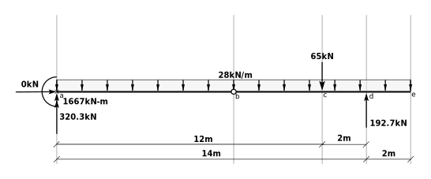

# 2: Determinate Beams and Frames
## 2.5: Beam Reactions Example

Consider the following beam structure, below which is shown the overall FBD.


There are 4 unknown reactions - the 3 available equations of equilibrium are not sufficient to solve for the reactions.


### 2.5.1: Free Body Diagram of Part b-c-d-e

The pin at point $b$ requires the internal bending moment at that point to be 0.  That allows us to
split the structure at that spot to develop an additional FBD.  It only adds 2 additional unknowns
(horizontal and vertical force at $b$) and so the three additional equilibrium equations will now
be sufficient.

We choose a side that involves only one unknown in an equation, allowing us to solve for
that unknown immediately; here the right side:


<div markdown="1" class="cell code_cell">
<div class="input_area" markdown="1">
```python
from sympy import symbols,solve

```
</div>

</div>


<div markdown="1" class="cell code_cell">
<div class="input_area" markdown="1">
```python
Hb,Vb,Vd = symbols('Hb Vb Vd')

```
</div>

</div>


### $\sum M_b = 0~~~~~+ccw$


<div markdown="1" class="cell code_cell">
<div class="input_area" markdown="1">
```python
sum_Mb = -65*4  - 28*(6+2)*(6+2)/2 + Vd*6
sum_Mb

```
</div>

<div class="output_wrapper" markdown="1">
<div class="output_subarea" markdown="1">


{:.output_data_text}
```
6*Vd - 1156.0
```


</div>
</div>
</div>


<div markdown="1" class="cell code_cell">
<div class="input_area" markdown="1">
```python
Vd = solve(sum_Mb,Vd)[0].n()
Vd

```
</div>

<div class="output_wrapper" markdown="1">
<div class="output_subarea" markdown="1">


{:.output_data_text}
```
192.666666666667
```


</div>
</div>
</div>


### $\sum F_y = 0~~~~~+\uparrow$


<div markdown="1" class="cell code_cell">
<div class="input_area" markdown="1">
```python
sum_Fy = Vb - 28*(6+2) - 65 + Vd
sum_Fy

```
</div>

<div class="output_wrapper" markdown="1">
<div class="output_subarea" markdown="1">


{:.output_data_text}
```
Vb - 96.3333333333333
```


</div>
</div>
</div>


<div markdown="1" class="cell code_cell">
<div class="input_area" markdown="1">
```python
Vb = solve(sum_Fy,Vb)[0].n()
Vb

```
</div>

<div class="output_wrapper" markdown="1">
<div class="output_subarea" markdown="1">


{:.output_data_text}
```
96.3333333333333
```


</div>
</div>
</div>


### $\sum F_x = 0~~~~~+ \rightarrow$


<div markdown="1" class="cell code_cell">
<div class="input_area" markdown="1">
```python
sum_Fx = Hb
Hb = solve(sum_Fx,Hb)[0].n()
Hb

```
</div>

<div class="output_wrapper" markdown="1">
<div class="output_subarea" markdown="1">


{:.output_data_text}
```
0
```


</div>
</div>
</div>


<div markdown="1" class="cell code_cell">
<div class="input_area" markdown="1">
```python
Vd, Vb, Hb

```
</div>

<div class="output_wrapper" markdown="1">
<div class="output_subarea" markdown="1">


{:.output_data_text}
```
(192.666666666667, 96.3333333333333, 0)
```


</div>
</div>
</div>


### 2.5.2: Free Body Diagram of part a-b


Note that $H_b$ and $V_b$ are shown equal and opposite to what they were on the FBD. **This is important.**


<div markdown="1" class="cell code_cell">
<div class="input_area" markdown="1">
```python
Ha,Ma,Va = symbols('Ha Ma Va')

```
</div>

</div>


### $\sum F_x = 0~~~~~+\rightarrow$


<div markdown="1" class="cell code_cell">
<div class="input_area" markdown="1">
```python
Ha = solve(Ha - Hb, Ha)[0].n()
Ha

```
</div>

<div class="output_wrapper" markdown="1">
<div class="output_subarea" markdown="1">


{:.output_data_text}
```
0
```


</div>
</div>
</div>


### $\sum F_y = 0~~~~~+\uparrow$


<div markdown="1" class="cell code_cell">
<div class="input_area" markdown="1">
```python
Va = solve(Va - 28*8 - Vb, Va)[0].n()
Va

```
</div>

<div class="output_wrapper" markdown="1">
<div class="output_subarea" markdown="1">


{:.output_data_text}
```
320.333333333333
```


</div>
</div>
</div>


### $\sum M_a = 0~~~~~+ ccw$


<div markdown="1" class="cell code_cell">
<div class="input_area" markdown="1">
```python
Ma = solve(Ma - 28*8*8/2 - Vb*8, Ma)[0].n()
Ma

```
</div>

<div class="output_wrapper" markdown="1">
<div class="output_subarea" markdown="1">


{:.output_data_text}
```
1666.66666666667
```


</div>
</div>
</div>


### 2.5.3: Equilibrium Check

We can use a third FBD as an equilibrium check.  It is not an independent FBD but it will at
least check for some numerical errors, giving us some confidence that the work is correct.




### $\sum F_x~~~~~+ \rightarrow$


<div markdown="1" class="cell code_cell">
<div class="input_area" markdown="1">
```python
Ha

```
</div>

<div class="output_wrapper" markdown="1">
<div class="output_subarea" markdown="1">


{:.output_data_text}
```
0
```


</div>
</div>
</div>


### $\sum F_y~~~~~+ \uparrow$


<div markdown="1" class="cell code_cell">
<div class="input_area" markdown="1">
```python
Va + Vd - 28*(14+2) - 65

```
</div>

<div class="output_wrapper" markdown="1">
<div class="output_subarea" markdown="1">


{:.output_data_text}
```
0
```


</div>
</div>
</div>


### $\sum M_e~~~~~+ccw$


<div markdown="1" class="cell code_cell">
<div class="input_area" markdown="1">
```python
Ma + 28*(14+2)*(14+2)/2 + 65*(2+2) - Va*(14+2) - Vd*2

```
</div>

<div class="output_wrapper" markdown="1">
<div class="output_subarea" markdown="1">


{:.output_data_text}
```
6.25277607468888e-13
```


</div>
</div>
</div>


$6.25 \times 10^{-13}$ is easily close enough to zero, attributable to normal floating point truncation errors.


**Note:** If you were using manual calculations and the numeric valies of $M_a$, $V_a$ and $V_d$ rounded to 4 significant
figures, this last equilibrium check would give something quite a bit further from zero, but still acceptable.

