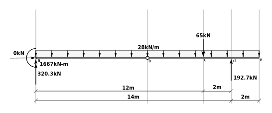

<div markdown="1" class="cell code_cell">
<div class="input_area" markdown="1">
```python
from sympy import symbols,solve
from sympy.physics.units import m,newton,force,kilo,Quantity
kilonewton = kilonewtons = kN = Quantity("kilonewton", force, kilo*newton, "kN")

```
</div>

</div>


## Free Body Diagram of Part b-c-d-e


<div markdown="1" class="cell code_cell">
<div class="input_area" markdown="1">
```python
Hb,Vb,Vd = symbols('Hb Vb Vd')

```
</div>

</div>


### $\sum M_b = 0~~~~~+ccw$


<div markdown="1" class="cell code_cell">
<div class="input_area" markdown="1">
```python
sum_Mb = -65*kN*4*m  - 28*kN/m*(6*m+2*m)*(6*m+2*m)/2 + Vd*6*m
sum_Mb

```
</div>

<div class="output_wrapper" markdown="1">
<div class="output_subarea" markdown="1">


{:.output_data_text}
```
-1156*kilonewton*meter + 6*meter*Vd
```


</div>
</div>
</div>


<div markdown="1" class="cell code_cell">
<div class="input_area" markdown="1">
```python
Vd = solve(sum_Mb,Vd)[0].n()
Vd

```
</div>

<div class="output_wrapper" markdown="1">
<div class="output_subarea" markdown="1">


{:.output_data_text}
```
192.666666666667*kilonewton
```


</div>
</div>
</div>


### $\sum F_y = 0~~~~~+\uparrow$


<div markdown="1" class="cell code_cell">
<div class="input_area" markdown="1">
```python
sum_Fy = Vb - 28*kN/m*(6*m+2*m) - 65*kN + Vd
sum_Fy

```
</div>

<div class="output_wrapper" markdown="1">
<div class="output_subarea" markdown="1">


{:.output_data_text}
```
-96.3333333333333*kilonewton + Vb
```


</div>
</div>
</div>


<div markdown="1" class="cell code_cell">
<div class="input_area" markdown="1">
```python
Vb = solve(sum_Fy,Vb)[0].n()
Vb

```
</div>

<div class="output_wrapper" markdown="1">
<div class="output_subarea" markdown="1">


{:.output_data_text}
```
96.3333333333333*kilonewton
```


</div>
</div>
</div>


### $\sum F_x = 0~~~~~+ \rightarrow$


<div markdown="1" class="cell code_cell">
<div class="input_area" markdown="1">
```python
sum_Fx = Hb
Hb = solve(sum_Fx,Hb)[0].n()
Hb

```
</div>

<div class="output_wrapper" markdown="1">
<div class="output_subarea" markdown="1">


{:.output_data_text}
```
0
```


</div>
</div>
</div>


<div markdown="1" class="cell code_cell">
<div class="input_area" markdown="1">
```python
Vd/kN, Vb/kN, Hb/kN

```
</div>

<div class="output_wrapper" markdown="1">
<div class="output_subarea" markdown="1">


{:.output_data_text}
```
(192.666666666667, 96.3333333333333, 0)
```


</div>
</div>
</div>


## Free Body Diagram of part a-b


<div markdown="1" class="cell code_cell">
<div class="input_area" markdown="1">
```python
Ha,Ma,Va = symbols('Ha Ma Va')

```
</div>

</div>


### $\sum F_x = 0~~~~~+\rightarrow$


<div markdown="1" class="cell code_cell">
<div class="input_area" markdown="1">
```python
sum_Fx = Ha - Hb
Ha = solve(sum_Fx,Ha)[0].n()
Ha

```
</div>

<div class="output_wrapper" markdown="1">
<div class="output_subarea" markdown="1">


{:.output_data_text}
```
0
```


</div>
</div>
</div>


### $\sum F_y = 0~~~~~+\uparrow$


<div markdown="1" class="cell code_cell">
<div class="input_area" markdown="1">
```python
sum_Fy = Va - 28*(kN/m)*8*m - Vb
Va = solve(sum_Fy,Va)[0].n()
Va

```
</div>

<div class="output_wrapper" markdown="1">
<div class="output_subarea" markdown="1">


{:.output_data_text}
```
320.333333333333*kilonewton
```


</div>
</div>
</div>


### $\sum M_a = 0~~~~~+ ccw$


<div markdown="1" class="cell code_cell">
<div class="input_area" markdown="1">
```python
sum_Ma = Ma - 28*(kN/m)*8*m*8*m/2 - Vb*8*m
Ma = solve(sum_Ma,Ma)[0].n()
Ma

```
</div>

<div class="output_wrapper" markdown="1">
<div class="output_subarea" markdown="1">


{:.output_data_text}
```
1666.66666666667*kilonewton*meter
```


</div>
</div>
</div>


## Equilibrium Check




### $\sum F_x~~~~~+ \rightarrow$


<div markdown="1" class="cell code_cell">
<div class="input_area" markdown="1">
```python
0*kN

```
</div>

<div class="output_wrapper" markdown="1">
<div class="output_subarea" markdown="1">


{:.output_data_text}
```
0
```


</div>
</div>
</div>


### $\sum F_y~~~~~+ \uparrow$


<div markdown="1" class="cell code_cell">
<div class="input_area" markdown="1">
```python
320.3*kN + 192.7*kN - 28*(kN/m)*(14*m+2*m) - 65*kN

```
</div>

<div class="output_wrapper" markdown="1">
<div class="output_subarea" markdown="1">


{:.output_data_text}
```
0
```


</div>
</div>
</div>


### $\sum M_e~~~~~+ccw$


<div markdown="1" class="cell code_cell">
<div class="input_area" markdown="1">
```python
1667*kN*m + 28*(kN/m)*(14*m+2*m)*(14*m+2*m)/2 + 65*kN*(2*m+2*m) - 320.3*kN*(14*m+2*m) - 192.7*kN*2*m

```
</div>

<div class="output_wrapper" markdown="1">
<div class="output_subarea" markdown="1">


{:.output_data_text}
```
0.799999999999841*kilonewton*meter
```


</div>
</div>
</div>


This is 0.8 kN-m which is very small compared to the moment at *a* (1667 kN-m) and is due entirely to floating point round-off errors.  This is further demonstrated below where we use the computed (and non-rounded) values.


<div markdown="1" class="cell code_cell">
<div class="input_area" markdown="1">
```python
Ma + 28*(kN/m)*(14*m+2*m)*(14*m+2*m)/2 + 65*kN*(2*m+2*m) - Va*(14*m+2*m) - Vd*2*m

```
</div>

<div class="output_wrapper" markdown="1">
<div class="output_subarea" markdown="1">


{:.output_data_text}
```
6.25277607468888e-13*kilonewton*meter
```


</div>
</div>
</div>


$6.25 \times 10^{-13}$ is easily close enough to zero, attributable to normal floating point truncation errors.

