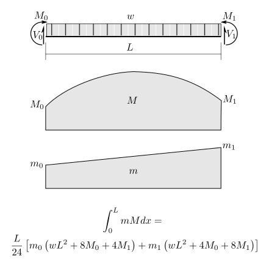

---
redirect_from:
  - "/notebooks/virtualwork/virtualforce/05-develop-intmm-formulae"
interact_link: content/notebooks/virtualwork/virtualforce/05-Develop-intmM-formulae.ipynb
kernel_name: python3
has_widgets: false
title: 'Development of Integration Formulae'
prev_page:
  url: /notebooks/index.html
  title: 'Notebooks'
next_page:
  url: /notebooks/virtualwork/virtualforce/10-Integrate-mM.html
  title: 'Demo of integrating m*M'
comment: "***PROGRAMMATICALLY GENERATED, DO NOT EDIT. SEE ORIGINAL FILES IN /content***"
---


# Values of $\int_0^L m M dx$

Some day we will have some better figures to help ...

In the meantime - have a look at this:



And also see [this](../../../images/virtualwork/virtualforce/beams/int-mM-sheet.pdf):


<div markdown="1" class="cell code_cell">
<div class="input_area" markdown="1">
```python
from sympy import init_printing, var, solve
init_printing()

```
</div>

</div>


<div markdown="1" class="cell code_cell">
<div class="input_area" markdown="1">
```python
var('m0 m1 M0 M1 V0 V1 x w EI L')

```
</div>

<div class="output_wrapper" markdown="1">
<div class="output_subarea" markdown="1">


$$\left ( m_{0}, \quad m_{1}, \quad M_{0}, \quad M_{1}, \quad V_{0}, \quad V_{1}, \quad x, \quad w, \quad EI, \quad L\right )$$


</div>
</div>
</div>


Express virtual moment as a function of $x$, $x = 0$ at left end and increasing rightward.  Fairly simple as the virtual moment is always linear, $m_0$ at left end and $m_1$ at the right:


<div markdown="1" class="cell code_cell">
<div class="input_area" markdown="1">
```python
mx = m0 + (m1-m0)*x/L
mx

```
</div>

<div class="output_wrapper" markdown="1">
<div class="output_subarea" markdown="1">


$$m_{0} + \frac{x \left(- m_{0} + m_{1}\right)}{L}$$


</div>
</div>
</div>


Prove that this gives the correct value at the right end, by substituting $x=L$:


<div markdown="1" class="cell code_cell">
<div class="input_area" markdown="1">
```python
mx.subs({x:L})

```
</div>

<div class="output_wrapper" markdown="1">
<div class="output_subarea" markdown="1">


$$m_{1}$$


</div>
</div>
</div>


Determine the shear at the left end of the real moment diagram, by solving $\sum M = 0$ about the right end, +ive CW:


<div markdown="1" class="cell code_cell">
<div class="input_area" markdown="1">
```python
V = solve( M0 + V0*L - M1 - w*L*L/2, V0 )[0]
V

```
</div>

<div class="output_wrapper" markdown="1">
<div class="output_subarea" markdown="1">


$$\frac{\frac{L^{2} w}{2} - M_{0} + M_{1}}{L}$$


</div>
</div>
</div>


Now express real moment as a function of $x$:


<div markdown="1" class="cell code_cell">
<div class="input_area" markdown="1">
```python
Mx = M0 + V*x - w*x*x/2
Mx

```
</div>

<div class="output_wrapper" markdown="1">
<div class="output_subarea" markdown="1">


$$M_{0} - \frac{w x^{2}}{2} + \frac{x \left(\frac{L^{2} w}{2} - M_{0} + M_{1}\right)}{L}$$


</div>
</div>
</div>


Thats too complex for easy checking.  Does it at least deliver the correct value, $M_1$ at $x=L$?


<div markdown="1" class="cell code_cell">
<div class="input_area" markdown="1">
```python
Mx.subs({x:L})

```
</div>

<div class="output_wrapper" markdown="1">
<div class="output_subarea" markdown="1">


$$M_{1}$$


</div>
</div>
</div>


Now integrate the product of the virtual and the real, for $x$ from $0$ to $L$:


<div markdown="1" class="cell code_cell">
<div class="input_area" markdown="1">
```python
I1 = (mx*Mx).integrate((x,0,L))
I1

```
</div>

<div class="output_wrapper" markdown="1">
<div class="output_subarea" markdown="1">


$$\frac{L^{3} \left(m_{0} w - m_{1} w\right)}{8} + L M_{0} m_{0} + \frac{L \left(L^{2} m_{0} w - 4 M_{0} m_{0} + 2 M_{0} m_{1} + 2 M_{1} m_{0}\right)}{4} + \frac{L \left(- 2 L^{2} m_{0} w + L^{2} m_{1} w + 2 M_{0} m_{0} - 2 M_{0} m_{1} - 2 M_{1} m_{0} + 2 M_{1} m_{1}\right)}{6}$$


</div>
</div>
</div>


Gnarly! Lets try to simplify:


<div markdown="1" class="cell code_cell">
<div class="input_area" markdown="1">
```python
I2 = I1.simplify()
I2

```
</div>

<div class="output_wrapper" markdown="1">
<div class="output_subarea" markdown="1">


$$\frac{L \left(L^{2} m_{0} w + L^{2} m_{1} w + 8 M_{0} m_{0} + 4 M_{0} m_{1} + 4 M_{1} m_{0} + 8 M_{1} m_{1}\right)}{24}$$


</div>
</div>
</div>


Thats quite a bit better, but we can see some additional factorizations that ```sympy``` may not be able to find on its
own.  Lets try this one, by factoring out $m_0$ and $m_1$ manually:


<div markdown="1" class="cell code_cell">
<div class="input_area" markdown="1">
```python
I3 = (L/24)*(m0*(w*L*L + 8*M0 + 4*M1) + m1*(w*L*L + 4*M0 + 8*M1))
I3

```
</div>

<div class="output_wrapper" markdown="1">
<div class="output_subarea" markdown="1">


$$\frac{L \left(m_{0} \left(L^{2} w + 8 M_{0} + 4 M_{1}\right) + m_{1} \left(L^{2} w + 4 M_{0} + 8 M_{1}\right)\right)}{24}$$


</div>
</div>
</div>


And confirm that they are equal:


<div markdown="1" class="cell code_cell">
<div class="input_area" markdown="1">
```python
(I2-I3).simplify()

```
</div>

<div class="output_wrapper" markdown="1">
<div class="output_subarea" markdown="1">


$$0$$


</div>
</div>
</div>


## The Result

So thats it!  Here is the formula we will use to give us the integral of the product of the most general virtual
moment and a general real moment (subjected to a UDL only):


<div markdown="1" class="cell code_cell">
<div class="input_area" markdown="1">
```python
I3

```
</div>

<div class="output_wrapper" markdown="1">
<div class="output_subarea" markdown="1">


$$\frac{L \left(m_{0} \left(L^{2} w + 8 M_{0} + 4 M_{1}\right) + m_{1} \left(L^{2} w + 4 M_{0} + 8 M_{1}\right)\right)}{24}$$


</div>
</div>
</div>


And in a format that is suitable for copying and pasting into computer software:


<div markdown="1" class="cell code_cell">
<div class="input_area" markdown="1">
```python
str(I3)

```
</div>

<div class="output_wrapper" markdown="1">
<div class="output_subarea" markdown="1">


{:.output_data_text}
```
'L*(m0*(L**2*w + 8*M0 + 4*M1) + m1*(L**2*w + 4*M0 + 8*M1))/24'
```


</div>
</div>
</div>


## Special Cases

The following generates the special case values in the [table provided by N. Holtz](../../../images/virtualwork/virtualforce/beams/int-mM-sheet.pdf).


<div markdown="1" class="cell code_cell">
<div class="input_area" markdown="1">
```python
var('m M')

```
</div>

<div class="output_wrapper" markdown="1">
<div class="output_subarea" markdown="1">


$$\left ( m, \quad M\right )$$


</div>
</div>
</div>


<div markdown="1" class="cell code_cell">
<div class="input_area" markdown="1">
```python
virtual_specials = [{m0:m,m1:m},{m1:0},{m0:0},{}]
real_specials = [{w:0,M0:M,M1:M},{w:0,M1:0},{w:0,M0:0},{w:0},
                 {M0:0,M1:0,w:8*M/(L*L)},{w:-2*M1/(L*L),M0:0},{w:2*(M0-M1)/(L*L)},]

```
</div>

</div>


<div markdown="1" class="cell code_cell">
<div class="input_area" markdown="1">
```python
for col,rs in enumerate(real_specials):
    for row,vs in enumerate(virtual_specials):
        s = I3.subs(rs).subs(vs).simplify()
        print(' ')
        print("Column",col+1,"  Row",row+1)
        print(rs)
        print(vs)
        display(s)

```
</div>

<div class="output_wrapper" markdown="1">
<div class="output_subarea" markdown="1">
{:.output_stream}
```
 
Column 1   Row 1
{w: 0, M0: M, M1: M}
{m0: m, m1: m}
```
</div>
</div>
<div class="output_wrapper" markdown="1">
<div class="output_subarea" markdown="1">

$$L M m$$

</div>
</div>
<div class="output_wrapper" markdown="1">
<div class="output_subarea" markdown="1">
{:.output_stream}
```
 
Column 1   Row 2
{w: 0, M0: M, M1: M}
{m1: 0}
```
</div>
</div>
<div class="output_wrapper" markdown="1">
<div class="output_subarea" markdown="1">

$$\frac{L M m_{0}}{2}$$

</div>
</div>
<div class="output_wrapper" markdown="1">
<div class="output_subarea" markdown="1">
{:.output_stream}
```
 
Column 1   Row 3
{w: 0, M0: M, M1: M}
{m0: 0}
```
</div>
</div>
<div class="output_wrapper" markdown="1">
<div class="output_subarea" markdown="1">

$$\frac{L M m_{1}}{2}$$

</div>
</div>
<div class="output_wrapper" markdown="1">
<div class="output_subarea" markdown="1">
{:.output_stream}
```
 
Column 1   Row 4
{w: 0, M0: M, M1: M}
{}
```
</div>
</div>
<div class="output_wrapper" markdown="1">
<div class="output_subarea" markdown="1">

$$\frac{L M \left(m_{0} + m_{1}\right)}{2}$$

</div>
</div>
<div class="output_wrapper" markdown="1">
<div class="output_subarea" markdown="1">
{:.output_stream}
```
 
Column 2   Row 1
{w: 0, M1: 0}
{m0: m, m1: m}
```
</div>
</div>
<div class="output_wrapper" markdown="1">
<div class="output_subarea" markdown="1">

$$\frac{L M_{0} m}{2}$$

</div>
</div>
<div class="output_wrapper" markdown="1">
<div class="output_subarea" markdown="1">
{:.output_stream}
```
 
Column 2   Row 2
{w: 0, M1: 0}
{m1: 0}
```
</div>
</div>
<div class="output_wrapper" markdown="1">
<div class="output_subarea" markdown="1">

$$\frac{L M_{0} m_{0}}{3}$$

</div>
</div>
<div class="output_wrapper" markdown="1">
<div class="output_subarea" markdown="1">
{:.output_stream}
```
 
Column 2   Row 3
{w: 0, M1: 0}
{m0: 0}
```
</div>
</div>
<div class="output_wrapper" markdown="1">
<div class="output_subarea" markdown="1">

$$\frac{L M_{0} m_{1}}{6}$$

</div>
</div>
<div class="output_wrapper" markdown="1">
<div class="output_subarea" markdown="1">
{:.output_stream}
```
 
Column 2   Row 4
{w: 0, M1: 0}
{}
```
</div>
</div>
<div class="output_wrapper" markdown="1">
<div class="output_subarea" markdown="1">

$$\frac{L M_{0} \left(2 m_{0} + m_{1}\right)}{6}$$

</div>
</div>
<div class="output_wrapper" markdown="1">
<div class="output_subarea" markdown="1">
{:.output_stream}
```
 
Column 3   Row 1
{w: 0, M0: 0}
{m0: m, m1: m}
```
</div>
</div>
<div class="output_wrapper" markdown="1">
<div class="output_subarea" markdown="1">

$$\frac{L M_{1} m}{2}$$

</div>
</div>
<div class="output_wrapper" markdown="1">
<div class="output_subarea" markdown="1">
{:.output_stream}
```
 
Column 3   Row 2
{w: 0, M0: 0}
{m1: 0}
```
</div>
</div>
<div class="output_wrapper" markdown="1">
<div class="output_subarea" markdown="1">

$$\frac{L M_{1} m_{0}}{6}$$

</div>
</div>
<div class="output_wrapper" markdown="1">
<div class="output_subarea" markdown="1">
{:.output_stream}
```
 
Column 3   Row 3
{w: 0, M0: 0}
{m0: 0}
```
</div>
</div>
<div class="output_wrapper" markdown="1">
<div class="output_subarea" markdown="1">

$$\frac{L M_{1} m_{1}}{3}$$

</div>
</div>
<div class="output_wrapper" markdown="1">
<div class="output_subarea" markdown="1">
{:.output_stream}
```
 
Column 3   Row 4
{w: 0, M0: 0}
{}
```
</div>
</div>
<div class="output_wrapper" markdown="1">
<div class="output_subarea" markdown="1">

$$\frac{L M_{1} \left(m_{0} + 2 m_{1}\right)}{6}$$

</div>
</div>
<div class="output_wrapper" markdown="1">
<div class="output_subarea" markdown="1">
{:.output_stream}
```
 
Column 4   Row 1
{w: 0}
{m0: m, m1: m}
```
</div>
</div>
<div class="output_wrapper" markdown="1">
<div class="output_subarea" markdown="1">

$$\frac{L m \left(M_{0} + M_{1}\right)}{2}$$

</div>
</div>
<div class="output_wrapper" markdown="1">
<div class="output_subarea" markdown="1">
{:.output_stream}
```
 
Column 4   Row 2
{w: 0}
{m1: 0}
```
</div>
</div>
<div class="output_wrapper" markdown="1">
<div class="output_subarea" markdown="1">

$$\frac{L m_{0} \left(2 M_{0} + M_{1}\right)}{6}$$

</div>
</div>
<div class="output_wrapper" markdown="1">
<div class="output_subarea" markdown="1">
{:.output_stream}
```
 
Column 4   Row 3
{w: 0}
{m0: 0}
```
</div>
</div>
<div class="output_wrapper" markdown="1">
<div class="output_subarea" markdown="1">

$$\frac{L m_{1} \left(M_{0} + 2 M_{1}\right)}{6}$$

</div>
</div>
<div class="output_wrapper" markdown="1">
<div class="output_subarea" markdown="1">
{:.output_stream}
```
 
Column 4   Row 4
{w: 0}
{}
```
</div>
</div>
<div class="output_wrapper" markdown="1">
<div class="output_subarea" markdown="1">

$$\frac{L \left(m_{0} \left(2 M_{0} + M_{1}\right) + m_{1} \left(M_{0} + 2 M_{1}\right)\right)}{6}$$

</div>
</div>
<div class="output_wrapper" markdown="1">
<div class="output_subarea" markdown="1">
{:.output_stream}
```
 
Column 5   Row 1
{M0: 0, M1: 0, w: 8*M/L**2}
{m0: m, m1: m}
```
</div>
</div>
<div class="output_wrapper" markdown="1">
<div class="output_subarea" markdown="1">

$$\frac{2 L M m}{3}$$

</div>
</div>
<div class="output_wrapper" markdown="1">
<div class="output_subarea" markdown="1">
{:.output_stream}
```
 
Column 5   Row 2
{M0: 0, M1: 0, w: 8*M/L**2}
{m1: 0}
```
</div>
</div>
<div class="output_wrapper" markdown="1">
<div class="output_subarea" markdown="1">

$$\frac{L M m_{0}}{3}$$

</div>
</div>
<div class="output_wrapper" markdown="1">
<div class="output_subarea" markdown="1">
{:.output_stream}
```
 
Column 5   Row 3
{M0: 0, M1: 0, w: 8*M/L**2}
{m0: 0}
```
</div>
</div>
<div class="output_wrapper" markdown="1">
<div class="output_subarea" markdown="1">

$$\frac{L M m_{1}}{3}$$

</div>
</div>
<div class="output_wrapper" markdown="1">
<div class="output_subarea" markdown="1">
{:.output_stream}
```
 
Column 5   Row 4
{M0: 0, M1: 0, w: 8*M/L**2}
{}
```
</div>
</div>
<div class="output_wrapper" markdown="1">
<div class="output_subarea" markdown="1">

$$\frac{L M \left(m_{0} + m_{1}\right)}{3}$$

</div>
</div>
<div class="output_wrapper" markdown="1">
<div class="output_subarea" markdown="1">
{:.output_stream}
```
 
Column 6   Row 1
{w: -2*M1/L**2, M0: 0}
{m0: m, m1: m}
```
</div>
</div>
<div class="output_wrapper" markdown="1">
<div class="output_subarea" markdown="1">

$$\frac{L M_{1} m}{3}$$

</div>
</div>
<div class="output_wrapper" markdown="1">
<div class="output_subarea" markdown="1">
{:.output_stream}
```
 
Column 6   Row 2
{w: -2*M1/L**2, M0: 0}
{m1: 0}
```
</div>
</div>
<div class="output_wrapper" markdown="1">
<div class="output_subarea" markdown="1">

$$\frac{L M_{1} m_{0}}{12}$$

</div>
</div>
<div class="output_wrapper" markdown="1">
<div class="output_subarea" markdown="1">
{:.output_stream}
```
 
Column 6   Row 3
{w: -2*M1/L**2, M0: 0}
{m0: 0}
```
</div>
</div>
<div class="output_wrapper" markdown="1">
<div class="output_subarea" markdown="1">

$$\frac{L M_{1} m_{1}}{4}$$

</div>
</div>
<div class="output_wrapper" markdown="1">
<div class="output_subarea" markdown="1">
{:.output_stream}
```
 
Column 6   Row 4
{w: -2*M1/L**2, M0: 0}
{}
```
</div>
</div>
<div class="output_wrapper" markdown="1">
<div class="output_subarea" markdown="1">

$$\frac{L M_{1} \left(m_{0} + 3 m_{1}\right)}{12}$$

</div>
</div>
<div class="output_wrapper" markdown="1">
<div class="output_subarea" markdown="1">
{:.output_stream}
```
 
Column 7   Row 1
{w: (2*M0 - 2*M1)/L**2}
{m0: m, m1: m}
```
</div>
</div>
<div class="output_wrapper" markdown="1">
<div class="output_subarea" markdown="1">

$$\frac{L m \left(2 M_{0} + M_{1}\right)}{3}$$

</div>
</div>
<div class="output_wrapper" markdown="1">
<div class="output_subarea" markdown="1">
{:.output_stream}
```
 
Column 7   Row 2
{w: (2*M0 - 2*M1)/L**2}
{m1: 0}
```
</div>
</div>
<div class="output_wrapper" markdown="1">
<div class="output_subarea" markdown="1">

$$\frac{L m_{0} \left(5 M_{0} + M_{1}\right)}{12}$$

</div>
</div>
<div class="output_wrapper" markdown="1">
<div class="output_subarea" markdown="1">
{:.output_stream}
```
 
Column 7   Row 3
{w: (2*M0 - 2*M1)/L**2}
{m0: 0}
```
</div>
</div>
<div class="output_wrapper" markdown="1">
<div class="output_subarea" markdown="1">

$$\frac{L m_{1} \left(M_{0} + M_{1}\right)}{4}$$

</div>
</div>
<div class="output_wrapper" markdown="1">
<div class="output_subarea" markdown="1">
{:.output_stream}
```
 
Column 7   Row 4
{w: (2*M0 - 2*M1)/L**2}
{}
```
</div>
</div>
<div class="output_wrapper" markdown="1">
<div class="output_subarea" markdown="1">

$$\frac{L \left(m_{0} \left(5 M_{0} + M_{1}\right) + 3 m_{1} \left(M_{0} + M_{1}\right)\right)}{12}$$

</div>
</div>
</div>

