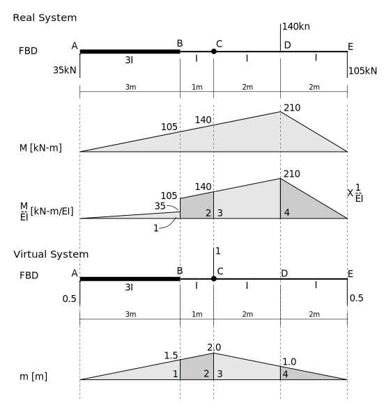

---
redirect_from:
  - "/notebooks/virtualwork/virtualforce/10-integrate-mm"
interact_link: content/notebooks/virtualwork/virtualforce/10-Integrate-mM.ipynb
kernel_name: python3
has_widgets: false
title: 'Demo of integrating m*M'
prev_page:
  url: /notebooks/virtualwork/virtualforce/05-Develop-intmM-formulae.html
  title: 'Development of Integration Formulae'
next_page:
  url: /notebooks/virtualwork/virtualforce/Problem-6-5.html
  title: 'Problem 6-5 Solution'
comment: "***PROGRAMMATICALLY GENERATED, DO NOT EDIT. SEE ORIGINAL FILES IN /content***"
---


## Integrate Products of Bending Moment Diagrams


This snippet integrates the product of two moment diagrams, as might be used to
integrate the product of virtual and real moments when finding deflections in beam and
frame structures using the method of virtual work.

It simply uses the solution for the most general case of a linear virtual moment
diagram and a real moment diagram resulting from a UDL of magnitude $w$ and constant $EI$.

*Note:* signs for moments and loads are positive in the directions shown in the figure.


<div markdown="1" class="cell code_cell">
<div class="input_area" markdown="1">
```python
def intmM(L,m0,m1,M0,M1,w=0,EI=1.):
    return (L/24.)*(m0*(w*L*L + 8.*M0 + 4.*M1) + m1*(w*L*L + 4.*M0 + 8.*M1))/EI

```
</div>

</div>


## Example Usage

Consider the example of Figure 5.24 from [Erochko](http://www.learnaboutstructures.com/Virtual-Work-Method), repeated
here with some minor changes:





First, integrate the four separate parts:


<div markdown="1" class="cell code_cell">
<div class="input_area" markdown="1">
```python
part1 = intmM(L=3,m0=0,m1=1.5,M0=0,M1=105,EI=3)
part1

```
</div>

<div class="output_wrapper" markdown="1">
<div class="output_subarea" markdown="1">


{:.output_data_text}
```
52.5
```


</div>
</div>
</div>


<div markdown="1" class="cell code_cell">
<div class="input_area" markdown="1">
```python
part2 = intmM(L=1,m0=1.5,m1=2.0,M0=105,M1=140,EI=1)
part2

```
</div>

<div class="output_wrapper" markdown="1">
<div class="output_subarea" markdown="1">


{:.output_data_text}
```
215.83333333333331
```


</div>
</div>
</div>


<div markdown="1" class="cell code_cell">
<div class="input_area" markdown="1">
```python
part3 = intmM(L=2,m0=2,m1=1,M0=140,M1=210,EI=1)
part3

```
</div>

<div class="output_wrapper" markdown="1">
<div class="output_subarea" markdown="1">


{:.output_data_text}
```
513.3333333333333
```


</div>
</div>
</div>


<div markdown="1" class="cell code_cell">
<div class="input_area" markdown="1">
```python
part4 = intmM(L=2,m0=1,m1=0,M0=210,M1=0,EI=1)
part4

```
</div>

<div class="output_wrapper" markdown="1">
<div class="output_subarea" markdown="1">


{:.output_data_text}
```
140.0
```


</div>
</div>
</div>


<div markdown="1" class="cell code_cell">
<div class="input_area" markdown="1">
```python
T = part1 + part2 + part3 + part4
T

```
</div>

<div class="output_wrapper" markdown="1">
<div class="output_subarea" markdown="1">


{:.output_data_text}
```
921.6666666666665
```


</div>
</div>
</div>


Then form the total internal virtual work, $U_i$:


The units of the above are $\text{kN}\text{m}^3$ (remember, the virtual unit load has no units).  If $E$ and $I$
have units of _N_ and _mm_ then we can convert the above to the same units by multiplying ${}\times 10^3 \times 10^3 \times 10^3 \times 10^3$.

Our virtual work equation is:

$$
U_i = \frac{T}{EI}
$$

$$
1 \times \Delta = U_i
$$

solving for $\Delta$ gives:


<div markdown="1" class="cell code_cell">
<div class="input_area" markdown="1">
```python
E = 200000.
I = 300E6
delta = T * 1E3 * 1e3**3 / (E*I)
delta

```
</div>

<div class="output_wrapper" markdown="1">
<div class="output_subarea" markdown="1">


{:.output_data_text}
```
15.361111111111109
```


</div>
</div>
</div>


And this is in _mm_.

