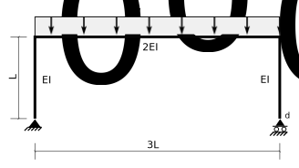

---
redirect_from:
  - "/notebooks/virtualwork/virtualforce/problem-6-5"
interact_link: content/notebooks/virtualwork/virtualforce/Problem-6-5.ipynb
kernel_name: python3
has_widgets: false
title: 'Problem 6-5 Solution'
prev_page:
  url: /notebooks/index.html
  title: 'Notebooks'
next_page:
  url: /notebooks/virtualwork/virtualforce/Problem-P6-demo.html
  title: 'Problem 6-6 Alternate Solution'
comment: "***PROGRAMMATICALLY GENERATED, DO NOT EDIT. SEE ORIGINAL FILES IN /content***"
---


## Problem 6-5



<div markdown="1" class="cell code_cell">
<div class="input_area" markdown="1">
```python
import sympy
sympy.init_printing()

```
</div>

</div>


<div markdown="1" class="cell code_cell">
<div class="input_area" markdown="1">
```python
class MDiag(object):
    
    def __init__(self,L,m0,m1=0.,w=0.):
        self.L = L
        self.m0 = m0
        self.m1 = m1
        self.w = w
        
def intmM(m,M,EI=1.):
    assert isinstance(m,MDiag),"Arguments must be instances of MDiag"
    assert isinstance(M,MDiag),"Arguments must be instances of MDiag"
    assert m.L == M.L,"Lengths of MDiags must be equal"
    assert m.w == 0.,"Virtual MDiag cannot have a UDL - w must be 0."
    L = m.L
    m0 = m.m0
    m1 = m.m1
    M0 = M.m0
    M1 = M.m1
    w = M.w
    return (L/24.)*(m0*(w*L*L+8.*M0+4.*M1) + m1*(w*L*L+4.*M0+8.*M1))/EI

```
</div>

</div>


### Part 1 - Determine horizontal displacement of member end d


<div markdown="1" class="cell code_cell">
<div class="input_area" markdown="1">
```python
sympy.var('w L EI')

```
</div>

<div class="output_wrapper" markdown="1">
<div class="output_subarea" markdown="1">


$$\left ( w, \quad L, \quad EI\right )$$


</div>
</div>
</div>


<div markdown="1" class="cell code_cell">
<div class="input_area" markdown="1">
```python
intmM(MDiag(3*L,L,L),MDiag(3*L,0,0,w),2*EI)

```
</div>

<div class="output_wrapper" markdown="1">
<div class="output_subarea" markdown="1">


$$\frac{1.125 L^{4} w}{EI}$$


</div>
</div>
</div>


### Part 2 - Determine the rotation of member end d


<div markdown="1" class="cell code_cell">
<div class="input_area" markdown="1">
```python
intmM(MDiag(3*L,0,1),MDiag(3*L,0,0,w),2*EI)

```
</div>

<div class="output_wrapper" markdown="1">
<div class="output_subarea" markdown="1">


$$\frac{0.5625 L^{3} w}{EI}$$


</div>
</div>
</div>

