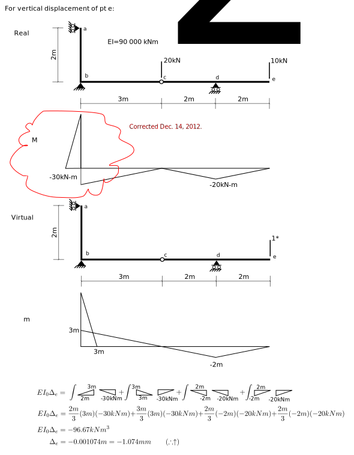

---
redirect_from:
  - "/notebooks/virtualwork/virtualforce/problem-p6-demo"
interact_link: content/notebooks/virtualwork/virtualforce/Problem-P6-demo.ipynb
kernel_name: python3
has_widgets: false
title: 'Problem 6-6 Alternate Solution'
prev_page:
  url: /notebooks/virtualwork/virtualforce/Problem-6-5.html
  title: 'Problem 6-5 Solution'
next_page:
  url: 
  title: ''
comment: "***PROGRAMMATICALLY GENERATED, DO NOT EDIT. SEE ORIGINAL FILES IN /content***"
---


## Problem 6-6


<div markdown="1" class="cell code_cell">
<div class="input_area" markdown="1">
```python
class MDiag(object):
    
    def __init__(self,L,m0,m1=0.,w=0.):
        self.L = L
        self.m0 = m0
        self.m1 = m1
        self.w = w
        
def intmM(m,M,EI=1.):
    assert isinstance(m,MDiag),"Arguments must be instances of MDiag"
    assert isinstance(M,MDiag),"Arguments must be instances of MDiag"
    assert m.L == M.L,"Lengths of MDiags must be equal"
    assert m.w == 0.,"Virtual MDiag cannot have a UDL - w must be 0."
    L = m.L
    m0 = m.m0
    m1 = m.m1
    M0 = M.m0
    M1 = M.m1
    w = M.w
    return (L/24.)*(m0*(w*L*L+8.*M0+4.*M1) + m1*(w*L*L+4.*M0+8.*M1))/EI

```
</div>

</div>





<div markdown="1" class="cell code_cell">
<div class="input_area" markdown="1">
```python
# units are kN and m
EI = 90000.
intmM(MDiag(2,0,3),MDiag(2,0,-30),EI) + \
intmM(MDiag(3,3,0),MDiag(3,-30,0),EI) + \
intmM(MDiag(2,0,-2),MDiag(2,0,-20),EI) + \
intmM(MDiag(2,-2,0),MDiag(2,-20,0),EI)

```
</div>

<div class="output_wrapper" markdown="1">
<div class="output_subarea" markdown="1">


{:.output_data_text}
```
-0.001074074074074074
```


</div>
</div>
</div>


<div markdown="1" class="cell code_cell">
<div class="input_area" markdown="1">
```python
# this confirms the "manual" solution

```
</div>

</div>

