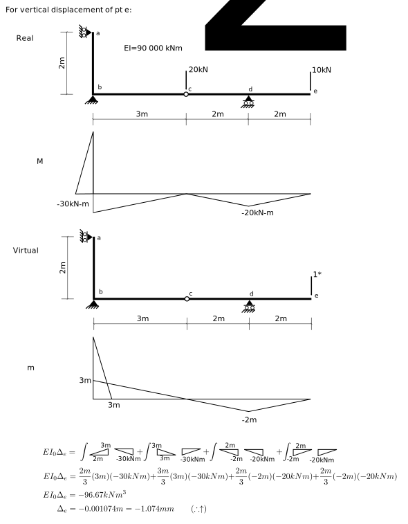

---
redirect_from:
  - "/notebooks/virtualwork/virtualforce/problem-p6-demo"
interact_link: content/notebooks/virtualwork/virtualforce/Problem-P6-demo.ipynb
kernel_name: python3
has_widgets: false
title: 'Problem 6-6 Alternate Solution'
prev_page:
  url: /notebooks/virtualwork/virtualforce/Problem-6-5.html
  title: 'Problem 6-5 Solution'
next_page:
  url: 
  title: ''
comment: "***PROGRAMMATICALLY GENERATED, DO NOT EDIT. SEE ORIGINAL FILES IN /content***"
---


## Problem 6-6


<div markdown="1" class="cell code_cell">
<div class="input_area" markdown="1">
```python
def intmM(L,m0,m1,M0,M1,w=0,EI=1.):
    return (L/24.)*(m0*(w*L*L + 8.*M0 + 4.*M1) + m1*(w*L*L + 4.*M0 + 8.*M1))/EI

```
</div>

</div>





<div markdown="1" class="cell code_cell">
<div class="input_area" markdown="1">
```python
# units are kN and m
EI = 90000 # kN m^2
intmM( L=2, m0=0, m1=3, M0=0, M1=-30, EI=EI) + \
intmM( L=3, m0=3, m1=0, M0=-30, M1=0, EI=EI ) + \
intmM( L=2, m0=0, m1=-2, M0=0, M1=-20, EI=EI ) + \
intmM( L=2, m0=-2, m1=0, M0=-20, M1=0, EI=EI )

```
</div>

<div class="output_wrapper" markdown="1">
<div class="output_subarea" markdown="1">


{:.output_data_text}
```
-0.001074074074074074
```


</div>
</div>
</div>


This confirms the "manual" solution

