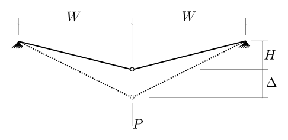

# 7. Displacements in Elastic Structures

## 7.1 Assumptions for Analysis

1. Internal and extrnal forces are in equilibrium.

1. Material is linearly elastic.

1. Internal and external deformations are compatible.

   * no gaps, overlaps, or discontinuities form in the structure
     as it deforms.
   * for every given set of external deformations, there is exactly
     one set of internal deformations (distortions, strains)
	 that is compatible.

1. Principle of super-position

   An effect is:
   * a stress at a point, or
   * a strain at a point, or
   * a shear force, at a point, or
   * a bending moment, at a point, or
   * a reaction, or
   * a displacement, at a point.
   * etc.
   
### When does super-position not hold?

1. Non-linear stress strain.

   

   Most engineering materials have non-linear stress-strian behaviour, where
   the slope of the stress-strain curve decreases as stress increases. For
   stresses in the significantly non-linear portion, the principle of
   super-position does not hold. (It should be noted that at normal working
   stresses for most materials, linearity is not a bad assumption).

1. Proportional limit exceeded.

   

   Similar to the above, when proportional limits are exceed, the stress-strain
   behaviour is no longer linear, and the principle of super-position is not
   valid.  The above figure shows a hypothetical case for structural steel 
   which has a well-defined yield point (except for the very high-strength steels).

1. Geometric changes.

   
   
   The above truss may have non-linear load-deformation behaviour, even
   if the material stays in the linear stress-strain region.  As $P$ and $\Delta$
   increase, if $\Delta$ becomes of significant size relative to $H$ and $W$,
   the tension in the two members will _decrease_ due to their more
   favourable angle to provide vertical equilibrium of the joint.
   
   When this happens, they elongate less, proportionally, then they
   do under lower loads (and higher bar tensions).

   
   
   This kind of structure "stiffens" as displacements increase, so that a load
   addition at high loads results in less displacement than the same addition at low loads.
   This is illustrated in the above load-displacement curve.
   
   Non-linear load-deformation behaviour can also result in "softening" of the
   structure.  Imagine the above truss inverted so that the load, $P$, produces
   compression in the bars rather than tension.  There increased load will "worsen" the
   geometry and lead to increased displacements.
   

