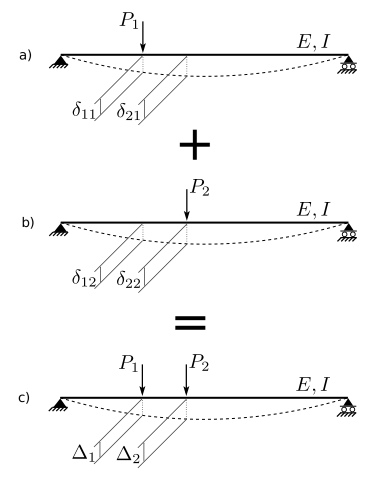
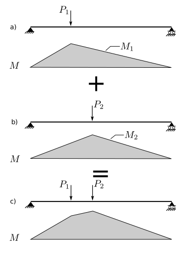
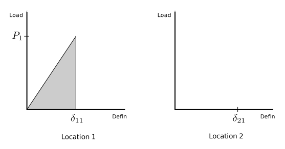
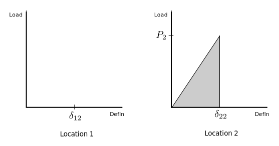
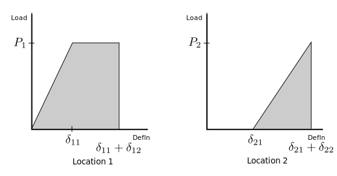
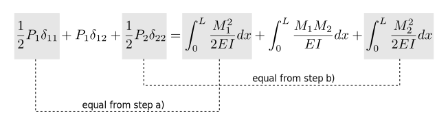

# 6. Elastic Displacements

## 6.3 Bettis Law and Virtual Work

### Principle of Superposition

The above figure shows, in sub-figure c), a beam subject to two concentrated forces, 
$P_1$ and $P_2$.  At each of those locations is also shown the corresponding
vertical displacements, $\Delta_1$ and $\Delta_2$.

Shown above that, in sub-figures a) and b) is the same beam with the loads
acting individually, rather than together as in c).

The principle of superposition says that any structural effect in 
c) can be determined by summing the same effect from a) and b).
More specifically, for one particular effect:

$$
\begin{align}
\Delta_1 &= \delta_{11} + \delta_{12}\\
\Delta_2 &= \delta_{21} + \delta_{22}\\
\end{align}
$$

where:

$\delta_{ij}$ is the displacement at location $i$ due to the force at location $j$.

The above figure shows the same three beams, but this time with the
bending moment diagram for each.  And again, the principle of superposition
says, that for any point along the span, the bending moment at that point in beam c)
is the sum of the bending moments at the same point in a) and b).

In beam a) the bending moment diagram is labelled as $M_1$ as it results
from the force applied at location 1.  Beam b)'s bending moment diagram
is labelled as $M_2$ as it results from the force at location 2.

### External Work and Strain Energy

__Step a)__

In the above beam, first imagine the force at location 1 increasing from 0 to
$P_1$ while $P_2$ is held at 0.  This would correspond to beam a) in the above figures,
and the load-displacement behaviour at the two locations is show here:

We can then compute external work and strain energy for that system:

$$
\begin{align}
U_{e1} &= \frac12 P_1\delta_{11}\\
U_{i1} &= \int_0^L \frac{M_1^2}{2 E I} dx\\
\\
\text{and}\\
\\
U_{e1} &= U_{i1}\\
\end{align}
$$

__Step b)__

Now imagine the force $P_1$ held to 0 and the force at location 2
increasing from 0 to $P_2$.

Now the work and energy terms are:

$$
\begin{align}
U_{e2} &= \frac12 P_2\delta_{22}\\
U_{i2} &= \int_0^L \frac{M_2^2}{2 E I} dx\\
\\
\text{and}\\
\\
U_{e2} &= U_{i2}\\
\end{align}
$$

__Step c)__

Finally imagine the force at location 1 increasing from 0 to $P_1$, then being held constant
at that value while the force at location 2 is increased from 0 to $P_2$.  
The final state will be beam c) in the above figures, with load-displacement
relationship shown here:

The total external work will involve the work done by force 1 as it increases and moves through
the displacement at 1 ($\delta_{11}$), 
plus the work done by the constant force $P_1$ as it moves through
the displacement at location 1 caused by increasing force $P_2$ ($\delta_{12}$), 
plus the work done by $P_2$
as it increases and moves through the displacement it causes at location 2 ($\delta_{22}$).

In other words:

$$
U_e = \frac12 P_1\delta_{11} + P_1\delta_{12} + \frac12 P_2 \delta_{22}
$$

and the strain energy calculations are similar:

$$
U_i = \int_0^L \frac{M_1^2}{2 E I} dx + \int_0^L \frac{M_1 M_2}{E I} dx + 
      \int_0^L \frac{M_2^2}{2 E I} dx
$$

The three terms above are:
1. strain energy due to increasing moments caused by force 1 acting through increasing
   curvatures caused by force 1.
1. strain energy due to constant moments caused by force 1 acting through increasing
   curvatures caused by force 2.
1. strain energy due to increasing moments caused by force 2 acting through increasing
   curvatures caused by force 2.
   
and, of course

$$
U_e = U_i
$$
 
 so:
 

and we are left with

$$
 P_1\delta_{12} =  \int_0^L \frac{M_1 M_2}{E I} dx
$$

This is a remarkable result.  It essentially says:

The external work done by load 1 acting through the
displacements caused by load 2 is equal to
the strain energy of the moments of load 2
acting through the curvatures caused by load 1.

That interpretation is as if we had writtent the right hand side of the equality as:

$$
 P_1\delta_{12} =  \int_0^L M_2 \frac{M_1}{E I} dx
$$

As multiplication is commutative, we can rewrite the right hand side thus:

$$
 P_1\delta_{12} =  \int_0^L M_1 \frac{M_2}{E I} dx
$$

and because the $M/EI$ terms are curvatures, the principle also says:

The external work done by load 1 acting through the
displacements caused by load 2 is equal to
the strain energy of the moments of load 1
acting through the curvatures caused by load 2.

### Virtual Work Example

The beauty of the above is that one of the load sets doesn't
even have to be real.  We can 'imagine' a force as load 1,
and perform the calculations to determine the displacement
caused by real load 2.  The force that we imagine, the virtual force, 
can be of any
non-zero magnitude.  It is convenient to use a magnitude of 1 (one).

 

The above figure shows the same beam that we used previously
in an example of the direct energy method. It has a single concentrated
force of $P$ acting at the middle of a span of length $L$.  We will call
that 'Load 2' for congruence with the principles summarized above.

In the bottom portion of the figure is the same beam, but now its
real loads are replaced by a single unit virtual load at the location
of and in the direction of the displacement we wish to calculate.
In algebraic terms, the above principle says:

$$
1\times\Delta = \int_0^L m_x \frac{M_x}{E I} dx
$$

working this out, we have:

$$
\begin{align}
\Delta &= \frac{2}{EI} \int_0^{L/2} \frac12 x \frac{P}{2}x dx\\
  &= \frac{P}{2EI} \int_0^{L/2} x^2 dx\\
  &= \left. \frac{P}{2EI} \frac{x^3}{3}\right|_0^{L/2}\\
\\
\Delta &= \frac{P L^3}{48 E I}\\
\end{align}
$$

This was about the same amount of work as the direct energy
method, but now this can be applied for any number of loads
in load set 2, and we can determine the displacement at
any locations just by varying the position of the virtual
unit load.

#### Dimensions

The dimensions of $M$ are [$F\times L$] (force$\times$length).

The dimensions of $m$ are [$L$] (the unit virtual load is unitless).

The dimensions of $\int m M dx$ are [$F\times L^3$].

The dimensions of $E$ is [$F/L^2$].

The dimensions of $I$ is [$L^4$].

The dimensions of $\int m M / E I dx$ is [$L$].
