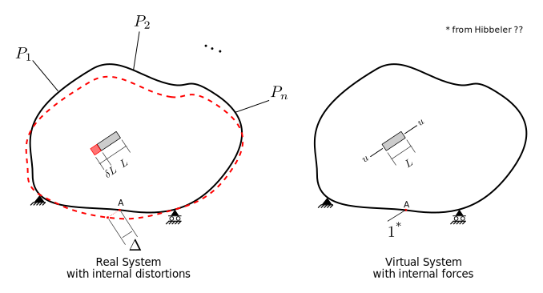

# 6. Elastic Displacements

## 6.4 Virtual Work

### 6.4.1 Generalized Virtual Work
 
    The following was taken from Hibbeler ...
	

The generalized principle of virtual work can be stated:

$$
1\times\Delta = \sum u \times \delta L
$$

Briefly:
* $1$ - a virtual load corresponding to the desired displacement.
* $\Delta$ - desired displacement in the real structure.
* $\delta L$ - distortion due to real effects in the real structure.
* $u$ - virtual force in equilibrium with applied virtual load.

The summation is discrete or continuous, as appropriate.

In the above figure, the left part shows a "real structure"
in generalized form.  There are a number of loads applied; these
may be concentrated or distributed forces or moments.  Also shown
is _one_ of the elements in the structure.  An element may be:
1. a member with constant axial load, or
1. a differential length of beam, or
1. a torsional member, etc.

Shown with the element is the distortion caused by the environmental
affects such as applied loads, temperature changes, etc.
Distortions, $\delta L$,
can be any of the following:
1. for an axially loaded member, the appropriate distortion is its change
   in length due to applied forces: $NL/AE$.
1. for a differential length of beam, the appropriate distortion
   is its curvature, calculated via $M/EI$.
1. for a torsion member of circular cross-section, the
   appropriate distortion is angle of twist, given by $TL/GJ$.
1. for a linear member subject to temperature change, 
   the appropriate distortion is change in length,
   given by $\alpha \Delta_T L$.
   
Note that some members in a structure may be subject to several
effects simultaneously.
The point is that all of these are straightforward to compute
usually using equilibrium, compatibility and elasticity (at
least in the case of forces).

Finally, the real system figure shows a displacement, $\Delta$,
in a particular direction at point A that we wish to compute.

The right portion of the figure shows the "virtual structure". 
It is the real structure with all loads and other environmental
effects removed.  A unit virtual force is applied to point A
in the direction we wish to know the displacement (note that had
we wanted a rotation, we would have applied a unit moment instead of
a unit force - the point being that the virtual force must be
compatible with the real displacement).

The element shows an internal virtual force, $u$, that is in equilibrium
with the applied unit virtual load at pont A.
1. if the element is an axially loaded member, $u$ is a tension force.
1. if the element is a differential length of beam, $u$ is a bending moment
   at the location of the element.
1. if the element is a torsion member, $u$ is a torque (moment about
   centroidal axis).

$u$ is of the same type as the real distortion, $\delta L$.

### 6.4.2 Virtual Work Procedure to Compute Displacement

1. For all structure types, analyze the structure and determine
   all relevant internal forces and moments under the real applied
   loads.

1. Apply a unit virtual load of the appropriate type at the location of
   and in the direction of the displacement we wish to determine.
   
   **For beams and frames, displacment due to bending**
   
   1. Compute $M$ for the entire structure, and form $M/EI$. These
      are the real distortions and are generally shown as M diagrams.
	  
   1. For the virtual load, determine the virtual moments, $m$, for
      the entire structure.
	  
   1. $\displaystyle \Delta = \int \frac{mM}{EI} dx$
	  
   **For trusses**
   
   1. Determine the real force, $N$, in each truss member.
   
   1. The real distortion of each truss member is:
   
      - $\displaystyle \delta L = \frac{N L}{A E}$, or
	  
	  - for temperature change, $\displaystyle \delta L = \alpha \Delta T L$, or
	  
	  - for fabrication errors, camber inducement, $\displaystyle \delta L = \Delta L$.
	  
   1. Compute the virtual force, $n$ in each member due to virtual load.
   
   1. $\displaystyle \Delta = \sum n \delta L$

