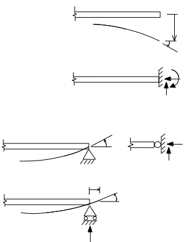
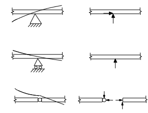
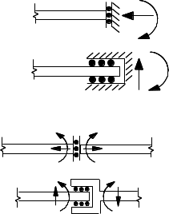

# 1: Fundamental Concepts

## 1.3: Boundary Conditions: Constraints and Internal Conditions

If a displacement or a relative displacement is
prevented, or constrained to be a certain value, there must be a
corresponding force that is exactly sufficient to ensure that
constraint.
 
If a displacement or relative displacement is freely allowed, the
corresponding force will be zero.

If an external or internal force is constrained to be
zero (or, rarely, some other specific value), there must be a
corresponding displacement that is exactly sufficient to ensure that
constraint.

At any point in a structure you cannot constrain both
*force* and *displacement*.  If one is constrained, the principles of
structural analysis must be used to compute the other.

This section by G.A. Hartley

### 1.3.1: Supports

Fig. 1-6: Support Conditions

From Statics we are familiar with beam support conditions. The free
end of a beam shown in Fig. 1-6 rotates and displaces without
restraint and carries no moment. The rigid wall cannot rotate or
displace and the end of the beam at the wall is capable of carrying
moment and shear, and (especially important for an inclined built-in
member) an axial force component could also be applied by the wall.

The pinned support is illustrated in two ways in Fig. 1-6. This
support condition prevents any translational displacement at the point
of connection, but rotation is permitted. The moment must be zero at a
pin. The version of the pin support to the right in Fig. 1-6, which we
will use occasionally in sketches of frames and arches, has been
included as a sort of limiting case of an internal articulation point,
which will be described presently. Normally the triangular shaped
pinned support on the left will be depicted in this text.

The roller support allows both a rotation, and also a displacement
along the direction of the plane on which the roller bearings sit. No
displacement, either up or down (in the configuration shown) is
permitted.  The roller can create neither a moment nor a reaction
force along the direction of rolling.

### 1.3.2: Conditions

Fig. 1-7: Internal Conditions (Support and Release)

In the analysis of general beam and frame systems we must be able to
deal with internal support and release conditions as well as end
support conditions. In the next chapter and throughout the book we
will encounter many beam and frame systems with combinations and
variations of these conditions. Three internal conditions are
illustrated in Fig. 1-7, the first two being support conditions and
the third a *release* condition.

The pinned support in Fig. 1-7 provides 2 reactions as shown. There is
no applied moment reaction, however, there is an internal bending
moment and slope continuity of the elastic curve of the structure must
be satisfied across the support.

The roller support shown in Fig.1-7 provides one reaction force, and
as with the pinned support the continuity of slope of the elastic
curve is maintained across the support.

At the internal hinge there is no bending moment. There are no
external reactions, but both internal axial force and shear are
possible in general. The internal condition can be stated briefly as
follows. The beam remains connected at this point, but the connected
elements are free to articulate about it.

The distinction between internal support conditions and
other support conditions is not very useful, but the determination of
internal release conditions is essential for understanding statical
determinacy (in a later section).

### 1.3.3: Contrived Supports and Conditions

Fig. 1-8: Contrived end and internal conditions

The conditions pictured in Fig. 1-8 are called contrived. As unusual
and impractical as these might appear, we may find these useful in
"statically indeterminate analysis" coming up later, where we will
have to create our own "released structures" which may well involve
the cases shown in the figure.

The external end reactions, and the internal member forces that
accompany each of these conditions are shown.

It is useful to classify the top two of these as supports, and the
bottom two as internal release conditions.
