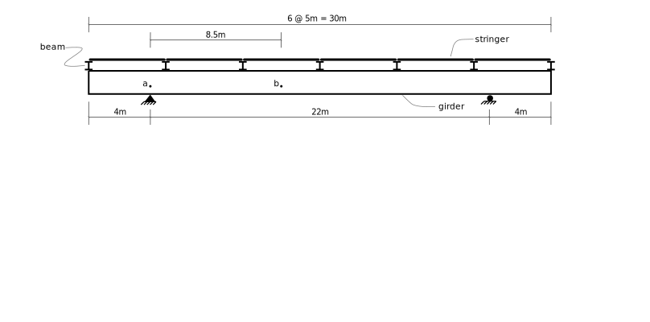
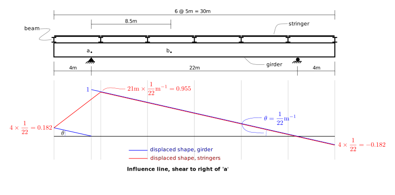
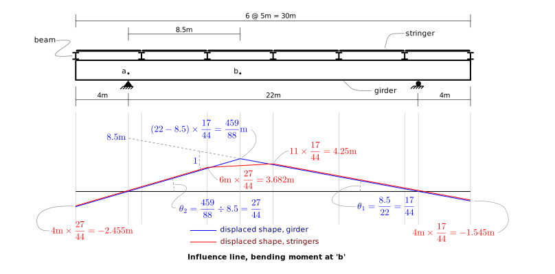

# 5. Influence Lines

## 5.2 Solved Problems

- [Example Set 1](../../images/influencelines/problems/influence-lines-2.pdf)

- [Example Set 2](../../images/influencelines/problems/influence-lines-3.pdf)

### Loads not applied directly to members

Sometimes loads are applied to one part of a structure, but an influence
line is wanted for the resulting action in another part.  When using the 
Muller-Breslau principle to draw the influence line, it is important
to know that unit displacements are imposed at the appropriate part
of the structure where the response is desired, but it is the displaced
shape of the load-carrying portion that provides the influence line.

A common example is that of a bridge structure such as that shown
above. The main load carrying girders are parallel to the road
direction and span between piers, but there may be only two of these
placed a considerable distance apart.  If the deck slab had to span
between the girders, it would be very thick and heavy.  So cross beams
are placed at regular intervals.  Then stringers are placed close
together, spanning between beams.  The slab then only has to span
between stringers and can be lighter as a result.

Wheel loads are transferred to the slab, then from the slab to the
stringers, then from the stringers to the beams and finally from the
beams to the girders and then into the supports.

Because environental loads are applied to the stringers,
it is the displaced shape of the stringers that gives the influence line.

If you wish an influence line for an action, such as shear force in the girder,
you must displace the girder appropriately then draw the resulting displaced
shapes of the stringers.

This is shown in the above figure.  It gives the influence line for shear in
the girder just to the right of point $a$.

The above figure gives the influence line for bending moment in the 
girder at point $b$.
