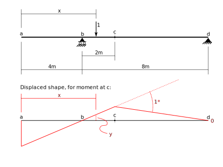

 # 5. Influence Lines

## 5.1 Introduction (Part 2) - M&uuml;ller-Breslau Principle

This section repeats the creation of one of the influence
lines of the previous section.  This time we will use the
principle of virtual displacement, instead of equilibrium.

The above figure shows the displaced shape used to determine the moment at 
point $c$.  Recall how that was constructed:

1. The constraint corresponding to the moment at $c$ was released.  
   In this case, that constraint is on relative rotation of the beam either
   side of point $c$.
1. A _unit_ value of the displacement is imposed at the released constraint.
1. A displaced shape is drawn where _all_ other constraints are met.

The resulting virtual displaced shape is shown in red in the lower part 
of the figure.

Now, for the influence line, we wish to determine moment at $c$ due to a
unit load applied a distance, $x$, from the left support.  That load is 
shown in the top part of the figure.

To use the method of virtual work (virtual displacement), we need to
know the displacements on the virtual displacement diagram 
corresponding to positions of the
load.  Here we show the single displacement, under the unit load,
labelled as the distance, $y$,  on the lower figure.

We can now write the virtual work expresssion and solve for
the moment at $c$:

$$
\begin{align}
&M_c \times 1 - 1 \times y = 0\\
&M_c = y\\
\end{align}
$$

This tells us that the moment at point $c$ due to a unit load at any 
point, is simply the ordinate on the displaced shape.  In other words,
the displaced shape _is_ the influence line!!

<b>M&uuml;ller-Breslau Principle:</b>
The influence line for a structural response is given by the displaced
shape of the structure when the constraint corresponding to the
response is removed and a <i>unit</i> displacement is introduced
in its place.

### Procedure

1. Relax the constraint corresponding to the response for which
   you wish to construct the influence line.  Typical constraints are:
   1. Absolute translation for force reactions.
   1. Absolute rotation for moment reactions.
   1. Relative longitudinal displacement for axial forces (relative transverse
      displacements and relative rotations being maintained).
   1. Relative transverse displacement for shear force (relative longitudinal 
      displacement being mainatained, as well as relative rotation (unless the
	  moment is forced to be 0).
   1. Relative rotation for bending moments (relative longitudinal 
      displacement being mainatained, as well as relative transverse (unless the
	  shear force is forced to be 0).
1. Impose a unit relative displacement in its place.
1. Draw a displace shaped of the structure with _all other_ constraints 
   maintained.
1. Compute ordinal values at key locations on the displaced shape.
	  

