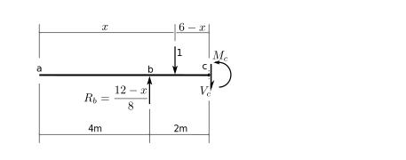
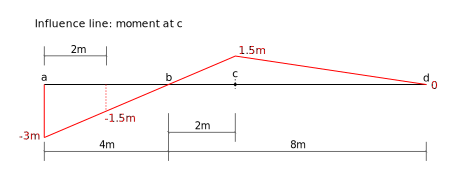

# 5. Influence Lines

## 5.1 Introduction

- [Introduction Part 1](../../images/influencelines/introduction/influence-lines-1.pdf) A short introduction to the concept and the direct way of forming the influence line.
- Introduction Part 2 (to come)

### What an influence line is

An influence line is a plot of how a structural response varies as a unit load
is placed at various locations on the stgructure.  For example, see the following
figure:

In that structure, the unit load is placed a distance $x$ from the left end of the beam.
We could determine functions that give us the corresponding shear force, $V_c$,
and bending moment, $M_c$ at point $c$, as a function of that distance $x$.
The plots of these functions over the range $0\text{m} \le x \le 12\text{m}$
would be influence lines for the two responses.

We will first show the development of these functions and influence lines from
first principles.

### Determine the reactions

In order to determine shear and moment at point $c$ for any position of the 
unit load, it is necessary to first determine at least one of the reactions,
expressed as a function of $x$.

The above is a free body diagram of the entire structure, with the
unit load placed a distance $x$ from the left end.  To determine the reactions,
it is a simple matter of applying standard equilibrium.

$$
\begin{split}
\sum M_d &= 0~~~~+\text{CCW}\\
1\times(12-x)\text{m} - R_b\times8\text{m} &= 0\\
R_b &= \frac{12-x}{8}\\
\end{split}
$$

$$
\begin{split}
\sum F_y &= 0~~~~+\uparrow\\
-1 + R_b + R_d &= 0\\
-1 + \frac{12-x}{8} + R_d &=0\\
R_d &= \frac{x-4}{8}\\
\end{split}
$$

And remember, $x$ is only valid in the range

$$
0 \le x \le 12\text{m}
$$

### Unit load left of c

The next step is to 'cut' the structure at point $c$, draw a FBD of one side of the cut,
and determine the shear and the moment at $c$ as a function of the applied forces.

We normally draw an FBD of the left side, so that is what we will do here (thought the
right side would work just as well).

But we notice there are two possible, and different FBDs.  One that includes the un it load,
for use when its position $x$ is $x\le 6\text{m}.  The first free body above represents
that case.

$$
\begin{split}
\sum F_y &= 0~~~+\uparrow\\
\frac{12-x}{8} - 1 - V_c &= 0\\
V_c &= \frac{4-x}{8}\\
\sum M_c &= 0~~~+\text{CCW}\\
1\times(6-x)\text{m} + M_c - \frac{12-x}{8}\times2\text{m} &= 0\\
M_c &= \frac{3}{4}x -3\text{m}\\
\end{split}
$$

### Unit load right of c

### Moment as a function of x

### Shear as a function of x

