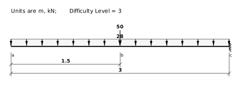

---
redirect_from:
  - "/text/sdbeams/beam-vm-problems"
title: 'Problems - Beam VM Diagrams'
prev_page:
  url: /text/sdbeams/NVM-diagrams.html
  title: 'NVM Diagrams'
next_page:
  url: /text/sdbeams/frame-NVM-problems.html
  title: 'Problems - Frame NVM Diagrams'
comment: "***PROGRAMMATICALLY GENERATED, DO NOT EDIT. SEE ORIGINAL FILES IN /content***"
---
# 2: Forces in Statically Determinate Beams and Plane Frames

## 2.8: Internal Forces in Beams

### 2.8-P1: Problem Set (1)

**Suggested Problems**

Draw complete free body, shear, and moment diagrams for the following beam structures. 

Click on the link to see the solution.

[Solution](../../images/sdbeams/probs-beams-vm/P-2-6-0001-soln.svg)

Problem 2.8-0001

[Solution](../../images/sdbeams/probs-beams-vm/P-2-6-0002-soln.svg)

Problem 2.8-0002

[Solution](../../images/sdbeams/probs-beams-vm/P-2-6-0003-soln.svg)

Problem 2.8-0003

[Solution](../../images/sdbeams/probs-beams-vm/P-2-6-0004-soln.svg)

Problem 2.8-0004

[Solution](../../images/sdbeams/probs-beams-vm/P-2-6-0005-soln.svg)

Problem 2.8-0005

[Solution](../../images/sdbeams/probs-beams-vm/P-2-6-0006-soln.svg)

Problem 2.8-0006

[Solution](../../images/sdbeams/probs-beams-vm/P-2-6-0007-soln.svg)

Problem 2.8-0007

[Solution](../../images/sdbeams/probs-beams-vm/P-2-6-0008-soln.svg)

Problem 2.8-0008

[Solution](../../images/sdbeams/probs-beams-vm/P-2-6-0009-soln.svg)

Problem 2.8-0009

[Solution](../../images/sdbeams/probs-beams-vm/P-2-6-0010-soln.svg)

Problem 2.8-0010

[Solution](../../images/sdbeams/probs-beams-vm/P-2-6-0011-soln.svg)

Problem 2.8-0011

[Solution](../../images/sdbeams/probs-beams-vm/P-2-6-0012-soln.svg)

Problem 2.8-0012

[Solution](../../images/sdbeams/probs-beams-vm/P-2-6-0013-soln.svg)

Problem 2.8-0013

[Solution](../../images/sdbeams/probs-beams-vm/P-2-6-0014-soln.svg)

Problem 2.8-0014

[Solution](../../images/sdbeams/probs-beams-vm/P-2-6-0015-soln.svg)

Problem 2.8-0015

[Solution](../../images/sdbeams/probs-beams-vm/P-2-6-0016-soln.svg)

Problem 2.8-0016

[Solution](../../images/sdbeams/probs-beams-vm/P-2-6-0017-soln.svg)

Problem 2.8-0017

[Solution](../../images/sdbeams/probs-beams-vm/P-2-6-0018-soln.svg)

Problem 2.8-0018

[Solution](../../images/sdbeams/probs-beams-vm/P-2-6-0019-soln.svg)

Problem 2.8-0019

[Solution](../../images/sdbeams/probs-beams-vm/P-2-6-0020-soln.svg)

Problem 2.8-0020
