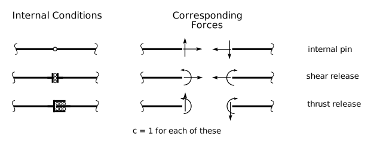

# 2: Forces in Statically Determinate Beams and Plane Frames

## 2.2: Stability and Determinacy

### 2.2.1: General Concepts of Determinacy

A structure is *statically determinate* if the equations of static
equilibrium are sufficient by themselves to determine all forces
acting on and within a structure.  Sometimes it is useful to
distinguish between *external determinacy* and *internal determinacy*.
A structure is *externally statically determinate* if its reactions
can be completely determined using only the equations of equilibrium.
A structure is *internally statically determinate* if all member
forces (normal, shear and bending moments) can be completely
determined using only the equations of statics.

The *degree of indeterminacy* of a structure is the excess number of
unknown quantities (reactions and internal forces) over the number of
independent equations of equilibrium available to solve for them.  If
the degree of indeterminacy is greater than 0, the structure is
statically indeterminate. If it is equal to 0, the structure is
statically determinate, but only if it is stable.  If the degree is
less than 0, then the structure is unstable (see below), and its
statical determinacy is not very relevant.

To determine the degree of indeterminacy of a structure, we simply
count the number of unknowns and compare to the number of equations
available.

### 2.2.2: Determinacy of Beams and External Determinacy of 2D Frames

For beam structures that are single linear elements with one or more
supports, we can take a somewhat simplified approach, one that deals
with _external determinacy_ only.  Thats OK for beam structures 
as they will be
internally determinate if they are externally determinate.

### Number of Unknowns

The number of unknowns is simply the number of independent reaction
components, $r$, in the entire structure:

If $r =$ the number of independent reaction components for the entire structure,
where 
$r = \sum r_c$ over all of the supports in the structure, and $r_c$ for each
support can be determined from the following table:

Figure 2.1: Reaction Components

then the number of unknowns is:

$$
r
$$

### Number of Equations

There are 3 equations available from the overall FBD.  Each condition that specifies
a known internal force value and that allows the beam to be cut into two separate
parts at the condition adds 1 independent equation.

Figure 2.2: Internal Conditions

If $c$ is the total number of releases in the beam.

The number of equations is:

$$
3 + c
$$

### Statical Determinacy

if $r < 3+c$,
   then the beam is unstable and determinacy does not matter very much.

if $r = 3+c$,
   then the beam is statically determinate, _if it is stable_.

if $r > 3+c$,
   then the beam is statically indeterminate. It may still be unstable.

Stability must be investigated separately from determinacy; 
one does not imply the other.

### 2.2.3: Determinacy of Beam and Frame Structures

The more general case works for beams and 2D Frames and also includes
the evaluation of internal determinacy.

### Number of Unknowns

Fig. 2.1 shows the most common support symbols and the independent
reaction components for each; column $r_c$ shows the
corresponding number of independent reaction components.  As before, we can
define:

$r$
   The number of independent reaction components for the entire structure, 
   $r = \sum r_c$ over all of the supports in the structure.

Members in a beam or frame structure are those portions that span
between supports, or joints (connections to other members), or free
ends.  Each member has exactly two joints, one at either end.  If the three
internal force components -- normal force (N), shear force (V) and
bending moment (M) are known at a point in a member, then that member
is completely determined.  That is, we can use simple statics to
determine the internal forces at any other point.  It can thus be said
that there are 3 unknowns associated with each member -- 3 independent
quantities that need be determined before everything is 'known'. So,
defining

$m$
   The number of members in a structure.

Then we have, as the number of unknowns:

$$
   N_u = 3m + r
$$

### Number of Equations

To determine the number of independent equilibrium equations that are
available to solve for the unknowns, we define:

$j$
   The number of joints in the structure.  Every member is connected to exactly 
   two joints, one at each end.

$c$
   The number of internal release conditions.  A condition is a constraint that specifies 
   that an internal force must be a particular numerical value (almost always zero) at a 
   point.  An example is an internal hinge or pin that constrains the bending moment to be 0.

It is possible to write 3 equations of equilibrium at each joint, and one more for 
each condition.  We state without proof, then, that the number of independent 
equilibrium equations is:

$$
N_e = 3j + c
$$

### Statical Determinacy

The _degree_ of statical indeterminacy is the number of unknowns in excess of the
number of equations:

$$
N_u - N_e = (3m + r) - (3j + c)
$$

To judge determinacy, we have the following three cases:

if   $(3m+r) < (3j + c)$,
   then the system is unstable.
   
if   $(3m+r) = (3j + c)$,
   then the system is statically determinate, _if it is stable_.
   
if   $(3m+r) > (3j + c)$,
   then the system is statically indeterminate.  It may also be unstable.

The latter two cases, $(3m+r)\ge(3j+c)$ are necessary, but not sufficient, for stability.

   The degree of statical indeterminacy is given by
   $(3m+r)-(3j+c)$ where $m$ =  number of members, $r$ = number of
   independent reaction components, $j$ = number of joints, and $c$ =
   number of conditions.

   If the degree of statical determinacy is negative, the structure is
   unstable.  If it is 0 or positive, the structure <em>may</em> be stable.

   If a real structure is unstable, that is almost always a disaster.

### 2.2.4: Determinacy Examples

Fig. 2-3, below, shows a number of examples of determinacy calculations.

Fig. 2-3: Examples of Determinacy Calculation

### Observations

 1. Internal hinges (conditions) such as those shown in examples,
    _iv_, _v_, _vii_, and _viii_ are not usually counted as joints,
    and thus we usually count just one member continuously through the
    hinge.  However, they can be counted as joints, in which case the
    one member becomes two, for consistency (every member has exactly
    two joints).  This adds 1 to _m_ and 1 to _j_ and thus does not
    change the important result.  This is illustrated in examples _iv_
    and _v_, which are otherwise identical, and in example _vii_.

 1. The determinacies given are _overall_ -- they include both member
    forces and reaction determination.  It is possible for a structure to
    be indeterminate, overall, and yet still be statically determinate
    with respect to the reactions (i.e., _externally_ statically
    determinate).  This is illustrated in example _viii_.

 1. If we define $c'$ as the number of conditions at which it is
    possible to separate the structure into two complete halves, then
    $c'=1$ in example _viii_.  The minimum number of reaction
    components necessary for stability is $r_{min}=3+c'$ and
    thus $r_{min}=4$ for this example.  If $r=r_{min}$, as
    it is in this case, the structure is statically determinate
    externally.

   The minimum number of independent external reaction components
   require for stability is $r_{min} = 3 + c'$, where $c'$ = the
   number of conditions at which the structure may be separated into
   two complete parts.

   If $r = r_{min}$, the structure is statically determinate externally, if it is stable.

### 2.2.5: Stability of Beam and Frame Structures

A structure is *stable* if it cannot undergo any small rigid-body
geometry changes.  It is important to recognize instability as it is
vitally important that no civil engineering structures are unstable.
An unstable structure will lead to either collapse, large
deformations, or very high member forces.

It is always possible to precisely determine the stability of a
structure by setting up all the possible equilibrium equations in
matrix form.  If the rank of the resulting matrix is less than the
number of rows, then the set of equations has no unique solution and
the structure is unstable.

   Someday there will be an example of the matrix method, but not today.

This method is laborious and impractical for hand calculation, so we
look for something easier to apply.  The method we will choose
involves looking for _mechanisms_ - i.e. _small_ geometry changes that
are otherwise consistent with all the displacement constraints in the
structure.  Only when we can't find a mechanism can we have some
confidence that the structure is stable.

 
   You can prove a structure is
   unstable by finding a mechanism.  You can't use this method to
   prove a structure is stable, however -- you can only fail to find a
   mechanism.  You have to try all possible mechanisms, and that
   number may be very large for larger structures.  

### Stability Example 1

Fig. 2-4: Stability Example 1.

Consider the first example of Fig. 2-4.  Counting the members, joints,
reactions and conditions tells us that the structure is statically
determinate, if it is stable.  But is it stable?  We must look for
mechanisms.

Start at one edge of the structure and proceed segment by segment,
looking for valid displacements.  Start with member _a-b_; it is
constrained against horizontal and vertical displacement at _a_, but
is free to rotate about _a_, and must stay straight from _a_ to _b_.
Point _b_ can move anywhere vertically on the line through _b_
(remember, _small_ displacements); let it move downwards.

Now point _b_ on _b-c-d_ must also move downwards, as there is a
constraint that both sides of _b_ must displace the same amount.
However, there is no constraint against relative rotation at _b_, so
we can let _b-c-d_ rotate relative to _a-b_.  _b-c-d_ is also
constrained against vertical displacement at _c_ and must remain
straight.  This can be accomplished by allowing point _d_ to displace
upwards, along the vertical line through its original location.

Point _d_ on _d-e_, now, must also move upward the same amount, and it
can be letting _d-e_ rotate clockwise about _e_.

So, we have found a mechanism - a set of small, consistent, geometry
changes.  Therefore, that beam is unstable.

### Stability Example 2

Fig. 2-5: Stability Example 2

Now consider the beam structure in Fig. 2-5.  All of the supports and
counts are the same as the previous example, but this time the
supports at _c_ and _e_ are displaced vertically.  Again, try to find
a mechanism.

Start with _a-b_ and imagine a rotation about _a_.  Point _b_ must
remain on the vertical line through _b_ -- that line is perpendicular
to the radius from _a_ to _b_.

Now consider a rotation of _b-c-d_ about _c_.  For this to happen,
point _b_ must remain along the inclined line through _b_, as that
line is perpendicular to the radius from _c_ to _b_.  Point _b_, then
has to lie on both lines, and the only point of intersection of those
two lines is at the original location of _b_.  Therefore, point _b_
cannot move,so that is not a possible mechanism.

This does not prove that the structure is stable, you must look for
other possible mechanism.  For this structure, you will not find a
mechanism, and you may eventually conclude that the structure is
stable.

### Stability Example 3

Fig. 2-6: Stability Example 3

Now see what happens when we change the pin at _c_ to a roller, as
shown in Fig. 2-6.  Starting with _a-b_, we allow _b_ to move along
the vertical line through _b_.  _b_ on _b-c-d_ can also move the same
amount along the same line by allowing point _c_ to move to the right
as _b-c-d_ rotates counter clockwise.  It can do that, as _c_ is a
roller and allows the horizontal displacement.  Point _d_ moves
upwards and to the right as a result of the rotation of _b-c-d_.
_d-e_ can rotate about _e_ while _e_ moves rightward (remember that
the lengths of the members must not change).

So, we have found a mechanism, so this structure is unstable. :-( But
you could have also told that by counting.
