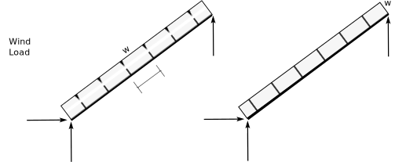
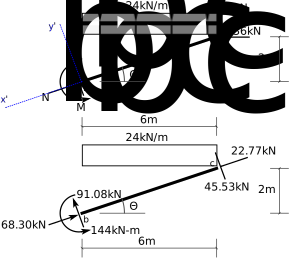

# 2: Forces in Statically Determinate Beams and Plane Frames

## 2.7: External Reactions in Frames (Part 1)

### 2.7.1: Loads on Inclined Members, Examples

**Basic Structure**

 
Figure 2.7-1: Inclined Beam

We will show the effects of different kinds of loads on the structure shown in Fig. 2.7-1.

**Snow Loads**

 
Figure 2.7-2: Snow Loads

Snow loads act vertically on the structure and are computed by
determining the weight of snow plus rain resting on a horizontal
surface (i.e., the 'ground' snow load).  These are often converted to
distributed loads acting on frame members by multiplying by the frame
spacing (member loaded width, really).  When expressed as a uniform
load such as 10kN/m, the distance is measured horizontally.

$$
   \begin{split}
   \sum M_a &= -10\times4\times2 + V_b\times4 = 0\\
   V_b &= 20\\
   \sum F_y &= -10\times4 + V_b + V_a = 0\\
   V_a &= 20\\
   \sum F_x &= H_a = 0\\
   H_a &= 0\\
   \end{split}
$$

**Dead Loads**

 
Figure 2.7-3: Dead Loads

Dead loads act vertically on the structure and are computed by
determining the self weight of the structure.  This usually means
estimating the weight of a unit area of the inclined surface, and
multiplying that by the loaded width to get a distributed load.  When
expressed as a uniform load such as 10kN/m, the distance is measured
along the incline.

$$
   \begin{split}
   \sum M_a &= -10\times5\times2 + V_b\times4 = 0\\
   V_b &= 25\\
   \sum F_y &= -10\times5 + V_b + V_a = 0\\
   V_a &= 25\\
   \sum F_x &= H_a = 0\\
   H_a &= 0
   \end{split}
$$

**Wind Loads**

 
Figure 2.7-4: Wind Loads

Wind loads act perpendicular to the surface and are computed by
determining wind pressure acting on that surface and multiplying by
the loaded width to get a distributed load acting on the member.  When
expressed as a uniform load such as 10kN/m, the distance is measured
along the incline.

$$
   \begin{split}
   \sum M_a &= -10\times5\times2.5 + V_b\times4 = 0\\
   V_b &= 31.25\\
   \sum F_y &= -10\times5\times{4\over5} + V_b + V_a = 0\\
   V_a &= 8.75\\
   \sum F_x &= 10\times5\times{3\over5} - H_a = 0\\
   H_a &= 30
   \end{split}
$$

### 2.7.2: Loads on Inclined Members, General Relationships

Here are some general relationships, expressed in terms of the
geometry of the basic structure.  For each load case are shown the
moment about point _a_, $M_a$, the total vertical component, $F_y$,
and the total horizontal component, $F_x$.  Also shown are the
distributed components normal to the member, $w_n$ and parallel to it,
$w_p$.  These distributed components, $w_n$ and $w_p$, are particularly
important when it comes time to construct the NVM diagrams for sloped
members, but can also be useful for local member equilibrium.

**Basic Structure**

 
Figure 2.7-5: Inclined Beam

The following relationships hold for this structure:

$$
   \begin{split}
   h &= L\cos\theta\\
   L &= h/\cos\theta
   \end{split}
$$

**Snow Load**

 
Figure 2.7-6: Snow Load and Distributed Components

For the distributed snow load, _w_:

$$
   \begin{split}
   F_x &= 0\\
   F_y &= w h\\
   M_a &= w h {h\over2}\\
   w_n &= { {w h \cos\theta}\over L}\\
   w_p &= { {w h \sin\theta}\over L}
   \end{split}
$$

**Dead Load**

 
Figure 2.7-7: Dead Load

For the distributed dead load, _w_:

$$
   \begin{split}
   F_x &= 0\\
   F_y &= w L\\
   M_a &= w L {h\over2}\\
   w_n &= { {w L \cos\theta}\over L} = w \cos\theta\\
   w_p &= { {w L \sin\theta}\over L} = w \sin\theta
   \end{split}
$$

**Wind Load**

 
Figure 2.7-8: Wind Load

For the distributed wind load, _w_:

$$
   \begin{split}
   F_x &= w L \sin\theta\\
   F_y &= w L \cos\theta\\
   M_a &= w L {L\over2}\\
   w_n &= w\\
   w_p &= 0
   \end{split}
$$

### 2.7.3: Example 2.7.3-1

Determine the reactions for the gable frame subjected to the unbalance
snow load shown in Fig. 2.7-9.  Also, calculate the member end forces,
draw an FBD for each individual member, and check the equilibrium of
the two hip joints.

**Reactions**

Figure 2.7-9: Gable Frame

The frame is a three-hinged arch, and so we know it is both statically
determinate and stable.  Nevertheless, we can count $m=4$, $r=4$,
$j=5$, and $c=1$.  Thus $3m+r=13$ and $3j+c=13$ and therefore
statically determinate if stable.  It is stable.

Figure 2.7-10: Complete Frame Free Body Diagram

Figure 2.7-10 shows the free body diagram of the complete frame.
There are four unknowns, but because the supports _a_ and _e_ are at
the same elevation, we can write some equilibrium equations that only
involve only one unknown and are thus solvable:

$$
   \begin{split}
   \sum M_a &= 0~~~~~\text{+CCW}\\
            &= -24\times6\times{6\over2}+V_e\times12\\
         V_e &= 36~~~~~(\therefore\uparrow)\\
   \sum F_y &= 0~~~~~\text+\uparrow\\
            &= V_a - 24\times6 + V_e\\
            &= V_a - 144 + 36\\
        V_a &= 108~~~~~(\therefore\uparrow)
   \end{split}
$$

Figure 2.7-11: Partial Frame Free Body Diagram

Fig. 2.7-11 shows a free body diagram of the right portion of the
structure, resulting from cutting the structure at the condition at
_c_.

$$
   \begin{split}
   \sum M_c &= 0~~~~~\text{+CCW}\\
            &= V_e\times6 - H_e\times6\\
        H_e &= V_e\\
        H_e &= 36~~~~~(\therefore\leftarrow)
   \end{split}
$$

We could have done this a little more simply by recognizing the
portion _c-d-e_ is a _two-force member_, subjected only to forces at
the pin on either end.  That means that the resultant of $V_e$ and
$H_e$ (and also of $V_c$ and $H_c$ must lie along the line joining the
ends, _c-e_.  As that line has a 1:1 slope in this problem, the
components $V_e$ and $H_e$ must be equal.

   Recognizing and identifying _two-force members_ can often make the analysis a little simpler.

Figure 2.7-12: Summary Free Body Diagram

Going back to the first free body diagram, we can now write:

$$
   \begin{split}
   \sum F_x &= 0~~~~~\text+\rightarrow\\
            &= H_a - H_e\\
            &= H_a - 36\\
        H_a &= 36~~~~~(\therefore\rightarrow)
   \end{split}
$$

Fig. 2.7-12 shows the results of the reaction calculation on a summary freebody diagram.

**Member End Forces**

Figure 2.7-13: Column _a-b_

To determine the forces (normal, shear and moment) at each of the
member ends, we draw a FBD for each.  Fig. 2.7-13 shows this for
column _a-b_.  The left portion of the figure shows a FBD with the
unknowns labelled; the right figure shows the summary results.

As this is a particularly simple FBD, we will simply write the
equilibrium expressions.

$$
   \begin{split}
   &N_{ba} = 108~\text{kN}\\
   &V_{ba} = 36~\text{kN}\\
   &M_{ba} = 36\times4 = 144~\text{kNm}
   \end{split}
$$

Figure 2.7-14: Column _d-e_

Similarly, column _d-e_ is shown in Fig. 2.7-14.

$$
   \begin{split}
   &N_{de} = 36~\text{kN}\\
   &V_{de} = 36~\text{kN}\\
   &M_{de} = 36\times4 = 144~\text{kNm}
   \end{split}
$$

Figure 2.7-15: Roof Beam _c-d_

Fig. 2.7-15 shows roof beam _c-d_.  It has not loads applied directly
to it.  From our previous work above, we know the horizontal and
vertical components applied to the end coming from the pin _c_, so we
show that in the top figure of the FBD.  To get the shears and normal
forces at end _d_, it is probably easiest to construct the _x'-y'_
axis system, with _x'_ parallel to the beam, as shown in the figure.

Having done that, we can then write equilibrium equations involving only one unknown each.

$$
   \begin{split}
   &\theta = \tan^{-1}{2\over6} = 18.44^\circ\\
   &\sum F_{y'} = 0:\\
   &V_{dc} = 36\times\cos\theta - 36\times\sin\theta\\
   &V_{dc} = 22.77\\
   &\sum F_{x'} = 0:\\
   &N_{dc} = 36\times\cos\theta + 36\times\sin\theta\\
   &N_{dc} = 45.53\\
   &\sum M_b = 0:\\
   &M_{dc} = 36\times6 - 36\times2\\
   &M_{dc} = 144\\
   \\
   &N_{cd} = N_{dc} = 45.53\\
   &V_{cd} = V_{dc} = 22.77\\
   \end{split}
$$

Figure 2.7-16: Roof Beam _b-c_

Fig. 2.7-16 shows the last remaining roof beam, _b-c_.  It is slightly
more complicated than the previous one due to the fact that it has a
distributed load applied.  We show that in a form thats most
convenient for our calculations.  We also show the pin forces at _c_
being _equal and opposite_ to the forces shown on the adjacent beam
_c-d_.

$$
   \begin{split}
   &\sum F_{y'} = 0:\\
   &V_{bc} = 24\times6\times\cos\theta - 36\times\cos\theta - 36\times\sin\theta\\
   &V_{bc} = 91.08\\
   &\sum F_{x'} = 0:\\
   &N_{bc} = 24\times6\times\sin\theta + 36\times\cos\theta - 36\times\sin\theta\\
   &N_{bc} = 68.30\\
   &\sum M_b = 0:\\
   &M_{bc} = 24\times6\times3 - 36\times6 - 36\times2\\
   &M_{bc} = 144\\
   \\
   &V_{cb} = 24\times6\times\cos\theta - 91.08\\
   &V_{cb} = 45.53\\
   &N_{cb} = 68.30 - 24\times6\times\cos\theta\\
   &N_{cb} = 22.77
   \end{split}
$$

**Joint Equilibrium**

Transferring the equal and opposites of the member end forces to the
joints allows us to check joint equilibrium.

Figure 2.7-17: Joint _b_

Fig. 2.7-17 is a free body diagram of joint _b_, the one that connects
members _a-b_ and _b-c_.  The joint has no dimensions -- it is of zero
size.  Checking equilibrium gives us:

$$
   \begin{split}
    &\sum M = 144 - 144 = 0~~~~~\text{O.K.}\\
    &\sum F_x = 36 + 91.08\sin\theta - 68.30\cos\theta = -0.002~~~~~\text{O.K.}\\
    &\sum F_y = 108 - 91.08\cos\theta - 68.03\sin\theta = -0.001~~~~~\text{O.K.}
    \end{split}
$$

Therefore, equilibrium is satisfied at joint _b_.

Figure 2.7-18: Joint _d_

Fig. 2.7-18 is a free body diagram of joint _d_, the one that connects
members _c-d_ and _d-e_.  Checking equilibrium gives us:

$$
   \begin{split}
    &\sum M = 144 - 144 = 0~~~~~\text{O.K.}\\
    &\sum F_x = -36 - 22.77\sin\theta + 45.53\cos\theta = -0.004~~~~~\text{O.K.}\\
    &\sum F_y = 36 - 22.77\cos\theta - 45.53\sin\theta = 0.004~~~~~\text{O.K.}
    \end{split}
$$

Therefore, equilibrium is satisfied at joint _d_.

For joint _c_, we can examine end _c_ of member _c-d_ in Fig. 2.7-15,
and end _c_ of _b-c_ in Fig. 2.7-16, we notice that the moments are
zero, and that the shears and normal forces are equal and opposite.
Therefore, by inspection, we see that equilibrium is also statisfied
at joint _c_.

The fact that joint equilibrium checks is very good evidence that you
have not made errors in calculation.  Unfortunately, it is not proof.
It is necessary, but not sufficient to prove correctness.

   Checking joint equilibrium is an <em>essential</em> part of checking your work.

