# 3: Forces in Statically Determinate Trusses

## 3.2: Determinacy and Stability

### 3.2.1: Determinacy

If there are $m$ members in a truss and $r$ independent reaction
components, then the total number of unknowns to to be determined is
$m+r$.  We will see later that the number of independent equations of
equilibrium available to solve for this is $2j$, where $j$ is the
number of joints in the truss.

One requirement for stability is that

$$
   m + r \ge 2j
$$

As usual, that is a necessary, but not sufficient, for stability.  

When $m + r > 2j$, then the degree of statical indeterminacy is

$$
   m + r - 2j
$$

### 3.2.2: Stability

In the worst case, it can be very difficult to tell by observation
whether a truss is stable or not.  We will start by learning to
recognize some special configurations, and at the same time introduce
a classification system that can help.

**Simple Trusses**

Figure 3.2.2-1:  Triangle (base truss unit)

A simple truss is one that can be built up starting from a triangular
arrangement of 3 members and 3 joints, such as that shown in
Fig. 3.2.2-1.

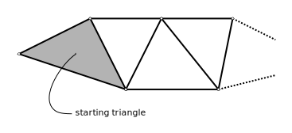

Figure 3.2.2-2: Simple truss built from base unit

The truss is to be built up in steps by adding 2 members and a joint
at each step, as shown in Fig. 3.2.2-2.  The original triangle is
stable, and if, at each step, the two new members are not co-linear,
the result will be stable as well.

The base triangle has $m=3$ and $j=3$.  The minimum stable support set
consists of a pin and a roller, so $r=3$ for the case of a simply
supported base.  Overall, we see that $m+r=2j$ and thus the triangular
base unit is statically determinate when simply supported (by a pin
and roller).  As we add 2 to $m$ and 1 to $j$ at each, step the
equality holds and the resulting truss remains statically determinate.

   Simple trusses are stable internally and statically determinate.
   If the reactions are stable, they are stable externally as well.

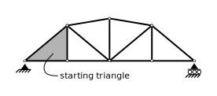

Figure 3.2.2-3: Simple truss

Recognizing simple trusses is a good first step in evaluating
stability.  For example, see Fig. 3.2.2-3 showing a simple truss, such
as might be used for a small bridge.  We note that it is supported by
a pin and a roller, thus ensuring that it is externally stable.

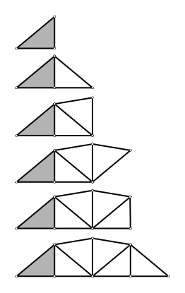

Figure 3.2.2-4: Truss "construction"

To determine that it is a simple truss, and therefore stable, we
imagine the construction of that truss, in steps, starting from a base
triangle.  One possible set of construction steps is show in
Fig. 3.2.2-4.  That figure shows the construction of the truss adding
2 members and a joint at each step.

Because the result is a simple truss, and because it is simply
supported, it is both stable and statically determinate.

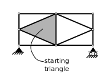

Figure 3.2.2-5: Simple truss.

Consider the truss of Fig. 3.2.2-5.  Is it stable and statically
determinate?  Because we can locate a starting triangle and can see
how the truss is built up 2 members and a joint at a time, the answer
to both questions is "yes".

**Compound Trusses**

Compound trusses are two or more simple trusses joined by linking
members.  It can sometimes be quite difficult to tell by inspection
whether the resulting truss is stable or not (you can always judge
determinacy by counting the members, joints and reactions).

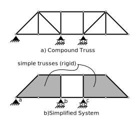

Figure 3.2.2-6:  Compound Truss

Consider the compound truss shown in Fig. 3.2.2-6, part a).  For this
truss, we see that $m=16$, $r=4$ and $j=10$.  Therefore $m+r=2j$ and
the truss is statically determinate, if it is stable.

To judge stability, one tactic is to identify the simple parts; we
know that those parts are each stable (i.e., rigid).  These are
identified in part b) of the figure.  We then try to imagine
consistent small geometry changes; if we can find one, then we know
the truss is unstable.

On this truss, we note that the left rigid unit is supported on a pin
and a roller, so therefore the left portion of the structure is
stable; no geometry changes are possible in that portion.

We can see that the two horizontal links between the two parts prevent
sideways displacement of the right portion.  The roller at _c_
prevents vertical displacement.  In addition, the top horizontal link
and the roller at _c_ prevent rotation about _c_ (the top link would
have to change in length to allow that).  The bottom link prevents
rotation about the right end of the top link.  So, under these support
conditions, the truss is stable.

What would happen if the roller at _c_ were was moved to one of the
other pins on the right rigid unit, say to _d_, as seen in
Fig. 3.2.2-7?

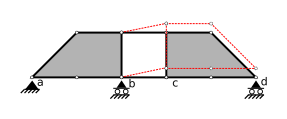

Figure 3.2.2-7: Inconsistent Displacements

In this case, the horizontal links will still prevent a lateral
displacement of the right portion.  Now the pin at _c_ may move
vertically.  For that to happen, both links must rotate counter
clockwise about their left ends, as shown in the figure.  If that
happens, the vertical member above _c_ will move straight up,
remaining vertical.  The only way that is possible is if the whole
right portion also moves straight up, with no rotation, also as shown
in the figure(it is rigid, after all).  But that is inconsistent with
the prevention of vertical displacement by the roller, now at _d_, and
is therefore not possible.

The truss is stable.  In fact, a constraint against vertical
displacement anywhere on the right portion will render the structure
stable.

**Compound Trusses - Common Forms**

We finish this section by illustrating a few common forms of compound trusses.

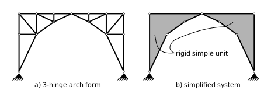

Figure 3.2.2-8: Compound Truss

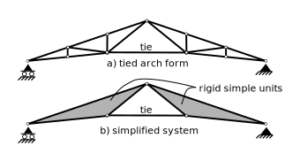

Figure 3.2.2-9: Compound Truss

The truss shown in Fig. 3.2.2-9 is particularly attractive for use in large roof trusses.  
Each portion can be assemblied in the shop, trucked to the site, and
placed by making a field conenction at the top and inserting the tie.
And yes, it is really a simple truss rather than a compound truss by
our criteria; we mention it in this section because of its normal
fabrication practice.

**Complex Trusses**

Trusses that cannot be classified as either simple or compound are
called _complex_.  A couple of examples are:

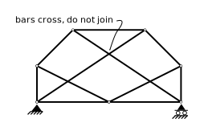

Figure 3.2.2-10: Complex Truss

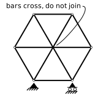

Figure 3.2.2-11: Complex Truss

It can be very difficult to tell by inspection whether a complex truss
is stable or not.  For example, in Fig. 3.2.2-10, $m=11$, $j=7$ and $r=3$
and in Fig. 3.2.2-11,
$m=9$, $r=3$, and $j=6$ and so $m+r=2j$ for both.  While the supports and
connectivity are the same in both, the truss in Fig. 3.2.2-10 is
stable and the one in Fig. 3.2.2-11 is not.

A truss that is not stable must undergo small geometry changes in
order to equilibrate with external forces, and is said to possess a
"critical form".

   A "critical form" is a truss arrangement that is unstable.

### Critical Form of a Hexagon Truss

To demonstrate a procedure that can be used to determine if a truss has
a critical form, consider the regular hexagon truss shown in Figure 3.2.2-12.
Our job is to determine if small geometry changes can be made to this
arrangement.  In other words, can the joints move while retaining the member lengths
of all the members and also maintaining all joint and support constraints?

Start by observing that joint _a_ is prevented from moving in any direction.
Similarly, joint _f_ is prevented from moving vertically by the
support and horizontally by member _af_, so it is fixed in location as
well.

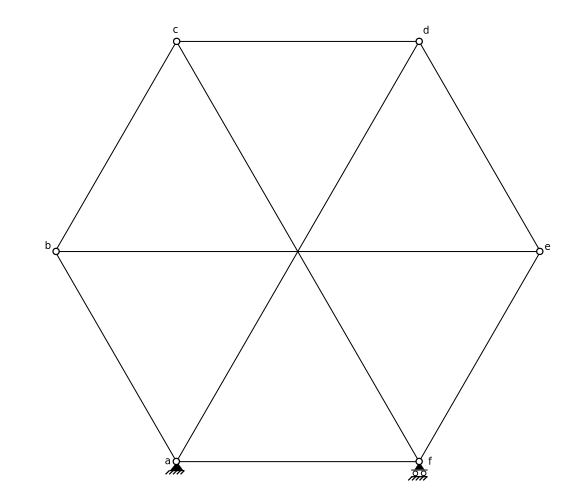

Figure 3.2.2-12: Hexagon Truss

We then examine the ends of the members attached to those fixed support joints -
these are members _ab_, _ad_, _fc_ and _fe_.
We sketch paths along which the joints at the other ends can move (joints _b_, _c_, _d_ and _e_).
This is shown in Figure 3.2.2-13.  The joints at the free ends can
move along paths that are perpendicular to each of the members; the
path through _b_ perpendicular to _ab_, etc.

Note that in the truss, all internal angles are 60 degrees, so members
_ab_ and _fc_ are parallel, as are members _ad_ and _fe_.  That means
the paths at joints _b_ and _c_ are parallel, as are the paths at
joints _d_ and _f_.

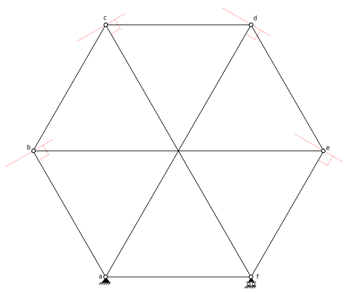

Figure 3.2.2-13: Paths of "Free" Nodes

The first step in imagining the displacements is to choose one of the
free joints, say joint _b_, and draw it moving along its path.  Also
show the member attached to both _b_ and the fixed joint _a_.  This is
shown in Figure 3.2.2-14.  Plainly, _ab_ does not change in length.

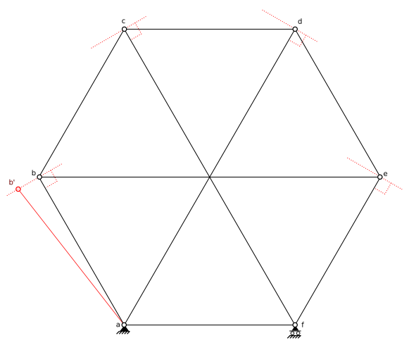

Figure 3.2.2-14: Step 1

Now, in step 2 shown in Figure 3.2.2-15, investigate some of the other
members attached to joint _b_.  If member _be_ is not to change in length,
then joint _e_ will be leftward the same amount as joint _b_
If joint _e_ moves to the left the
same amount as joint _b_, it will move up the same amount as _b_ moves
downward and member _be_ will not change in length. Member _fe_ will
retain its length as well as it follows joint _e_.  So far, all
displacements are possible.

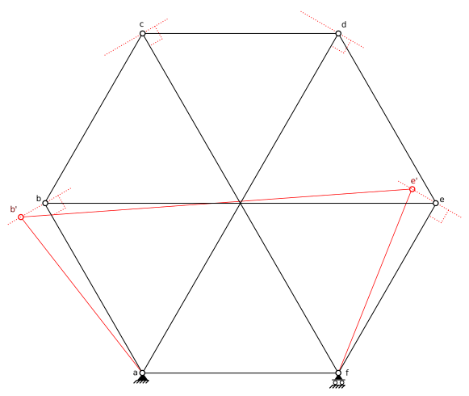

Figure 3.2.2-15: Step 2

In step 3, we move joint _c_ along its path the same amount as joint
_b_, as we see in Figure 3.2.2-16.  Member _bc_ remains parallel
to its original location, so neither it nor member _cf_ change in
length.  Joint _d_ and members _de_ and _ad_ are similar.

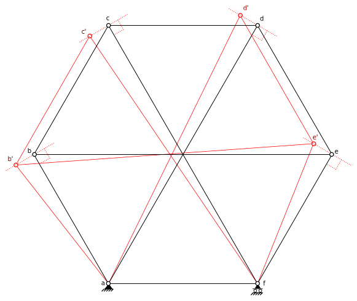

Figure 3.2.2-16: Step 3

Finally, the last step is shown in Figure 3.2.2-17.  We have one
remaining member to fit: _cd_.  Joints _c_ and _d_ plainly displace
horizontally the same amount. As these are very small displacments,
the distance _c'd'_ is the same as _cd_ and so member _cd_ does not
change in length.

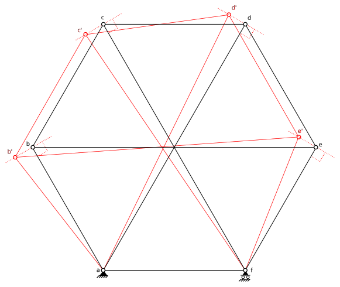

Figure 3.2.2-17: Step 4

We have determined that we can make a small, consistent set of
displacements in the truss.  Therefore, it is unstable, and the original
regular hexagon is a critical form.

In the example above, the three long members cross in the middle and are not joined.
If, instead of crossing, the members were joined with a normal pin joint at
the centre, as in Figure 3.2.2-18, the truss would be stable because it would be a simple truss.
But this would add 3 to $m$ and 1 to $j$ meaning that $m+r > 2 j$ and the truss
would be statically indeterminate to 1 degree.

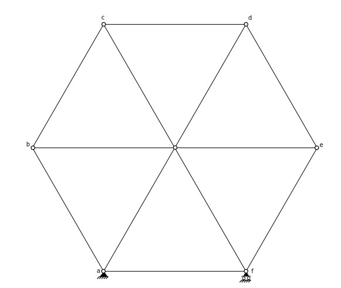

Figure 3.2.2-18: Stable version of hexagon truss
