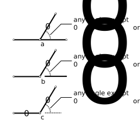
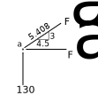
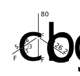
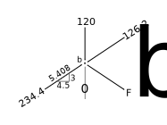

# 3: Forces in Statically Determinate Trusses

## 3.3: Member Forces by Method of Joints

### 3.3.1: Zero-force members

Figure 3.3-1: Zero-force members

It is convenient before starting any analysis to identify all of the zero-force members.  
These are members known by "inspection" to carry no force.  Fig. 3.3-1 shows several
common arrangements.

In the first, three members attach to joint _a_, two of them
co-linear.  If there are no external forces applied to the joint, then
the third member carries no force.  This can be seen by summing forces
in a direction perpendicular to the co-linear members; the component
of the third member force in that direction must be zero and therefore
the force must be zero.  As it is a zero-force member, it can be
"removed" from the truss (for analysis purposes).

In the second example, two members connect at joint _b_.  An applied
force is co-linear with one of the members, leaving the other a
zero-force member.

In the third example, two members connect at joint _c_.  If there are
no external forces applied to the joint, both members will be
zero-force.

In all cases, the member arrangement at the other end of the
zero-force members is irrelevant.

   Identifying a zero-force member requires use of an equation of
   equilibrium, even though it is trivially easy to setup and solve.
   It doesn't allow you to solve for more unknowns than you normally
   could.

   If the conditions at one end of a member suggest that it is
   zero-force, it doesn't matter what the conditions are at the other
   end.

### 3.3.2: Example J-1

Figure 3.3-2: Example J-1

Before beginning the numerical calculations for the truss in
Fig. 3.3-2, we should identify the zero-force members.  We quickly see
that members _bh_ and _df_ are zero-force, because of the conditions
at joints _h_ and _f_ respectively.  As they can be 'removed' from the
structure with no ill effects, member _gd_ is also zero-force because
of the conditions at joint _d_ (with member _df_ removed).  However,
_bg_ is not zero-force, because of the external load at joint _b_.

The three zero-force members are marked on the figure to help us keep
track of the solved members.

Calculating the reactions using external equations of equilibrium:

$$
   \begin{split}
   &\sum M_a = 0~~~~~(\text{+CCW})\\
   &-120\times4.5 - 80\times9.0 + V_e\times18=0\\
   &\underline{V_e = 70~ \text{kN}}\\
   &\sum F_y = 0~~~~~(+\uparrow)\\
   &V_a - 120 - 80 + V_e = 0\\
   &\underline{V_a = 130~ \text{kN}}
   \end{split}
$$

To start the analysis by the method of joints, choose one of the
joints on the truss into which two or fewer unknown members frame and
also on which some known forces act.  Joints _a_ and _e_ are the only
possibilities, so we choose joint _a_.  The free body diagram of that
joint is shown in Fig. 3.3-3.

Figure 3.3-3: Joint a

We choose to show all unknown member forces as if they were tension
forces in the members.  That means, when they are shown on the same
side as they member, they pull _away_ from the joint toward the other
end of the member, as we see in the figure.  When we solve the
equilibrium equations, the sign will tell us if we assumed correctly
or not.

To avoid solving simultaneous equations, we try to write equilibrium
equations involving only one unknown, where ever possible.  On joint
_a_, that involves summing forces in the vertical direction.  Because
that direction is perpendicular to $F_{ah}$, that won't appear in the
equation.

$$
   \begin{split}
   &\sum F_y = 0~~~~~(+\uparrow)\\
   &130 + \frac{3}{5.408} \times F_{ab}= 0\\
   &\underline{F_{ab} = -234.4}~~~~~(\therefore C)
   \end{split}
$$

The negative sign tells us that we showed the force in the wrong
direction on the free body diagram.  Therefore, the member force must
be compression and we carefully label the result with that
observation.

   Engineering results of this kind are normally shown to no more than
   three significant figures.  We sometimes carry four significant
   figures in intermediate results, as done here, to reduce the
   round-off errors.

On the same joint _a_, we can now solve for the remaining unknown by
summing forces in the horizontal direction:

$$
   \begin{split}
   &\sum F_x = 0~~~~~(+\rightarrow)\\
   &F_{ab}\times\frac{4.5}{5.408} + F_{ah} = 0\\
   &-234.4\times\frac{4.5}{5.408} + F_{ah} = 0\\
   &\underline{F_{ah} = 195.0}~~~~~(\therefore T)
   \end{split}
$$

In the above, we were careful to first write the equilibrium equations
in terms of the forces shown on the free body diagram - that figure
shows $F_{ab}$ having a positive component in the _x_-direction.  Then
we substituted the numerical value for that force, using the proper
sign as determined in the previous solution.

   Equilibrium equations should first be written using the directions
   shown on the free body diagram.  Attempting to "correct" the signs
   mentally before writing the equation is a recipe for disaster.

   Figure 3.3-4: Joint e

Now we can do a similar solution for joint _e_ (see Fig. 3.3-4):

$$
   \begin{split}
   &\sum F_y = 0~~~~~(+\uparrow)\\
   &70 + \frac{3}{5.408} \times F_{ed}= 0\\
   &\underline{F_{ed} = -126.2}~~~~~(\therefore C)
   \end{split}
$$

$$
   \begin{split}
   &\sum F_x = 0~~~~~(+\rightarrow)\\
   &-F_{ed}\times\frac{4.5}{5.408} - F_{ef} = 0\\
   &126.2\times\frac{4.5}{5.408} - F_{ef} = 0\\
   &\underline{F_{ef} = 105.0}~~~~~(\therefore T)
   \end{split}
$$

Figure 3.3-5: Joints f, h

By inspection, from Fig. 3.3-5, we can determine:

$$
   \begin{split}
   &\underline{F_{hg} = 195.0}~~~~~(\therefore T)\\
   &\underline{F_{fg} = 105.0}~~~~~(\therefore T)
   \end{split}
$$

Figure 3.3-6: Joint d

Also by inspection (i.e. from $\sum F_{x'} = 0$) from Fig. 3.3-6, we can determine:

$$
   \begin{split}
   &\underline{F_{cd} = -126.2}~~~~~(\therefore C)
   \end{split}
$$

Figure 3.3-7: Joint c

Fig. 3.3-7 now shows joint _c_ at which two unsolved members terminate.  By inspection
(or by $\sum F_x=0$) we can see:

$$   
   \begin{split}
   &\underline{F_{cb} = -126.2}~~~~~(\therefore C)
   \end{split}
$$

Also:

$$
   \begin{split}
   &\sum F_y = 0~~~~~(+\uparrow)\\
   &-F_{cb}\times\frac{3}{5.408} -80 + 126.2\times\frac{3}{5.408} - F_{cg} = 0\\
   &126.2\times\frac{3}{5.408} -80 + 126.2\times\frac{3}{5.408} - F_{cg} = 0\\
   &\underline{F_{cg} = 60.02}~~~~~(\therefore T)
   \end{split}
$$

Figure 3.3-8: Joint b

We have one remaining unknown, $F_{bg}$ and we can use joint _b_ to solve for that.
See Fig. 3.3-8.

$$
   \begin{split}
   &\sum F_x = 0~~~~~(+\rightarrow)\\
   &234.4\times\frac{4.5}{5.408} - 126.2\times\frac{4.5}{5.408} + F_{bg}\times\frac{4.5}{5.408} = 0\\
   &\underline{F_{bg} = -108.2}~~~~~(\therefore C)
   \end{split}
$$

We haven't used all equilibrium equations for this joint, yet, so we can use
$\sum F_y$ as a statics check:

$$
   \begin{split}
   \sum F_y &= 234.4\times\frac{3}{5.408} - 120 - 126.2\times\frac{3}{5.408} - F_{bg}\times\frac{3}{5.408}\\
   &= 234.4\times\frac{3}{5.408} - 120 - 126.2\times\frac{3}{5.408} + 108.2\times\frac{3}{5.408}\\
   &= 0.04 \approx 0~~~~~\text{O.K.}
   \end{split}
$$

Statics checks of joints should be performed whenever possible.

Figure 3.3-9: Joint g

Joint _g_ hasn't been used at all, yet.  We will use it now to perform two more statics checks:

$$
   \begin{split}
   \sum F_x &= -195.0 + 108.2\times\frac{4.5}{5.408} + 105.0\\
   &= 0.03 \approx 0~~~~~\text{O.K.}\\
   \sum F_y &= -108.2\times\frac{3}{5.408} + 60.02\\
   &= -0.002 \approx 0~~~~~\text{O.K.}
   \end{split}
$$

Figure 3.3-10: Summary of Forces

Finally, a summary of all forces is shown in Fig. 3.3-10.  Note that
all values are rounded to three significant figures, and that we
clearly show the magnitude of each force and the sense of each as
tension or compression.

   There is no clear convention as to whether to label a compression
   force as negative or positive.  Do not rely on the +/- signs to
   convey that crucial information.

