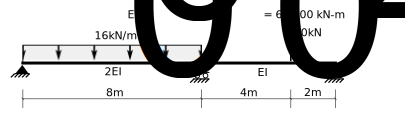
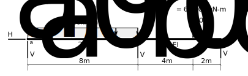
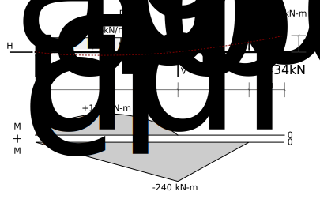
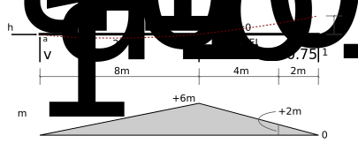
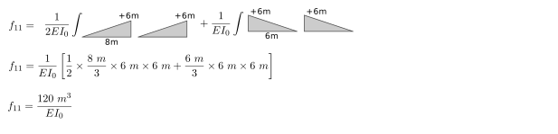
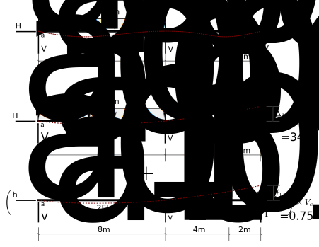
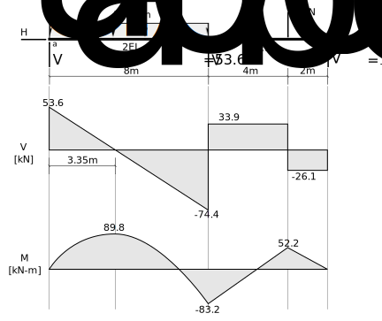

# 7: Statically Indeterminate Beams and Plane Frames

## 7.2: Example, Beam Structure 1

Draw the complete free body, shear and moment diagrams for the beam shown in Fig. 7.2-1.

   Figure 7.2-1: Beam Example 1

Following the steps of the detailed procedure of Section 7.1.3, we have the following.

### Step 1: Determine Statical Determinacy

There are 4 reaction components and no internal conditions, so this
structure is 1 degree statically indeterminate and so 1 redundant must
be identified.  The complete free body diagram is shown in Fig. 7.2-2.

   Figure 7.2-2:  Real Structure and Free Body Diagram

### Step 2: Identify the redundants

Choose the vertical force at point _c_ as the only redundant.

The verticals at _a_ or _b_ _could_
have been chosen instead; there is no completely compelling reason to choose _c_.
Experience has shown that the bending moment diagrams are slightly simpler this way,
and thus slightly simpler to integrate, but the difference is not large.

### Step 3: Analyze the primary structure

Fig. 7.2-3 shows the primary structure (with the redundant force removed). 

   Figure 7.2-3: Primary structure with real loads

That figure also shows the results of the analysis - i.e. of
determining the reactions and bending moments due to the real loads
acting on the primary structure.  We will find it slightly more
convenient to integrate later if we show the bending moment diagrams
for each load separately.  $M_{udl}$ are the bending moments due
to the uniformly distributed load of 16 kN/m.  $M_{cl}$ are the
bending moments due to the concentrated load of 60 kN.  The total
bending moments are the sum of these two.

### Step 4: Apply unit values of the redundants

Fig. 7.2-4 shows the statically determinate structure with a unit
value of the redundant applied to point _c_.  The unit value is
applied in the same direction as was shown for that reaction earlier.

   Figure 7.2-4: Unit value of the redundant

The figure also shows the corresponding reactions and bending moment diagram, $m_1$.

We note that it is probably better to show the reactions in the same
direction as we have shown on the previous 3 free body diagrams.  In
this case, then, we label the value of $v_{b1}$, the center
reaction, as -1.75 as it actually would act in the direction opposite
to that shown.

### Step 5: Compute displacements in the primary structure

Using the unit value of the redundant as the virtual load, the method
of virtual work is used to compute the displacement at the redundant
due to the real loads on the primary structure:

### Step 6: Compute flexibility coefficients

The displacement due to the unit value of the redundant is calculated
next, again using the method of virtual work.  Note that the unit load 
is used both as a virtual load and as a real unit load.

  Figure 7.2-4 Unit value of the redundant
   
The resulting displacement is called a flexibility coefficient.

### Step 7: Write compatibility equations

The compatibility equations are illustrated graphically in Fig. 7.2-5:

   Figure 7.2-5:  Compatibility Relationships Illustrated

The specific equation used involves the known displacement (= 0) at
point _c_:

$$
   \begin{split}
   0 &= \Delta_{10} + V_c f_{11}\\
   0 &= -\frac{3136~kNm^3}{EI_0} + V_c \times \frac{120 m^3}{EI_0}\\
   \end{split}
$$

### Step 8: Solve for the unknown redundant forces

Solving the above equation, we obtain:

$$
   \begin{split}
   V_c &= 26.133~kN~~~~~(\therefore\uparrow)
   \end{split}
$$

### Step 9: Use superposition to determine forces in the real structure

Now, superposition can be used to determine all of the other
reactions, and the moment at _b_:

$$
   \begin{split}
   V_a &= V_{a0} + V_c v_{a1}\\
       &= 34~kN + 26.133~kN \times 0.75\\
   V_a &= 53.60~kN\\
   \\
   V_b &= V_{b0} + V_c v_{b1}\\
       &= 154~kN + 26.133~kN \times -1.75\\
   V_b &= 108.27~kN\\
   \\
   M_b &= -240~kNm + 26.133~kN \times 6~m\\
   M_b &= -83.20~kNm
   \end{split}
$$

The summary is shown in Fig. 7.2-6:

   Figure 7.2-6: Example 1 Summary
   
