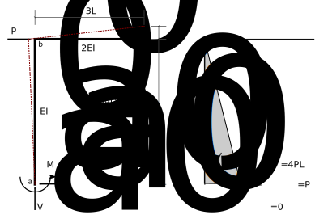
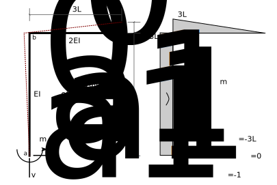

# 7: Statically Indeterminate Beams and Plane Frames

## 7.6: Example - Frame Example 1

Determine all of the reactions for the following frame:

### 1: Statical determinacy

The frame is 1 degree statically indeterminate.

### 2: Identify redundants

Choose the vertical reaction at *c* ($V_c$) as the redundant.

### 3: Analyze the primary structure

### 4: Apply unit values of the redundants

### 5: Compute Displacements in the primary structure

### 6: Compute flexibilty coefficients

### 7: Write compatibilty equations

The real vertical displacement at point *c* is zero, therefore:

$$
\begin{split}
0 &= \Delta_{10} + V_c f_{11}\\
  &= -\frac{24 P L^3}{E I_0} + V_c \times \frac{81 L^3}{2 E I_0}
\end{split}
$$

### 8: Solve for the redundant

$$V_c = \frac{16}{27} P$$

### 9: Other reactions by superposition

$$
\begin{split}
M_a &= M_{a0} + V_c m_{a1} \\
    &= 4PL +  \frac{16}{27} P \times -3L \\
	&= \frac{20}{9} P L\\
H_a &= H_{a0} + V_c h_{a1} \\
    &= P + \frac{16}{27} P \times 0 \\
	&= P\\
V_a &= V_{a0} + V_c v_{a1} \\
    &= 0 + \frac{16}{27} P \times -1 \\
	&= -\frac{16}{27} P
\end{split}
$$

### 10: Summary

