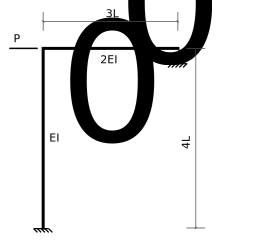
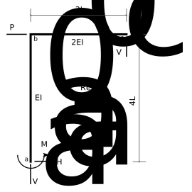
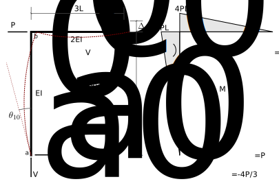
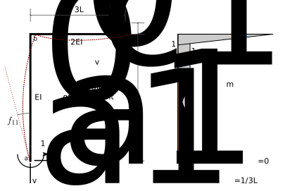
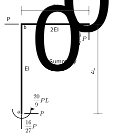

# 7: Statically Indeterminate Beams and Plane Frames

## 7.7: Example - Frame Example 2

Determine all of the reactions for the following frame:

   Figure 7.7-1: Frame Example 2

This example is the same as Example 1 of the previous section.
This time we will choose a moment redundant, rather than a force redundant.

### 1: Statical determinacy

The frame is 1 degree statically indeterminate.

### 2: Identify redundants

   Figure 7.7-2: Free body of real structure

Choose the moment at *a* ($M_a$) as the redundant.

### 3: Analyze the primary structure

   Figure 7.7-3: Determinate structure with real loads

### 4: Apply unit values of the redundants

   Figure 7.7-4: Determinate structure with unit redundants

### 5: Compute Displacements in the primary structure

### 6: Compute flexibilty coefficients

### 7: Write compatibilty equations

The real vertical displacement at point _c_ is zero, therefore:

$$  
   \begin{split}
   0 &= \theta_{10} + M_a f_{11}\\
     &= -\frac{10 P L^2}{E I_0} + Ma \times \frac{9 L}{2 E I_0}
   \end{split}
$$

### 8: Solve for the redundant

$$
   M_a = \frac{20}{9} P L
$$

### 9: Other reactions by superposition

$$
   \begin{split}
   V_c &= V_{c0} + M_a v_{ac} \\
       &= \frac{4P}{3} +  \frac{20 P L}{9} \times -\frac{1}{3L} \\
	   &= \frac{16}{27} P\\
   H_a &= H_{a0} + M_a h_{a1} \\
       &= P + \frac{20 PL}{9} \times 0 \\
	   &= P\\
   V_a &= V_{a0} + M_a v_{a1} \\
       &= -frac{4P}{3} + \frac{20 P L}{9} \times \frac{1}{3L} \\
	   &= -\frac{16}{27} P\\
   \end{split}
$$

### 10: Summary

   Figure 7.7-5: Summary of Frame Example 2
   
