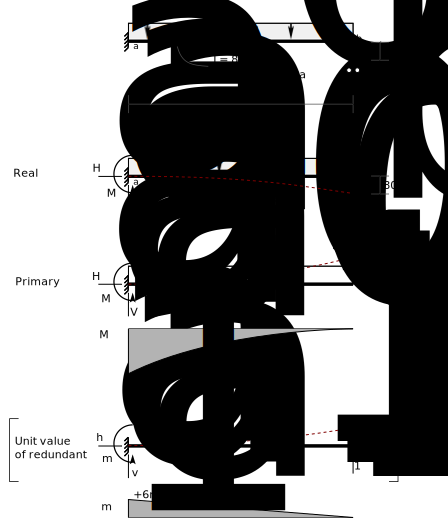

# 7: Statically Indeterminate Beams and Plane Frames

## 7.4: Example: Support Settlement

    Figure 7.4-1 Support Settlement

The beam shown in Fig. 7.4-1 has a fixed support on the left and on
the right end is supported by a roller that settles downward by 80 mm as
the load is applied.

It has 4 independent support forces and is thus 1 degree statically
indeterminate. We choose the moving support as the redundant and sketch
a free body diagram of the real structure, labelling key forces and
displacements.

Now we draw the primary structure (i.e., with the redundant removed) and
determine the key reaction forces and the bending moment diagram.

$$\begin{aligned}
\begin{split}
H_{a0} &= 0\\
V_{a0} &= 24~kN/m \times 6~m = 144~kN\\
M_{a0} &= 24~kN/m \times 6~m \times \frac{6~m}{2} = 432~kN
\end{split}
\end{aligned}$$

Next, we show the structure with a unit value of the redundant applied.
In the real structure, we drew redundant force $V_b$ acting upwards;
therefore we apply the unit load in the same direction, as shown. After
drawing the reactions in the same direction as they are on the primary
structure (and on the real structure)we determine the reactions due to
the unit redundant:

$$\begin{aligned}
\begin{split}
h_{a1} &= 0\\
v_{a1} &= -1\\
m_{a1} &= -1 \times 6~m = -6~m\\
\end{split}
\end{aligned}$$

Finally, we sketch deflected shapes on all structures. Starting with the
unit value of the redundant, plainly that will result in an upward
displacement of point *b*, so that is what we draw.

We use the unit value of the redundant for two purposes. The second is
as a virtual load so that we can compute the displacement in the primary
structure. Drawing it the way we did (upwards) establishes a sign
convention for displacements as being positive upwards. Therefore, that
is what we show on the primary structure, even though we \'know\' the
displacement will be downward. The computations will tell us that
eventually, but for now, sketching it this way makes it simpler to
develop the superposition equations.

All unknown quantities should be drawn in the same direction on all
structures -- otherwise the superposition equations are trickier to
write.

The direction of the unit value of the redundant should be the same as
the assumed direction of the unknown redundant.

The direction of the unit value of the redundant establishes the
positive direction of the corresponding displacement.

The displacement in the primary structure is:

$$\begin{aligned}
\begin{split}
\Delta_{10} &= \int \frac{m_1 M}{EI} dx\\
            & = \frac{1}{EI}\times\frac{6~m}{4} \times 6~m \times -432~kNm\\
            & = \frac{-3888~kNm^3}{EI}
\end{split}
\end{aligned}$$

Substituting numeric values for the beam properties:

$$\begin{aligned}
\begin{split}
EI &= 200~kN/mm^2 \times 82.7\times10^6mm^4 \times10^{-6}m^2/mm^2 = 200\times82.7~kNm^2 = 16540~kNm^2\\
\Delta_{10} &= \frac{-3888~kNm^3}{16540~kNm^2}\\
\\
\Delta_{10} &= -0.23507~m~~~~~(\therefore\downarrow)
\end{split}
\end{aligned}$$

The displacement due to a unit value of the redundant is:

$$\begin{aligned}
\begin{split}
f_{11} &= \int \frac{m_1 m_1}{EI} dx\\
       &= \frac{1}{EI} \times \frac{6~m}{3} \times 6~m \times 6~m\\
       &= \frac{72~m^3}{EI}\\
       &= \frac{72~m^3}{16540~kNm^2}\\
\\
f_{11} &= 0.0043531~m/kN
\end{split}
\end{aligned}$$

The compatibility equation, noting that, due to the reasoning stated
above, the real displacement at _b_ is downward and therefore negative:

$$\begin{aligned}
\begin{split}
\Delta_{10} + V_b \times f_{11} &= -0.080~m\\
-0.23507~m + V_b\times 0.0043531~m/kN &= -0.080m\\
V_b\times 0.0043531~m/kN &= 0.15507~m\\
\\
V_b &= 35.62~kN
\end{split}
\end{aligned}$$

Determine all other reactions in the real structure by superposition:

$$\begin{aligned}
\begin{split}
H_a &= 0\\
\\
V_a &= V_{a0} + V_b v_{a1} \\
    &= 144~kN + 35.62~kN\times-1\\
V_a &= 108.38~kN~~~~~(\therefore\uparrow)\\
\\
M_a &= M_{a0} + V_b m_{a1}\\
    &= 432~kNm + 35.62~kN\times -6~m \\
M_a &= 218.28~kNm ~~~~~(\therefore CCW)
\end{split}
\end{aligned}$$
