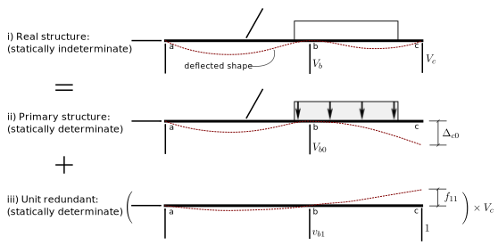

# 7. Statically Indeterminate Beams and Frames
 
## 7.1 Flexibility Method
 
### 7.1.1 Introduction
 
 
Consider the beam structure shown below:

The beam has four independent reaction components and no internal
conditions.  Thus there are four unknowns and only three equilibrium
equations available.  The beam is statically indeterminate to 1
degree.

### Redundants

Some of the reaction components are _redundant_ -- they are extra to
stability and can be removed without rendering the structure unstable.
In this example, any one of the three independent vertical reaction
components can be considered as redundant; any one of them could be
removed and the beam would still be stable.

The horizontal reaction at the pin support on the left end cannot be
considered a redundant, however.  If it were removed (by changing the
left support to a roller, for example), the beam would be unstable and
could not support any horizontal components of applied loads.

### Method of Consistent Deformation

The first method of statically indeterminate analysis is illustrated
in the following figure.  A free body diagram and deflected shape of
the real structure is shown in part i) of that figure.

 

The method starts by identifying the redundants and removing them from
the structure.  This forms the _primary structure_, which is
statically determinate, and is shown in part ii) of the figure.
Removing the redundants removes the constraints corresponding to those
redundants, and thus the primary structure has a downward
displacement, $\Delta_{c0}$, that doesn't exist in the real
structure.  We know how to compute that displacement (for example, by
using the method of virtual work of a previous section).

If we can determine the value of $V_c$ that will result in an
appropriate upward displacement, as shown in part iii)of the figure,
then the superposition of structures ii) and iii) will give us the
real structure, i).  

In the real structure, the vertical displacement of point _c_ is zero.
Summing the displacements in ii) and iii) (taking upward as positive),
we get

$$
\Delta_{c1} - \Delta_{c0} = 0
$$

or

$$
\Delta_{c1} = \Delta_{c0}
$$

The correct value of $V_c$, therefore, is the one that makes
$\Delta_{c1} = \Delta_{c0}$.

To compute the correct value of $V_c$, it is easier to
instead apply a unit value of the redundant and scale it by multiplying
by the (currently unknown) value of $V_c$, as seen here:

 

We can compute the displacement, $f_{11}$, due to a unit value of the
redundant (using any method, but virtual work is a good choice).

Superposition then gives us the relationships:

$$
   \begin{split}
   V_c f_{11} - \Delta_{c0} &= 0\\
   \\
   V_c &= \frac{\Delta_{c0}}{f_{11}}
   \end{split}
$$

Other structural actions can then also be determined from superpostion.
For example:

$$
V_b = V_{b0} + v_{b1}\times V_c
$$

By the way, $f_{11}$ is called a _flexibility coefficient_ -- it is
the inverse of a _stiffness coefficient_.

#### Notation

$V_i$, $\Delta_i$ - structural actions at point $i$ in the real structure.

$V_{i0}$, $\Delta_{i0}$ - structural actions at point $i$ in the primary structure.

$v_{ij}$, structural action at point $i$ due to a unit value of the $j^{th}$ redundant.

$f_{ij}$, displacement at the $i^{th}$ redundant due to a unit value of the $j^{th}$ redundant.

### 7.1.3: Consistent Deformation - Detailed Procedure

The above procedure requires the calculation of a number of
displacements.  For a structure that is 1 degree statically
indeterminate, we must calculate two: a displacement at the redundant
in the primary structure, and a flexibility coefficient (a
displacement at the redundant due to a unit value of the redundant).

We can use the method of virtual work for both; to apply that requires
application of a virtual unit load corresponding to the redundant.
But that is just what we have done for the flexibility coefficient.
We can therefore use that unit load for several purposes, and reduce
the computational effort somewhat.

We can now give the detailed steps for using the method of consistent
deformation to analyze statically indeterminate structures.

1. Determine the degree statical indeterminacy of the structure.

1. Identify a sufficient number of redundants to render the structure
   statically determinate and stable.  The structure so formed is the
   primary structure.

1. Analyze the primary structure subjected to the real loads.  In
   particular, determine all reactions and internal forces that are
   relevant in determining displacements.  For beam and frame
   structures, this requires complete bending moment diagrams, $M$, at
   the least.  For trusses, this requires determining all member
   forces.

1. Apply unit values of the redundants, one at a time, and determine
   all relevant reactions and internal forces due to each.  For beam
   and frame structures, this requires at least the determination of
   the complete bending moment diagrams, $m$.

1. Using the unit value moment diagrams, $m$, as the virtual, compute
   the displacements corresponding to the redundants due to the real
   loads in the primary structure.  For beam and frame structures,
   this will require at least the evaluation of the following integral
   over the whole structure.

   $$
      \int \frac{m M}{EI} dx
   $$
   

1. Using the unit value moment diagrams, $m$, as the virtual, compute
   the displacements due unit values of the redundants.  This will
   require evaluation of something like this integral, again over the
   whole structure (for beam and frame structures).

   $$
      \int \frac{m m}{EI} dx
   $$

1. Write compatibility equations, equating displacements at the
   redundants to known values.  This will involve treating values of
   the redundants as unknowns.

1. Solve for the redundants.

1. Use superposition and the known values of the redundants to
   determine other structural responses in the real structure.

See following sections for examples.

### 7.1.4: Summary

The method of consistent deformation is a _flexibility method_.
