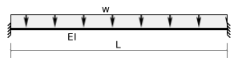
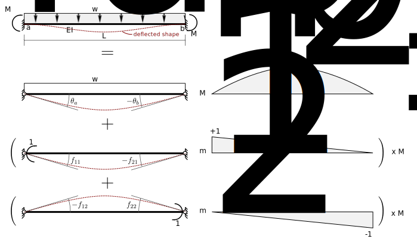

# 8. Slope Deflection

## 8.2 Fixed End Moments

### Uniform Load

This section shows how to determine the fixed-end moments for a beam of span
_L_ subjected to a uniformly distributed load over its
entire length, as shown in Fig. 8.2-1.

   Figure 8.2-1: Uniformly distributed load

If axial effects are ignored, this structure is two degrees statically
indeterminate.  Therefore two redundants must be identified when using the
flexibility method to determine the moments.

We have chosen the end moments as the redundants.
Fig. 8.2-2 shows the relevant superposition, unit loads and
bending moment diagrams.

   Figure 8.2-2: Superposition and unit loads

The displacements corresponding to the redundants are rotations at the ends.
The rotations in the released structure due to the applied loads are:

$$
   \begin{split}
   \theta_a &= \int \frac{m_1 M}{E I}
             = \frac{1}{EI} \times \frac{L}{3}\times+1\times\frac{wL^2}{8}
             = \frac{w L^3}{24 E I}
   \end{split}
$$

$$
   \begin{split}
   \theta_b &= \int \frac{m_2 M}{E I}
             = \frac{1}{EI} \times \frac{L}{3}\times-1\times\frac{wL^2}{8}
             = -\frac{w L^3}{24 E I}
   \end{split}
$$

The flexibility coefficients are the rotations due to unit values of
the redundants, applied one at a time as shown in Fig. 8.2-1 above.
They are:

$$
   \begin{split}
   f_{11} &= \int \frac{m_1 m_1}{E I}
          = \frac{1}{E I} \times \frac{L}{3} \times +1 \times +1
          = \frac{L}{3 E I}
   \end{split}
$$

   \begin{split}
   f_{12} &= \int \frac{m_1 m_2}{E I}
          = \frac{1}{E I} \times \frac{L}{6} \times +1 \times -1
          = -\frac{L}{6 E I}
   \end{split}

   \begin{split}
   f_{21} &= \int \frac{m_2 m_1}{E I}
          = \frac{1}{E I} \times \frac{L}{6} \times -1 \times +1
          = -\frac{L}{6 E I}
   \end{split}

   \begin{split}
   f_{22} &= \int \frac{m_2 m_2}{E I}
          = \frac{1}{E I} \times \frac{L}{3} \times -1 \times -1
          = \frac{L}{3 E I}
   \end{split}

The superposition (compatibility) equations, equate the sum of the rotations at each end
to zero.  These are the rotations at the end of the fixed beam:

$$
   \begin{split}
   0 &= \theta_a + M^f_{ab} f_{11} + M^f_{ba} f_{12}\\
   0 &= \theta_b + M^f_{ab} f_{21} + M^f_{ba} f_{22}
   \end{split}
$$

Substituting, rearranging, and expressing in matrix form gives:

$$
   \begin{split}
   \frac{L}{6EI}
   \left[
   \begin{array}{cc}
   2 & -1\\
   -1 & 2\\
   \end{array}
   \right]
   \left\{
   \begin{array}{c}
   M^f_{ab}\\
   M^f_{ba}\\
   \end{array}
   \right\}
   =
   -
   \left\{
   \begin{array}{c}
   \frac{wL^3}{24EI} \\
   - \frac{wL^3}{24EI} \\
   \end{array}
   \right\}
   \end{split}
$$

Solving for the moments gives:

$$
   \begin{split}
   \left\{
   \begin{array}{c}
   M^f_{ab}\\
   M^f_{ba}\\
   \end{array}
   \right\}
   =
   -
   \frac{6EI}{L}
   \frac{1}{2\times2-1\times1}
   \left[
   \begin{array}{cc}
   2 & 1\\
   1 & 2\\
   \end{array}
   \right]
   \left\{
   \begin{array}{c}
   \frac{wL^3}{24EI} \\
   - \frac{wL^3}{24EI} \\
   \end{array}
   \right\}
   \end{split}
$$

$$
   \begin{split}
   \left\{
   \begin{array}{c}
   M^f_{ab}\\
   M^f_{ba}\\
   \end{array}
   \right\}
   =
   \left\{
   \begin{array}{c}
   -\frac{wL^2}{12} \\
   \frac{wL^2}{12} \\
   \end{array}
   \right\}
   \end{split}
$$

### Other Load Cases

Fig. 8.2-3 provides a summary of the fixed end moments for a number of
common cases.

See a following section for the case of
the far end being pinned.

   Figure 8.2-3: Fixed end moments and slope deflection summary

[Download a PDF copy](../../../../../images/sibeams/stiffness/slope-deflection/fem/fems.pdf).

