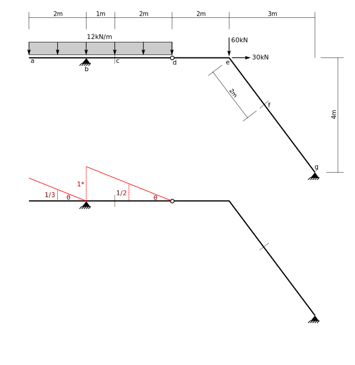

# 4: Method of Virtual Work (1): Principle of Virtual Displacements

$$
\def\kN{~\text{kN}}
\def\m{~\text{m}}
\def\kNm{~\text{kN}\!\cdot\!\text{m}}
\def\kNpm{~\text{kN/m}}
$$

## 4.1 Introduction

## 4.1.1 Principle of Virtual Displacements

The main principle is offered here without proof:

 

  If a body in equilibrium under a set of forces is subject to a virtual rigid
  body displacement (i.e., strains everywhere are zero), the total virtual work done
  by the forces is zero.
  

   
  Some proofs are available here:
  1. [CIVE 3203 Lecture, 2019](http://holtz3.cee.carleton.ca/recordings/3203/2019/2019-10-11/Part-1/)
  1. [Learning the Virtual Work Method in Statics](https://peer.asee.org/learning-the-virtual-work-method-in-statics-what-is-a-compatible-virtual-displacement.pdf).
     Note that the first portion of this paper has a good discussion of small virtual 
	 rigid body displacements.
	
## 4.1.2 Procedure

The above principle can be used in a procedure to determine structural actions (reactions, internal
forces) by the method of virtual displacements.

1. Identify the single action you wish to determine (e.g., a vertical reaction, a bending moment 
   at a point, or a shear force at a point).
1. Identify the constraint that corresponds to that action (e.g, against vertical displacement, 
   against relative rotation from one side of the point to the other, or against relative
   transverse displacement from one side of the point to the other).
1. Relax the constraint and impose an arbitrary small displacement in its place.
1. Maintain all other constraints and draw a consistent deflected shape.  In particular, 
   all other support constraints are honoured, and no additional curvature is allowed in 
   structural members.
1. Assign one of the displacements an arbitrary value, and express all other displacements
   in the deflected shape in terms of that.
1. Write a virtual work equation in terms of the unknown action and known displacements and forces
   and set it to zero.
1. Solve for the unknown action.

This procedure, with the use of
properly displaced structures, ensures that we can write equations that contain only 
one unknown action.

Some notes:

1. You may use anything, including a symbolic term, as the value you assign to the
   particular displacement.  Whatever you use will cancel out of the final equation.
   A particularly convenient value is '1'.
1. The resulting equation is really an equilibrium equation.  This is just a different
   (and sometimes easier) way to develop it.

## 4.1.3 Frame Reactions

The procedure will be illustrated by determining all four reactions in the following
frame (note that by inspection it is stable and statically determinate).  Each reaction
will be determined seperately and independently.  For each, the virtual deflected
shape will be drawn below the structure and key displacements will be shown.

For each deflected shape, the displacement corresponding to the action desired will
be assigned the value '1' (with no units).  It will be labelled on the drawing
as '1*' to remind us that this is a virtual displacement.

The value '1' is used as this slightly simplifies the solution of the resulting equations.

### Vertical Reaction at a

The relevant constraint is against vertical displacement at joint $a$.  That constraint
is relaxed and a unit displacement assigned in its place.  Joint $a$ is free to rotate
and move horizontally as required.  Frame portion $b c d$ is constrained from any displacement
by its rigidity and by the fixed support at $d$.  The pin at $b$ allows relative rotation
between $ab$ and $bcd$.  The final deflected shape then is a rotation of $ab$ clockwise
to accommodate the unit upward displacement of $a$.  The deflected shape drawing
shows the end displacement
(assigned a value of '1') and also the displacement at the center of gravity of the portion 
of the distributed load above $ab$.

The assigned displacement on the deflected shape should be in the same
direction as that assumed for the reaction force.  Signs are easier to keep
track of that way.

The work done by displacement of a distributed load can be calculated using the
displacement at its centroid, times the total load.

Writing the virtual work expression:

$$
\begin{split}
&V_a \times 1 - 16\kNpm \times 12\m \times 0.5 = 0\\
&V_a = 96\kN\\
\end{split}
$$

### Vertical Reaction at d

The constraint against vertical displacement at $d$ is relaxed and a unit upward displacement
is assigned in its place (upward, because the drawing assumes that $V_d$ is upward).
Constraints still prevent horizontal displacement and rotation at $d$ and therefore frame
portion $bcd$ must displace straight vertically with no rotation nor
horizontal translation.  The pin at $b$ allows relative rotation
of $ab$ to $bcd$, and point $a$ is constrained against vertical displacement (but not
against rotation).  The final deflected shape then shows a counter-clockwise rotation
of $ab$ and a vertical translation of $bcd$.

Virtual work (noting that all virtual displacements are unitless):

$$
\begin{split}
&V_d \times 1 - 16\kNpm\times 8\m \times 1 - 16\kNpm\times12\m\times0.5 = 0\\
&V_d = 224\kN\\
\end{split}
$$

### Horizontal Reaction at d

The constraint against horizontal displacement at $d$ is relaxed and a unit displacement assigned
in its place.  The frame drawing shows that $H_d$ is assumed acting rightwards and so the displacement
is assigned in the same direction.

The fixed support at $d$ constrains the frame portion $bcd$ from rotating and from displacing 
vertically, so that portion can only move horizontally a unit amount everywhere (especially note joint
$c$, the point of application of the $30\kN$ load).

The pin at $b$ prevents differential horizontal displacements af $ab$ and $bcd$ so $ab$
must displace a unit amount rightward as well.  That is allowed by the roller support at
$a$.

Note that vertical displacements of the distributed load are zero everywhere, so that load
does not contribute to the horizontal reaction.

Virtual work:

$$
\begin{split}
&H_d\times 1 + 30\kN\times 1 = 0\\
&H_d = -30\kN~~~~~~~~(\therefore\leftarrow)\\
\end{split}
$$

Note that the computed value turned out negative.  That only means that we assummed
incorrect directions on the drawings and that the reaction does act toward the left,
instead of toward the right as assumed.

### Moment Reaction at d

The drawing shows an assumed clockwise direction for the moment reaction, $M_d$ at $d$.
Therefore, the constraint against rotation at $d$ is relaxed and a unit clockwise
rotation at point $d$ is assigned.  Because $bcd$ is rigid, that means that point $c$
must move horizontally to the right. Point $b$ will move horizontally the same amount
as point $c$, but it will also move vertically (the total movement is perpendicular
to a radius drawn from $d$ to $b$, as the centre of rotation is point $d$).

The pin at $b$ drags the portion $ab$ rightward by the same amount (allowed by
the roller at $a$).  Member $ab$ rotates counter-clockwise in order not to violate
the constraint against relative transverse displacement at $b$, while honouring the constraint
against vertical displacement at $a$.

Deflection amounts are shown.  Although the rotation is unitless, the member lengths
are not.  Therefore the displacements on the deflected shape all have units.

When displacements are calculated from rotations, the displacements will have
units, obtained from the units of the member lengths, even when the
rotation is unitless.  Those units should be maintained in your calculations.

Virtual work:

$$
\begin{split}
&M_d\times1 - 16\kNpm\times12\m\times4\m - 16\kNpm\times8\m\times4\m + 30\kN\times8\m = 0\\
&M_d = 1040\kNm\\
\end{split}
$$

## 4.1.4 Frame Internal Forces

The following sections show the virtual displaced shape for a number of internal quantities.
On each drawing is shown the assigned displacement, other key displacements,
and displacements at the centroids of the distributed load, above each portion.

Note that consistent displacements for the three types of internal actions are as follows:

1. For moment, a unit rotation of one side of the point relative to the other.
Normal beam sign convention would have the left portion rotating counter-clockwise and
the rigth portion clockwise (relatively).  Relative transverse and longitudinal displacements
are prevented.

1. For shear, a unit relative displacement of one side of the point relative
to the other.  This displacement is transverse (perpendicular to the axis of the
member).  Unless the bening moments are forced to be zero (by a pin), there may be no
relative rotations.  Normal beam sign convention will have the left portion
moving dow relative to the right portion.

1. For axial force, a unit relative displacement in the longitudinal direction.
If tension is assumed +ive, the displacement is an overlap.

### General Comments on Stability

The frame used in the following examples is shown here:

Many of the following examples rely on one particular consequence of the stability
of this frame, so we will explain it once here and rely on this explanation 
many times below.

The pin supports at _b_ and _g_ prevent horizontal and vertical
displacements at those points, but allow rotation.  The internal pin
at _d_ allows relative rotation, only, between parts _abd_ and _deg_.

Now, if part _deg_ rotates about point _g_, points _d_ and _e_ will have horizontal
components of displacement.  But that is prevented by support _b_ and member
_bd_.  We will often say something like "point _d_ cannot move" in the
explanations below.  That is what we mean.

### Moment at b

As the portion to the right of _b_ cannot rotate, all of the rotation must occur in the
left portion _ab_.  It is assigned a unit counter-clockwise rotation.  The centre of _ab_ 
is 1m away, so that point displaces downwards $1\times1\m = 1\m$.

Virtual work:

$$
\begin{split}
&M_b\times1 + 12\kNpm\times2\m\times1\m = 0\\
&M_b = -24\kNm\\
\end{split}
$$

### Moment at c

The beam is given a unit rotation at point _c_.  Point _d_ cannot move vertically, so the
section _cd_ must rotate about _d_ to allow the upward displacement of point _c_.
Section _abc_ rotates about _b_ to maintain the vertical displacement constraint at _b_.

To compute the displacements, extend the straight line _abc_ to over point _d_.
As the angle in the triangle above
and to the right of _c_ is 1 and the horizontal distance _cd_ is 2m, the vertical distance
from _d_ to the extended line is $1\times2\m=2\m$.  Similar triangles give the 
remaining displacements.

Virtual work:

$$
\begin{split}
&M_c \times 1 + 12\kNpm\times2\m\times\frac{2}{3}\m - 12\kNpm\times 1\m\times\frac{1}{3}\m  
   - 12\kNpm\times 2\m\times\frac{1}{3}\m = 0\\
&M_c = 4\kNm\\
\end{split}
$$

### Moment at e

Here we compute the bending moment just to the left of joint _e_.

As member _eg_ cannot rotate (see above), all rotation must occur in _ed_, which is given the
normal unit rotation, counter-clockwise as that is the direction of +ive moment on that
side by the beam sign convention.  See the following figure showing an expanded view of
joint _e_ for clarity:

The vertical displacement of _d_ is given as $1\times2\m=2\m$.  Use similar triangles
to get the other displacements.

Virtual work:

$$
\begin{split}
&M_{ed}\times 1 - 12\kNpm\times2\m\times\frac{2}{3}\m + 12\kNpm\times3\m\times1\m = 0\\
&M_{ed} = -20\kNm\\
\end{split}
$$

### Moment at f

A unit rotation is imposed at point _f_, causing that point to move perpendicularly to the
line _eg_.  In order for that to happen, _def_ must rotate about a point on that same line
(ie., on a line through _e_ and _g_).  

At the same time, point _d_ must move perpendicularly
to the line through _e_, _d_ and _b_ (constrained by _db_).  
The only way that can happen is if _def_ rotates about a point on the line 
through _bde_.  Point _e_ is the only point
that statisfies both rotation criteria, therefore _def_ rotates about _e_.

As the distance _ef_ is 2m, the distance from _e_ to the extension of rotated _fg_
is $1\times2\m=2\m$.  By similar triangles, the displacement of _f_ is $2\m\times3/5=6/5\m$.
As _de_ is the same length as _ef_, and _def_ rotates rigidly, the downward displacement of _d_ is the same as the displacement of _f_.

Virtual work:

$$
\begin{split}
&M_{f}\times 1 - 12\kNpm\times2\m\times\frac{2}{5}\m + 12\kNpm\times3\m\times\frac{3}{5}\m = 0\\
&M_{f} = -12\kNm\\
\end{split}
$$

### Shear to the left of b

Here we are determining shear force at a point of
interest _just to the left of support b_.  For the displaced shape for shear forces,
the rotations must almost always be kept equal (see 'Shear at d' below for the only exception).
The member _bd_ to the right of the point of interest is prevented from
translating or rotating (see general comments above).  Therefore, all of the
translation must occur on the left side of the point of interest, and
the rotation must be kept to zero (to match the right side).

Virtual work:

$$
\begin{split}
&V_{ba}\times 1 + 12\kNpm\times2\m\times1 = 0\\
&V_{ba} = -24\kN\\
\end{split}
$$

### Shear to the right of b

Now we determine shear force at a point of interest _just to the right of support b_.
The left side of that point is prevented from moving vertically by support _b_
(but it can rotate).  Therefore all transverse displacement must occur to the right
of the point of interest.  Point _d_ still cannot move (see above), so member _bd_
rotates upward about _d_.  The slope to the left must be made equal to the slope
to the right, leading to the displacements shown.

Virtual work:

$$
\begin{split}
&V_{bd}\times 1 - 12\kNpm\times2\m\times\frac13 - 12\kNpm\times3\m\times\frac12 = 0\\
&V_{bd} = 26\kN\\
\end{split}
$$

### Shear at c

The left side of point _c_ moves downward relative to the right side, with the total
displacement at that point a unit amount.  The right side moves upward.  In order to
keep the slopes equal ($\theta$ is equal on both sides) portions _abc_ and _cd_
rotate the same amount.

In order to compute the displacements, extend rotated _cd_ to over the support at _b_.
As both portions have rotated the same amount, the deflected shapes are parallel,
so the distance from point _b_ to the extension of _cd_ is 1.  That allows us
to compute the angle $\theta = 1/3\m = 1/3 \m^{-1}$.  All other displacements
can be calculated from the horizontal distances and $\theta$.

Virtual work:

$$
\begin{split}
&V_{c}\times 1 - 12\kNpm\times2\m\times\frac13 + 12\kNpm\times1\m\times\frac16 - 12\kNpm\times2\m\times\frac13 = 0\\
&V_{c} = 14\kN\\
\end{split}
$$

### Shear at d

Because there are no internal bending moments at _d_ (it is an internal pin), the slopes
of the deflected shape do _not_ have to be equal on each side of _d_ (this is the single
exception to the requirement for equal slopes).  As _d_ attached to _deg_ cannot move,
all of the transverse displacement must occur on the left side (in _abd_).

Virtual work:

$$
\begin{split}
&V_{d}\times 1 - 12\kNpm\times2\m\times\frac13 + 12\kNpm\times3\m\times\frac12 = 0\\
&V_{d} = -10\kN\\
\end{split}
$$

### Shear to the left of e

Here our point of interest is _just to the left of the joint at e_.

For reasons explained above, the portion of joint _e_ attached to _eg_ cannot have any displacement
or rotation.   Therefore all displacement must be on the left side of our
point of interest, and the rotation at _e_ must be zero.  Relative rotation is allowed
at the pin at _d_, and so the displaced shape is as shown.

Virtual work:

$$
\begin{split}
&V_{ed}\times 1 - 12\kNpm\times2\m\times\frac13 + 12\kNpm\times3\m\times\frac12 = 0\\
&V_{ed} = -10\kN\\
\end{split}
$$

Note that the 60Kn load is not included because it is just to the right of the point
at which we are finding the shear,
and does not appear on any displaced portion of the virtual displacement diagram.

Also note that as there are no transverse loads between _d_ and just to
the left of _e_, the shear forces
at these two locations will be equal.

### Shear at the top of eg

Now the point of interest is just below joint _e_, at the top of member _eg_.  As we are
interested in shear force, the directions of interest are perpendicular to _eg_.  Point _e_
on member _de_ cannot move in that direction, so all translation must occur
in _eg_ just below our point of interest, resulting in a rotation of _eg_ about _g_.
_de_ above the point of interest must rotate the same amount to keep the slopes
equal.  The amount of rotation is easy to determine as the length of _eg_ is 5m, thus
$\theta = 1/5\m^{-1}$.

Virtual work:

$$
\begin{split}
&V_{eg}\times 1 + 12\kNpm\times2\m\times\frac{2}{15} - 12\kNpm\times3\m\times\frac{1}{5} = 0\\
&V_{eg} = 4\kN\\
\end{split}
$$

### Shear at f

The shear force at _f_ is determined very similar to that at _c_, above -- the only complexity
being the directions are perpendicular to the sloped member, _eg_.

Virtual work:

$$
\begin{split}
&V_{f}\times 1 + 12\kNpm\times2\m\times\frac{2}{15} - 12\kNpm\times3\m\times\frac{1}{5} = 0\\
&V_{f} = 4\kN\\
\end{split}
$$

As there are no transverse loads between _e_ and _f_, the shear force at _f_ must be the same
as at _ef_ (above).

### Axial force at c

Assuming tension forces +ive, the virtual displacement imposed is a unit overlap in member _bd_
at _c_.  As _c_ cannot move rightward, both 
points _d_ and _e_ must move leftward a unit
amount to accommodate this.  The only way this can happen is if _deg_ rotates an amount
$\theta$ about point $g$.  

From the relationship that horizontal displacement = vertical
distance times angle, and the vertical distance is 4m, then $\theta = 1/4\m^{-1}$.
The horizontal distance from _g_ to _d_ is 5m, so its vertical displacement
is $5\theta = 5/4$.

Virtual work:

$$
\begin{split}
&N_{c}\times 1 - 12\kNpm\times2\m\times\frac{5}{12} + 12\kNpm\times3\m\times\frac{5}{8} 
  + 60\kN\times\frac{3}{4} - 30\kN\times1= 0\\
&N_{c} = -27.5\kN\\
\end{split}
$$

### Axial force at f

A unit overlap at point _f_ must be accommodated by displacement in the portion above, _def_, as
the portion below _f_ is constrained by support _g_.  Point _e_, therefore, has to move a unit amount
in the direction _eg_.  Also, point _e_ must move straight vertically, as it is constrained
from moving horizontally (by the support at _b_ and member _bde_).  Therefore, the displacement
in the direction _eg_ is a component of the vertical displacement.
From $\Delta_y\times(4/5) = 1$, we get the vertical displacement required as $\Delta_y=5/4$.

The displacement of _e_ perpendicular to _eg_ is $(3/5)\times\Delta_y = 3/4$.  The rotation of member
_eg_ is then $(3/4)/5 = 3/20\m^{-1}$.

The vertical displacement of _d_ is the vertical displacement of _e_ plus a portion due to 
the rotation of _ed_:  $(5/4) + 2\m\times 3/20\m^{-1} = 31/20$.

Virtual work:

$$
\begin{split}
&N_{f}\times 1 - 12\kNpm\times2\m\times\frac{31}{60} + 12\kNpm\times3\m\times\frac{31}{40} 
  + 60\kN\times\frac{5}{4} = 0\\
&N_{f} = -90.5\kN\\
\end{split}
$$

