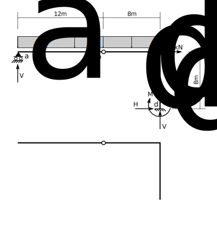
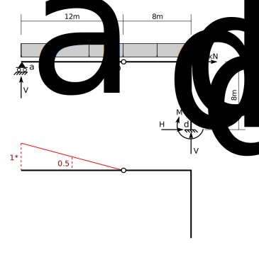
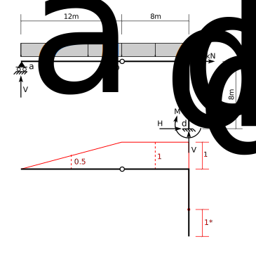
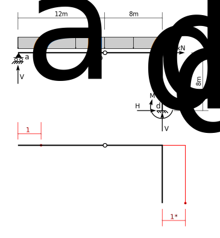
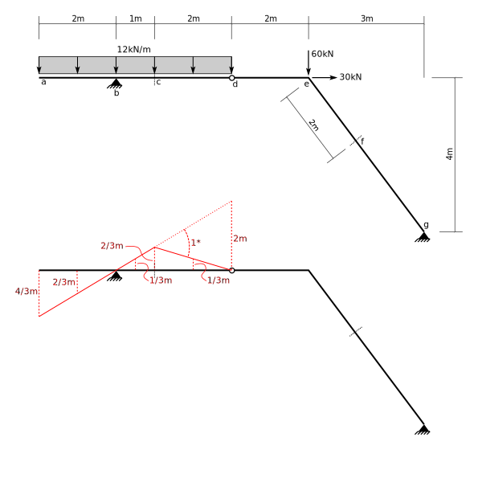

# 4: Method of Virtual Work (1): Principle of Virtual Displacements

$$
\def\kN{~\text{kN}}
\def\m{~\text{m}}
\def\kNm{~\text{kN-m}}
\def\kNpm{~\text{kN/m}}
$$

## 4.1.1 Introduction

The main principle is offered here without proof:

 

  If a body in equilibrium under a set of forces is subject to a virtual rigid
  body displacement (i.e., strains everywhere are zero), the total virtual work done
  by the forces is zero.
  

   
  Some proofs are available here:
  1. [CIVE 3203 Lecture, 2019](http://holtz3.cee.carleton.ca/recordings/3203/2019/2019-10-11/Part-1/)
  1. [Learning the Virtual Work Method in Statics](https://peer.asee.org/learning-the-virtual-work-method-in-statics-what-is-a-compatible-virtual-displacement.pdf)
	
## 4.1.2 Procedure

The above principle can be used in a procedure to determine structural actions (reactions, internal
forces) by the method of virtual displacements.

1. Identify the single action you wish to determine (e.g., a vertical reaction, a bending moment 
   at a point, or a shear force at a point).
1. Identify the constraint that corresponds to that action (e.g, against vertical displacement, 
   against relative rotation from one side of the point to the other, or against relative
   transverse displacement from one side of the point to the other).
1. Relax the constraint and impose an arbitrary small displacement in its place.
1. Maintain all other constraints and draw a consistent deflected shape.  In particular, 
   all other support constraints are honoured, and no additional curvature is allowed in 
   structural members.
1. Assign one of the displacements an arbitrary value, and express all other displacements
   in the deflected shape in terms of that.
1. Write a virtual work equation in terms of the unknown action and known displacements
   and set it to zero.
1. Solve for the unknown action.

Some notes:

1. You may use anything, including a symbolic term, as the value you assign to the
   particular displacement.  Whatever you use will cancel out of the final equation.
   A particularly convenient value is '1'.
1. The resulting equation is really an equilibrium equation.  This is just a different
   (and sometimes easier) way to develop it.

## 4.1.3 Frame Reactions

The procedure will be illustrated by determining all four reactions in the following
frame (note that by inspection it is stable and statically determinate).  Each reaction
will be determined seperately and independently.  For each, the virtual deflected
shape will be drawn underneath the structure and key displacements will be shown.

For each deflected shape, the displacement corresponding to the action desired will
be assigned the value '1' (with no units).  It will be labelled on the drawing
as '1*' to remind us that this is a virtual displacement.

The value '1' is used, as this slightly simplifies the solution of the equations.

### Vertical Reaction at a

The relevant constraint is against vertical displacement at joint $a$.  That constraint
is relaxed and a unit displacement assigned in its place.  Joint $a$ is free to rotate
and move horizontally as required.  Frame portion $b c d$ is constrained from any displacement
by its rigidity and by the fixed support at $d$.  The pin at $b$ allows relative rotation
between $ab$ and $bcd$.  The final deflected shape then is a rotation of $ab$ clockwise
to accommodate the unit upward displacement of $a$.  The deflected shape drawing
shows the end displacement
(assigned a value of '1') and also the displacement at the center of gravity of the portion 
of the distributed load above $ab$.

The assigned displacement on the deflected shape should be in the same
direction as that assumed for the reaction force.  Signs are easier to keep
track of that way.

The work done by displacement of a distributed load can be calculated using the
displacement of its centroid, times the total load.

Writing the virtual work expression:

$$
\begin{split}
&V_a \times 1 - 16\kNpm \times 12\m \times 0.5 = 0\\
&V_a = 96\kN\\
\end{split}
$$

### Vertical Reaction at d

The constraint against vertical displacement at $d$ is relaxed and a unit upward displacement
is assigned in its place (upward, because the drawing assumes that $V_d$ is upward).
Constraints still prevent horizontal displacement and rotation at $d$ and therefore frame
portion $bcd$ must displace straight vertically with no rotation nor
horizontal translation.  The pin at $b$ allows relative rotation
of $ab$ to $bcd$, and point $a$ is constrained against vertical displacement (but not
against rotation).  The final deflected shape then shows a counter-clockwise rotation
of $ab$ and a vertical translation of $bcd$.

Virtual work (noting that all virtual displacements are unitless):

$$
\begin{split}
&V_d \times 1 - 16\kNpm\times 8\m \times 1 - 16\kNpm\times12\m\times0.5 = 0\\
&V_d = 224\kN\\
\end{split}
$$

### Horizontal Reaction at d

The constraint against horizontal displacement at $d$ is relaxed and a unit displacement assigned
in its place.  The frame drawing shows that $H_d$ is assumed acting rightwards and so the displacement
is assigned in the same direction.

The fixed support at $d$ constrains the frame portion $bcd$ from rotating and from displacing 
vertically, so that portion can only move horizontally a unit amount everywhere (especially at joint
$c$, the point of application of the $30\kN$ load).

The pin at $b$ prevents differential horizontal displacements af $ab$ and $bcd$ so $ab$
must displace a unit amount rightward as well.  That is allowed by the roller support at
$a$.

Note that vertical displacements of the distributed load are zero everywhere, so that load
does not contribute to the horizontal reaction.

Virtual work:

$$
\begin{split}
&H_d\times 1 + 30\kN\times 1 = 0\\
&H_d = -30\kN~~~~~~~~(\therefore\leftarrow)\\
\end{split}
$$

Note that the computed value turned out negative.  That only means that we assummed
incorrect directions on the drawings and that the reaction does act toward the left,
instead of toward the right as assumed.

### Moment Reaction at d

The drawing shows an assumed clockwise direction for the moment reaction, $M_d$ at $d$.
Therefore, the constraint against rotation at $d$ is relaxed and a unit clockwise
rotation at point $d$ is assigned.  Because $bcd$ is rigid, that means that point $c$
must move horizontally to the right. Point $b$ will move horizontally the same amount
as point $c$, but it will also move vertically (the total movement is perpendicular
to a radius drawn from $d$ to $b$, as the centre of rotation is point $d$).

The pin at $b$ drags the portion $ab$ rightward by the same amount (allowed by
the roller at $a$).  Member $ab$ rotates counter-clockwise in order not to violate
the constraint against relative transverse displacement at $b$, while honouring the constraint
against vertical displacement at $a$.

Deflection amounts are shown.  Although the rotation is unitless, the member lengths
are not.  Therefore the displacements on the deflected shape have units in this example, 
whereas in the above three examples all displacements were unitless.

When displacements are calculated from rotations, the displacements will have
units, obtained from the units of the member lengths, even when the
rotation is unitless.  Those units should be maintained in your calculations.

Virtual work:

$$
\begin{split}
&M_d\times1 - 16\kNpm\times12\m\times4\m - 16\kNpm\times8\m\times4\m + 30\kN\times8\m = 0\\
&M_d = 1040\kNm\\
\end{split}
$$

## 4.1.4 Frame Internal Forces

The following section is not yet complete.

The following shows the virtual displaced shape for a number of internal quantities.
On each drawing is shown the assigned displacement, other key displacements,
and displacements at the centroids of the distributed load, above.

The virtual work expressions are not yet shown, but they will be (someday).

Note that for the three internal actions are as follows:

1. For moment, a unit rotation of one side of the point relative to the other.
Normal sign convention would have the left portion rotating coun ter-clockwise and
the rigth portion clockwise (relatively).  Relative transverse and longitudinal displacements
are prevented

1. For shear, a unit relative displacement of one side of the point relative
to the other.  This displacement is transverse (perpendicular to the axis of the
member).  If there is a non-zero bending moment at the point, there may be no
relative rotations.

1. For axial force, a unit relative displacement in the longitudinal direction.

### Moment at b

As the portion to the right of _b_ cannot rotate, all of the rotation must occur in the
left portion _ab_.  It is assigned a unit counter-clockwise rotation.  The centre of _ab_ 
is 1m away, so that point displaces downwards $1\times1\m = 1\m$.

### Moment at c

The beam is given a unit rotation at point _c_.  Point _d_ cannot move vertically, so the
section _cd_ must rotate about _d_ to allow the upward displacement of point _c_.

To compute the displacements, extend the straight line _abc_ to over point _d_.
As the horizontal distance from _c_ to _d_ is 2m and the angle is 1, the vertical distance
from _d_ to the extended line is also 2m.  Similar triangles give the remaining displacements.

### Moment at e

### Moment at f

### Shear to the left of b

### Shear to the right of b

### Shear at c

### Shear at d

### Shear to the left of e

### Shear at the top of eg

### Shear at f

### Axial force at c

### Axial force at f

