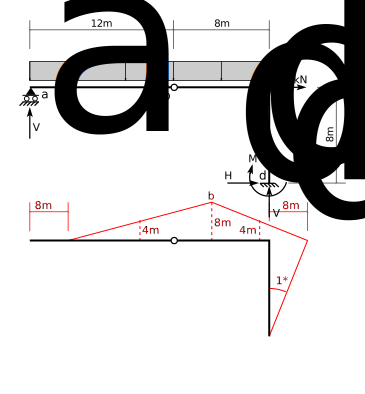

# 4: Method of Virtual Work (1): Principle of Virtual Displacements

## 4.1 Introduction

## 4.2 Reactions

### Vertical Reaction at a

### Vertical Reaction at d

### Horizontal Reaction at d

### Moment Reaction at d

