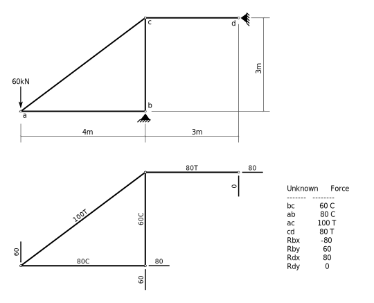
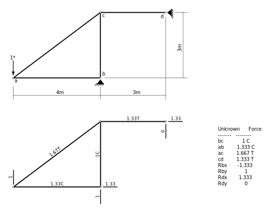
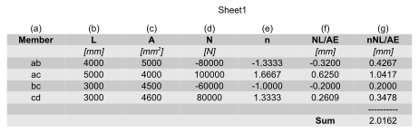

# Elastic Displacements

## 6.5 Truss Example 1

To review, using notation similar to that of Hibbeler (?), 
the general virtual work expression
can be given as:

$$
1^* \times \Delta = \sum u \times \delta L
$$

where

$\Delta$
  is the desired displacement due to real effects; 

$1^*$ 
  is an applied virtual unit force corresponding
  to the displacement; 

$\delta L$ 
  are internal distortions due to the real effects; and 

$u$
  are internal virtual forces corresponding to the
  internal distortions and in equilibrium with the virtual unit force.

For trusses, the $u$ terms will be member forces, $n_i$ due to the virtual 
unit load
and the $\delta L$ terms will be real changes in length of the members.

To determine the distortions due to the real applied loads, we have, 
for each member $i$, its change of length:

$$
   \delta L_i = \left( {N L \over A E} \right)_i
$$

where

$N$
  is the real normal (axial) force in each member;

$L$
  is the length of the member;

$A$
  is its cross sectional area, and

$E$
  is the modulus of elasticity.

### Displacements Due To Loads

Consider the following loaded truss.  The bottom portion of the figure
shows the member forces corresponding to the 60kN applied load; these
are determined by a simple truss analysis (the truss is statically
determinate and stable).

All the truss members are steel ($E = 200 000 MPa$) and the cross
sectional areas of each are given here (in $mm^2$):

| Member      |   Area  |
|:-----------:|:-------:|
| ab          |   5000  |
| ac          |   4000  |
| bc          |   4500  |
| cd          |   4600  |

We wish to determine the vertical displacement of joint _a_ due to the
applied loads.  Therefore we place a unit virtual load at joint _a_,
corresponding to the displacement we desire.  The direction that we
show for the unit load is the assumed direction of the displacement
(i.e., downwards).  For the virtual system, the unit load must be the
only load acting.  The bottom portion of this figure shows the virtual
member forces corresponding to the unit load.

The calculation of the displacement is most conveniently done in tabular form.
The following figure shows these calculations.

A few notes about the various columns:

**(d)**
   this column shows the normal forces in each member due to the real, applied loads.  The usual sign convention is that tension is +ive and compression is -ive.

**(e)**
   this column shows the normal force in each member due to the application of the unit virtual load.  As the virtual load is unitless, so are the values in this column.  The sign convention must be the same as for the real forces (tension +ive).

**(f)**
   this column need not be computed separately.  It is done so here just to show the real distortions due to the real applied loads.  These are increases in lengths (or decreases, if -ive) of each of the members due to the real loads.

**(g)**
   finally, column (g) is the product of the virtual force in each member times its real change in length.  This column shows the contribution toward the final displacement of each member.

The sum of column (g) is then the real vertical displacement of joint
_a_ (because that is where the virtual load was placed).  It is +ive,
so therefore the displacement direction agrees with the direction of
the virtual load - downwards.

Therefore, the displacement of joint *a* is **2.02mm** downwards.

### Displacements due to temperature change

Suppose that members _ac_ and _cd_ undergo a temperature change of
$-30^\circ C$ (i.e., a temperature decrease).  What will be the
vertical displacement of joint _a_ due only to this temperature change
in two of the members?

Now the $\delta L$ term for each member is its change in length due
to the temperature change:

$$   
\delta L_i = \left( \alpha_T L \Delta T \right)_i
$$

where

$\alpha_T$
   is the coefficient of thermal expansion, commonly $12\times10^{-6} mm/mm/{}^\circ C$ for steel,

$L$
   is the length of the member, in _mm_, and

$\Delta T$
   is the temperature change, in ${}^\circ C$.

For this problem we can reuse the same virtual forces as in part a)
because we want the same displacement.

The calculations are simple enough that we don't need to use a tabular
form - simply compute the contributions of members _ac_ (length =
5000mm) and _cd_ (length = 3000mm):

$$   
\begin{split}
   \Delta_a &= \sum u\times\delta L\\
            &= 1.6667\times 12\times10^{-6}\times 5000 \times -30 +
               1.3333\times 12\times10^{-6}\times 3000 \times -30\\
            &= -4.44
   \end{split}
$$

The final displacement is **-4.44mm** (therefore counter to the
direction of the virtual load, therefore upward) due to the
contractions of members _ac_ and _cd_.

### Displacements due to 'Fabrication Errors'

For the same truss, suppose member _bc_ had been fabricated 10mm too
long due to a fabrication error.  What effect would that have on joint
_a_?  In other words, compute the vertical displacement of joint _a_
due to a change in length of member _bc_ of +10mm (increases in length
are +ive to match the sign convention established earlier).

Again we can reuse the virtual loads computed in part a) as we are
interested in the same displacement of the same joint.

This time, the $\delta L$ term for each member is simply the specified
change in length, and only member _bc_ has a $\delta L$ that is
non-zero.  So:

$$   
\begin{split}
   \Delta_a &= \sum u\times\delta L\\
             &= -1.0000\times +10mm\\
             &= -10 mm
   \end{split}
$$

The vertical displacement of joint _a_ due to member _bc_ being 10mm too 
long is **10mm upward**.
