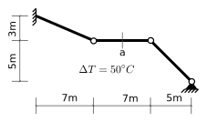
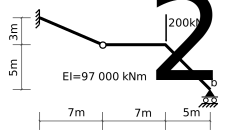
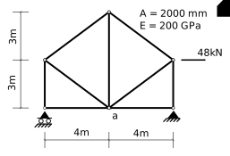
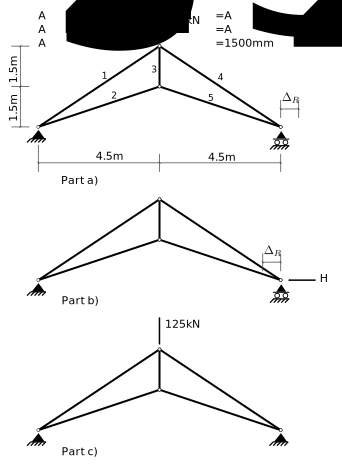
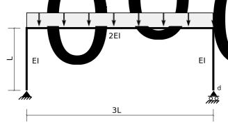
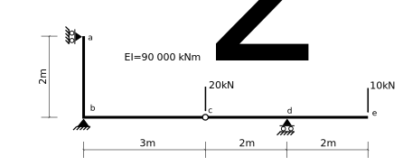
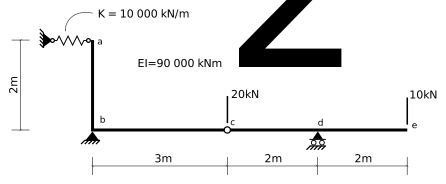

# 6. Elastic Displacements

## 6.8 Suggested Problems

### Problem 6-1

Determine the vertical displacement of point _a_ due to the temperature change.
Assume a coefficient of thermal expansion of $8\times10^{-6}/{}^{\circ}C$.

([Partial Solution for 6-1](../../../../images/virtualwork/virtualforce/problems/p1-soln.svg))

### Problem 6-2

Determine both the horizontal displacement and the rotation of end _b_ due to the single 200kN applied load.

### Problem 6-3

Determine the vertical displacement of joint _a_ due to the 48kN applied load.

([Partial Solution for 6-3](../../../../images/virtualwork/virtualforce/problems/p3-soln.svg))

### Problem 6-4

In the following truss:

1. Determine the horizontal displacement of the right support, $\Delta_R$, due to the applied load.

1. Determine the horizontal force, $H_R$, necessary to produce an equal displacement of the right joint in the opposite direction.

1. Determine all of the forces and reactions.

### Problem 6-5

In the following frame, determine:

1. the horizontal displacement of member end _d_.
1. the rotation of member end _d_.

([Notebook Solution](../../../../notebooks/virtualwork/virtualforce/Problem-6-5))

### Problem 6-6

In the following structure determine:

1. the vertical displacement of point _e_.
1. the vertical displacement of point _c_.
1. the rotation of joint _b_.
1. the relative rotation between member ends _cb_ and _cd_ at joint _c_.

([Solution for 6-6](../../../../images/virtualwork/virtualforce/problems/p6-soln-1.svg))

([Notebook Solution](../../../../notebooks/virtualwork/virtualforce/Problem-P6-demo))

### Problem 6-7

In the following structure determine:

1. the vertical displacement of point _e_.
1. the vertical displacement of point _c_.
1. the rotation of joint _b_.
1. the relative rotation between member ends _cb_ and _cd_ at joint _c_.

([Solution for 6-7](../../../../images/virtualwork/virtualforce/problems/p7-soln-1.svg))
