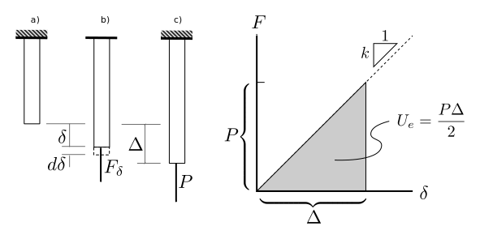
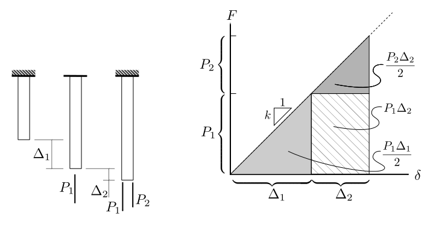
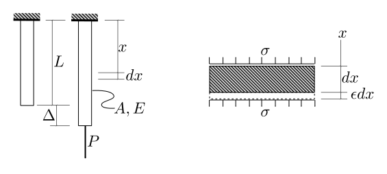

# 6. Elastic Displacements

## 6.2 External Work and Strain Energy

### Axial Force - External Work

Consider a rod of linearly elastic material and constant cross-section
as shown in the following figure.  As the tension force, $F$, is applied, the free
end moves downward (i.e., the rod elongates) a distance $x$.

Because the force moves with the elongation of the rod, it does
work; we will call that external work, $U_e$.

External work, $U_e$, is the work done by the application
of external forces (loads and reactions) as they move through the
elastic displacements of the structure.

As force, $F$, is increased from 0, end displacement, $\delta$, increases
as well.  The differential amount of external work at displacement $\delta$
is given by

$$
dU_e = F_\delta d\delta
$$

The total external work done by a force, $F$ is the summation
of all the differential work terms:

$$
U_e = \int_{0}^{\Delta} F_\delta d\delta
$$

but as $F_\delta = k\delta$, where $k$ is a constant:

$$
\begin{align}
U_e &= \int_{0}^{\Delta} k \delta d\delta\\
    &= \frac{k \Delta^2}{2}\\
\end{align}
$$

When the displacement $\delta$ reaches the limit, $\Delta$,
$F_\delta$ reaches the limit, $P$ and we have $P = k\Delta$ or
$k = P/\Delta$.  Then

$$
\begin{align}
U_e &= \frac{P}{\Delta} \frac{\Delta^2}{2}\\
U_e &= \frac{P \Delta}{2}
\end{align}
$$

or, more simply, it is the area under the force-displacement curve, above.

Now consider the same loaded rod, with the force increasing slowly
from zero to a maximum of $P_1$ and a corresponding elongation
of $\Delta_1$ as shown in the following figure.

As before, the total external work done is 

$$
U_e = \frac{P_1 \Delta_1}{2}
$$

Now, consider the rod with 2 forces
applied. Force 1 is held constant at $P_1$ and force 2
is increased slowly from 0 to $P_2$.  This is illustrated below.

The force-displacement curve is also shown , and from that
we can determine the external work done by this system.
* $P_1\Delta_1/2$ is the work done by force 1 as it
   moves through the displacements caused by force 1.
* $P_2\Delta_2/2$ is the work done by force 2 as it moves through
  the displacements caused by force 2.
* $P_1\Delta_2$ is the work done by the constant force 1 as it moves
  through the displacements caused by application of force 2.
  
The total external work is thus:

$$
U_e = \frac{P_1\Delta_1}{2} + P_1\Delta_2 + \frac{P_2\Delta_2}{2}
$$

Now, reverse the application of the forces.  Starting with no forces applied,
slowly apply force 2 up to its value of $P_2$.  Then hold that constant
and slowly apply force 1 up to its value of $P_1$.  This is
illustrated in the following figure.

The force-displacement curve is also shown , and from that
we can determine the external work done by this system.
* $P_2\Delta_2/2$ is the work done by force 2 as it
   moves through the displacements caused by force 2.
* $P_1\Delta_1/2$ is the work done by force 1 as it moves through
  the displacements caused by force 1.
* $P_2\Delta_1$ is the work done by the constant force 2 as it moves
  through the displacements caused by application of force 1.
  
The total external work is thus:

$$
U_e = \frac{P_2\Delta_2}{2} + P_2\Delta_1 + \frac{P_1\Delta_1}{2}
$$

As it is irrelevant in what order the forces are applied, the total
external work done in both cases must be equal. Therefore

$$
P_1\Delta_2 = P_2\Delta_1
$$

The work done by force 1 acting through the displacement caused by force 2
is equal to the work done by force 2 acting through the displacement
caused by force 1.

This is an important result, and will be generalized below.
It forms the basis of many computation tools for analyzing
structures.

### Axial Force - Strain Energy

As a structure deforms, the internal stresses acting through the internal
strains result in a quantity known as "strain energy".  This is the energy
stored in the structure as it deforms, and will be released when the structure
is allowed to return to its original position.

The above figure shows internal forces (stresses) acting through internal
displacements (strain) resulting in internal work, $U_i$.  
Remembering that both $\sigma$ and $\epsilon$ increase 
simultaneously from 0, in the element
the differential amount of work done is:

$$
d U_i = \frac12 \sigma A \epsilon dx
$$

But $\sigma = P/A$ and $\epsilon = \sigma/E = P/A E$.

$$
\begin{align}
d U_i &= \frac12 \frac{P}{A} A \frac{P}{A E} dx\\
      &= \frac{P^2}{2 A E} dx\\
\end{align}
$$

The total internal work, or strain energy, is:

$$
\begin{align}
U_i &= \int_0^L \frac{P^2}{2AE} dx\\
U_i &= \frac{P^2 L}{2 A E}\\
\end{align}
$$

### External work = strain energy

The principle of the Conservation of Energy states that external work = inter work or starin 
energy.  That is, all of the work doen by forces being applied to structures is
stored as energy in the structure.

So we have:

$$ 
\begin{align}
U_e &= U_i\\
\frac{P\Delta}{2} &= \frac{P^2 L}{2 A E}\\
\end{align}
$$

This gives us a tool that we c an use to solve for displacements, for example.
For an axially loaded bar:

$$
\Delta = \frac{P L}{A E}
$$

This  displacement was computed using the "Direct Energy Method".

### Bending - Strain Energy

As loads are increased from 0 to their final values, moment on the element
also increases from 0 to $M_x$ and angle change, $d\theta$ increases linearly from 0
at the same time.

The work done on the element by the internal forces is the strain energy.

Considering only bending moments,

$$
d U_i = \frac12 M_x d\theta
$$

from strength of materials, we have:

$$
d\theta = \frac{M}{EI} dx
$$

and thus for the element:

$$
d U_i = \frac{M_x^2}{2 E I} dx
$$

For the whole beam, where $M_x$ varies over the length, the strain energy is:

$$
U_i = \int_0^L \frac{M_x^2}{2 E I} dx
$$

### Example: Using direct energy method to find deflection

Consider the prismatic simply-supported beam as shown in the above figure.
$E$ and $I$ are constant over the whole length and a single concentrated
force $P$ is applied at the centre.

As the force is increased from 0 to $P$, the work done by the force
is the external work, given by:

$$
U_e = \frac12 P\Delta
$$

From above, we have the strain energy (internal work) as:

$$
\begin{align}
U_i &= \int_0^L \frac{M_x^2}{2 E I} dx\\
    &= 2\times\frac{1}{2 E I} \int_0^{L/2} (\frac{P}{2} x)^2 dx\\
	&= \frac{P^2}{4 E I} \int_0^{L/2} x^2 dx\\
	&= \left. \frac{P^2}{4 E I} \frac{x^3}{3} \right|_0^{L/2}\\
U_i &= \frac{P^2 L^3}{96 E I}\\
\end{align}
$$

but, as $U_e = U_i$,

$$
\begin{align}
\frac12 P\Delta &= \frac{P^2 L^3}{96 E I}\\
\Delta &= \frac{P L^3}{48 E I}\\
\end{align}
$$

We have just calculated a beam displacement using the direct energy method. 
While that
method should have made the basis of work and energy methods
easier to understand, it has a very serious drawback that makes it essentially useless
in practice.

For beams, using the direct energy method, it is only possible to compute displacements
when there is a sigle concentrated force applied, and then only
at the point of application of the force.

Below, we will develop methods that are more general.
