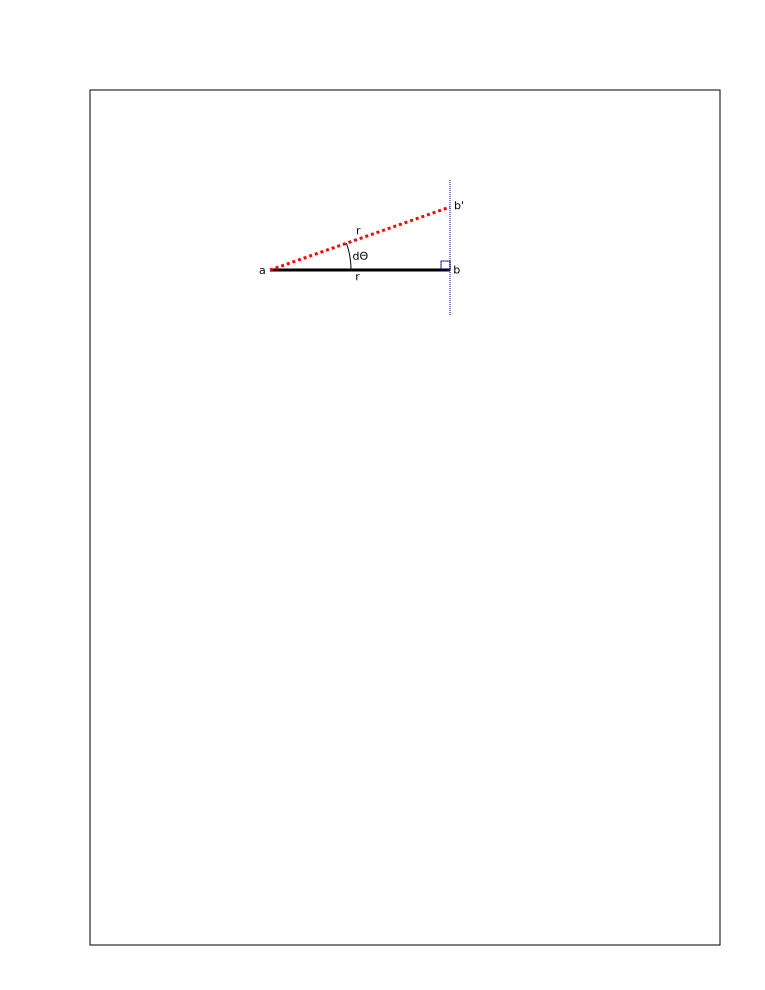
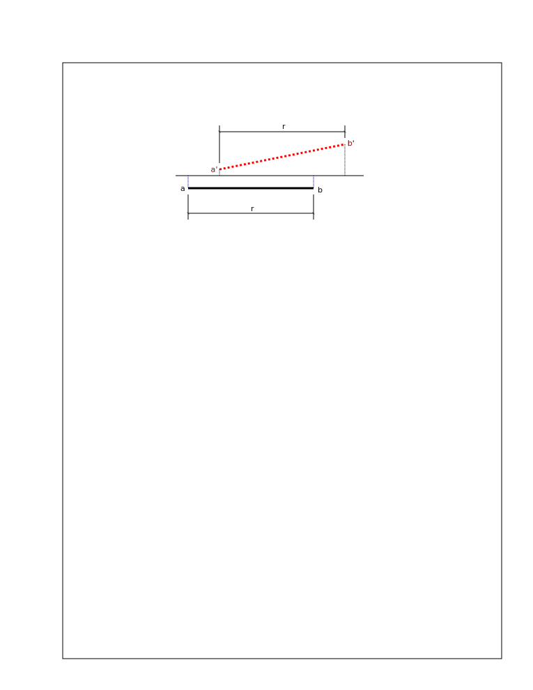
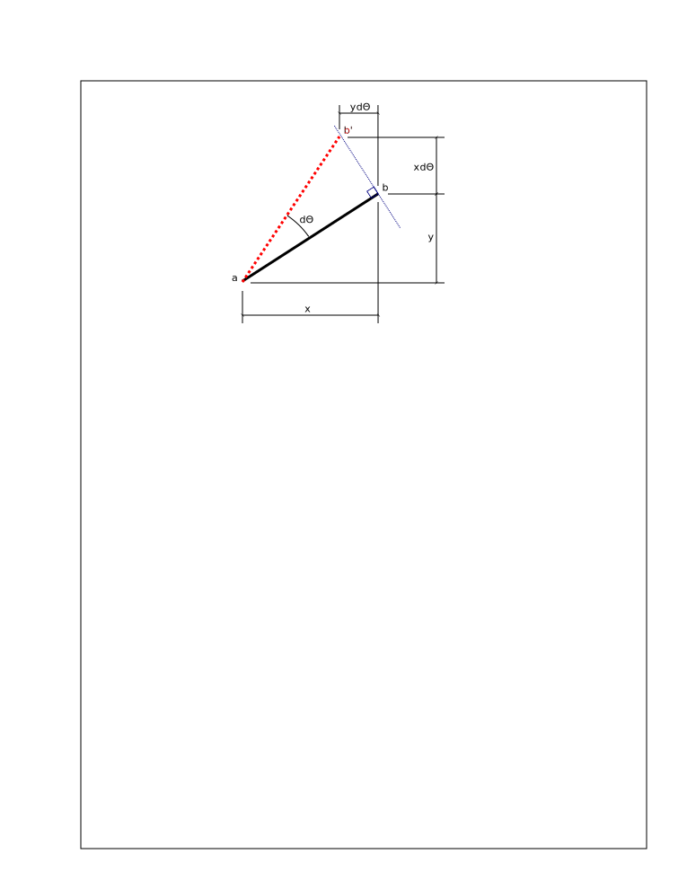
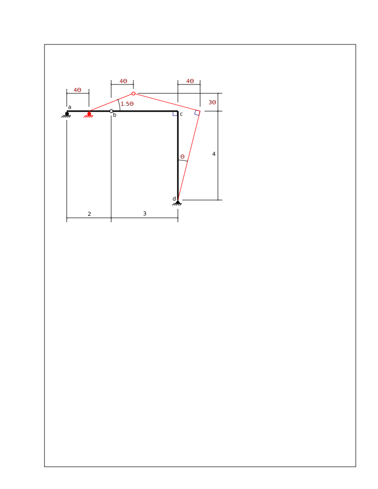

# 1. Fundamental Concepts

## 1.5: Small Rigid Body Displacements

It is frequently important to visualize a structure as it undergoes
*small* rigid body displacements.  We are using the term 'rigid body'
in a slightly unusual sense here that really refers to articulated
bodies.  Individual parts of a structure remain rigid, but relative
displacements may be allowed between the parts.

### Rigid Body Displacements

*Rigid body* simply means that we assume members are infinitely stiff
-- they neither bend, nor shear, nor change in length.  On the other
hand, compatible deformations are allowed at special conditions:
relative rotations are allowed at internal articulations such as
hinges, and supports are allowed to move in any direction in which
they are *not* constrained.  For example, a beam end connected to a pin
support is allowed to rotate, and one connected to a roller support is
allowed to rotate and translate perpendicularly to the direction of
constraint.

   Beams and columns remain straight and unchanged in length during a
   rigid body displacement and obey all external displacement
   constraints.  Relative displacements are allowed at release
   conditions.

### Small Rotations

Fig. 5-1: Small Rotation

The characteristics of small rotations are illustrated in Fig. 5-1.
Let straight beam element *a-b* rotate about point *a* a small amount
$d\theta$.  Point *b* travels along the *straight* line (*not*
an arc) that is perpendicular to the radius from *a* to *b* (in its
original location).  Point *b* ends up at point *b'* along that line.
The rotated member is now the line *a-b'* and its length is still *r*,
unchanged from its original length.

In the limit, as $d\theta \rightarrow 0$, this is valid and without error.

   During a small rotation, points move along a perpendicular
   straight line, not along an arc.

Fig. 5-2: Small Rotation + Translation

When a line member undergoes small rigid body translations and a
rotation, such as that shown in Fig. 5-2, the length of the projection
of the line on an axis parallel to the original line does not change.

   During a small displacement, projections of lines unto the original
   direction do not change.

Fig. 5-3: Resulting Displacements

Fig. 5-3 shows the displacements that result when an inclined line
undergoes a small rotation about one end -- point *a*.

Point *b* moves along the perpendicular to *b'*.  Its horizontal
movement is equal to its vertical distance from *a* times the angle
change and its vertical movement is equal to the horizontal distance
from *a* times the angle change.

The lengths of the horizontal projections, $x$ and $y$, <em>do
not change</em> as a result of this small rotation.

### Systems of Small Displacements

Finally, Fig. 5-4 shows all of these concepts together on one structure.

Fig. 5-4: Small Rigid Structural Displacements

Articulated frame *a-b-c-d* has an internal hinge at *b*.  The section
*b-c-d* is rigid; let it rotate clockwise a small amount $\theta$
about the pin at point *d* - this is our starting point.

* The rigid joint *c* translates horizontally (perpendicular to *c-d*)
  a distance $4\theta$, and rotates clockwise an amount
  $\theta$.

* The portion *b-c-d* rigidly retains its shape.  The right angle at
  *c* is maintained.

* Point *b* then translates horizontally a distance $4\theta$
  (the same as *c*) and vertically a distance $3\theta$ (its
  horizontal distance from the centre of rotation is 3).

* Point *a* translates horizontally a distance of $4\theta$, as
  does every point on the straight line *a-b-c*.

* Line *a-b* must rotate ${3\over 2}\theta = 1.5\theta$ in order
  to have the correct vertical displacement of $3\theta$ at *b*.

* The projection of *a-b-c* on the horizontal does not change in
  length during the displacement.

   Rigid portions of the structure remain rigid -- they do not change
   their shape.  In particular, rigid angles do not change.

   This structure is <em>unstable</em>; see the section on 
   <a href="../sdbeams/determinacy-and-stability">Determinacy and Stability</a>.

