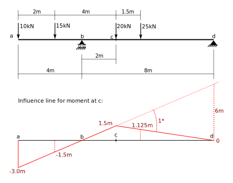
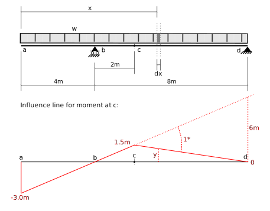
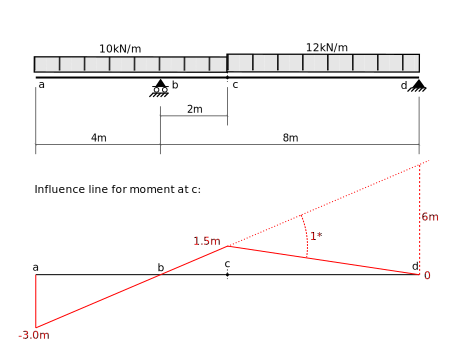
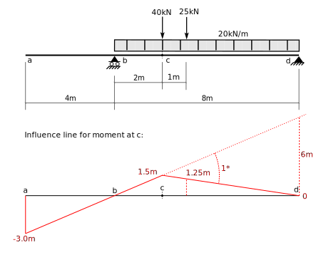
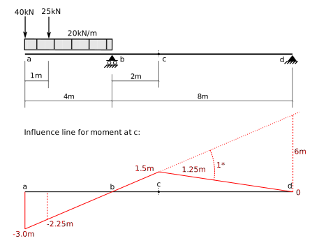

 # 5. Influence Lines

## 5.1 Introduction (Part 3) - Use of Influence Lines

### Concentrated Forces

Because the ordinate, $y$, of an influence line, gives the
structural response, $S$, when a unit load is placed at the location
of the ordinate, we can use superposition to sum the responses
for a series of concentrated forces.

$$
\begin{align}
\displaystyle &S = \sum_{i=1}^{n} P_i y_i\\
 \end{align}
 $$
 
 where:
 
 * $S$ - is the structural response determined by the influence line.
 * $P_i$ - the value of the $i^{th}$ concentrated force (+ive downwards).
 * $y_i$ - the ordinate of the i.l. at the location of $P_i$, (+ive upwards).
 

### Example Concentrated Force

For example:
 

For the beam subjected to 4 concentrated forces, the bending moment
at point $c$ is:

$$
\begin{align}
&M_c = 10\text{ kN}\times -3.0\text{ m} + 15\text{ kN}\times -1.5\text{ m}
  + 20\text{ kN}\times 1.5\text{ m} + 25\text{ kN}\times 1.125\text{ m}\\
&M_c = 42.535\text{ kN}\cdot\text{m}\\
\end{align}
$$

### Uniformly distributed forces

Consider the loads in the following figure, where a uniformly distributed load, 
of intensity $w$, is distributed over the whole length of the beam.

Consider an element of length $dx$, at a distance $x$ from the left end.
The amount of load on that element is:

$$
dw = w dx
$$

Its differential contribution to the structural response is obtained by multiplying
by the ordinate of the IL at its location:

$$
dS = y dw = w y dx
$$

The total contribution is obtained by summing all the differential
contributions:

$$
\begin{align}
& S = \int_{x=0}^{x=L} dS\\
& S = \int_{x=0}^{x=L} w y dx\\
& S = w \int_{x=0}^{x=L} y dx\\
\end{align}
$$

But $\int y dx$ is the area under the IL, so

$$
S = w \times \text{area under IL}
$$

Of course, the area under the IL is for only that portion that corresponds
to locations of the distributed load.

### Example Distributed Force

For example:

The moment at point $c$ due to the 2 distributed forces is:

$$
\begin{align}
&M_c = 10\text{ kN/m} \times (-3\text{ m} \times 4\text{ m} \times \frac12)
       + 10\text{ kN/m} \times (1.5\text{ m} \times 2\text{ m} \times \frac12)
	   + 12\text{ kN/m} \times (1.5\text{ m} \times 6\text{ m} \times \frac12)\\
&M_c = 24\text{ kN}\cdot\text{m}
\end{align}
$$

### Movable loads (live loads)

Many loads are not fixed in location but in fact may be placed anywhere on the 
structure.  Examples are:
1. truck or wheel loads on bridges.
1. live loads due to use and occupancy.
1. snow loads.
1. wind loads.

Designers usually have to account for the fact that the load must be placed where
it will cause the worst effects.  The reason is nicely illustrated by the influence
line for $M_c$, above.  In that example, loads placed on the span between 
points $a$ and $b$ cause a negative moment at $c$.  Loads placed between $b$ and $d$
cause a positive moment at $c$.

For design purposes, it is likely necessary to determine the maximum positive _and_
negative moments at point $c$.  This general procedure is followed:
* place any live concentrated force at the maximum +ive ordinate.
* place live distributed forces over all regions that have +ive influence coefficients.
* determine the +ive momement.
* repeat for -ive ordinates.

The general principle is to place all loads where their effect will be worse.

### Example live loads

The beam structure has a live distributed load of 20kN/m, and two
concentrated live loads
of 25kN and 40kN.  The concentrated loads are separated by a fixed 1.0m distance
to represent truck axles,
and may be travelling in either direction.  Determine the maximum +ive and -ive moment
at point $c$.

The above figure shows the live load placement for +ive moment at $c$. 
The distributed load is placed above all areas that have +ive I.L. ordinates.
The largest concentrated load (40kN) is placed above the maximum ordinate.
The other load (25kN) is place 1m away, on the side that has the least 
slope of the I.L. -- that will maximize its ordinate.

$$
\begin{align}
M_c &= 20\text{ kN/m} \times (1.5\text{ m} \times 8\text{ m} \times \frac12)
      + 40\text{ kN}\times 1.5\text{ m}
	  + 25\text{ kN}\times 1.25\text{ m}\\
   &= 211.25\text{ kN}\cdot\text{ m}\\
\end{align}
$$

The above figure shows the load placement to determine maximum -ive moment.
The distributed load placed over all areas that have -ive I.L. ordinates.
The 40kN load placed at the maximum -ive ordinate tand the 25kN load
placed 1m to its left.

$$
\begin{align}
M_c &= 20\text{ kN/m} \times (-3\text{ m} \times 4\text{ m} \times \frac12)
      + 40\text{ kN}\times -3\text{ m}
	  + 25\text{ kN}\times -2.25\text{ m}\\
   &= -296.25\text{ kN}\cdot\text{ m}\\
\end{align}
$$
