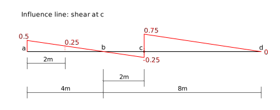

# 5. Influence Lines

## 5.1 Introduction (Part 1) - Equilibrium Method

### What is an influence line?

An influence line is a plot of how a structural response varies as a unit load
is placed at various locations on the structure.  For example, see the following
figure:

In that structure, the unit load is placed a distance $x$ from the left end of the beam.
We could determine functions that give us the corresponding shear force, $V_c$,
and bending moment, $M_c$ at point $c$, as a function of that distance $x$.
The plots of these functions over the range $0 \le x \le 12$
would be influence lines for the two responses.

The ordinate of an influence line at a distance $x$ from the left end gives the
value of the structural response when a unit load is placed a distance $x$ from
the left end.

We will first show the development of these functions and influence lines from
first principles.

## Construction using Equilibrium

Influence lines are almost never constructed using this technique, but the
function of an influence line is easier to understand when we do it this way.
Almost always, the M&uuml;ller-Breslau principle is used to construct them
(see below).

### Determine the reactions

In order to determine shear and moment at point $c$ for any position of the 
unit load, it is necessary to first determine at least one of the reactions,
expressed as a function of $x$.

The above is a free body diagram of the entire structure, with the
unit load placed a distance $x$ from the left end.  To determine the reactions,
it is a simple matter of applying standard equilibrium.

$$
\begin{align}
&\sum M_d = 0~~~~+\text{CCW}\\
&1\times(12-x) - R_b\times8 = 0\\
&R_b = \frac{12-x}{8}\\
&\\
&\sum F_y = 0~~~~+\uparrow\\
&-1 + R_b + R_d = 0\\
&-1 + \frac{12-x}{8} + R_d =0\\
&R_d = \frac{x-4}{8}\\
\end{align}
$$

And remember, $x$ is only covers the range:

$$
0 \le x \le 12
$$

### Unit load left of c

The next step is to 'cut' the structure at point $c$, draw a FBD of one side of the cut,
and determine the shear and the moment at $c$ as a function of the applied forces, and $x$.

We normally draw an FBD of the left side, so that is what we will do here (thought the
right side would work just as well).

But we notice there are two possible, and different FBDs.  One that includes the unit load,
for use when its position, $x$, is $0\le x\le 6$.  The first free body above represents
that case, and we get the following for shear and moment

$$
\begin{align}
&\sum F_y = 0~~~+\uparrow\\
&\frac{12-x}{8} - 1 - V_c = 0\\
&V_c = \frac{4-x}{8} = 0.5 - \frac{x}{8}\\
&\\
&\sum M_c = 0~~~+\text{CCW}\\
&1\times(6-x) + M_c - \frac{12-x}{8}\times2 = 0\\
&M_c = \frac{3}{4}x -3\\
\\
\text{for}~~~&0 \le x \le 6\\
&\end{align}
$$

### Unit load right of c

The free body diagram for when $x\gt 6$ is different, and is show above.
In this FBD, the unit load does not appear on the diagram, so equilibrium
gives us:

$$
\begin{align}
&\sum F_y = 0~~~+\uparrow\\
&\frac{12-x}{8} - V_c = 0\\
&V_c = \frac{12-x}{8} = 1.5 - \frac{x}{8}\\
&\\
&\sum M_c = 0~~~+\text{CCW}\\
&M_c - \frac{12-x}{8}\times 2 = 0\\
&M_c = 3 - \frac{x}{4}\\
\\
\text{for}~~~&6 \lt x \le 12\\
&\end{align}
$$

### Moment at c as a function of x

We plot the influence line for moment by noticing that all moment functions
are linear in $x$, so we just evaluate the function at either end of the allowable $x$
range:

$$
\begin{array}{|c|c|c|c|}
\hline
\displaystyle     M(x)         &  @ x=0   &  @ x=6   &  @ x=12\\
	 \hline
\displaystyle \frac{3}{4}x - 3 &  -3   &  1.5  &   na \\
\displaystyle  3 - \frac{x}{4} &   na   &  1.5  &   0 \\
  \hline
  \end{array}
$$

Plotting those values results in the above influence line.

For example, the ordinate at $x=2$ is $-1.5m$.  That means that a 1kN load placed
at $x=2$ will cause a moment of $1\text{kN}\times -1.5\text{m} = -1.5\text{kN}\cdot\text{m}$
at point $c$.

### Shear at c as a function of x

Similarly, to plot the influence line for shear:

$$
\begin{array}{|c|c|c|c|}
\hline
\displaystyle     V(x)         &  @ x=0   &  @ x=6   &  @ x=12\\
	 \hline
\displaystyle  0.5 - \frac{x}{8} &  0.5   &  -0.25  &   na \\
\displaystyle  1.5 - \frac{x}{8}&   na   &  0.75  &   0 \\
  \hline
  \end{array}
$$

The above figure shows this influence line.

For example, the ordinate at $x=2$ is $0.25$.  That means that a 1kN load placed
at $x=2$ will cause a shear force of $1\text{kN}\times 0.25 = 0.25\text{kN}$
at point $c$.

## Previous Notes (Mostly obsolete):

- [Introduction Part 1](../../images/influencelines/introduction/influence-lines-1.pdf) A short introduction to the concept and the direct way of forming the influence line.  This is largely a repeat of the above work, but more compact
and handwritten.
- Introduction Part 2 (to come)

