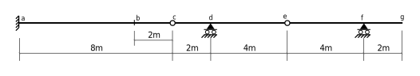
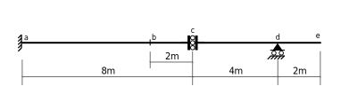
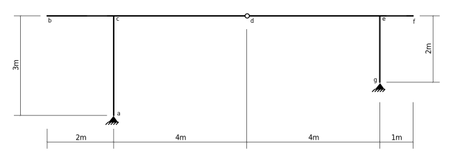
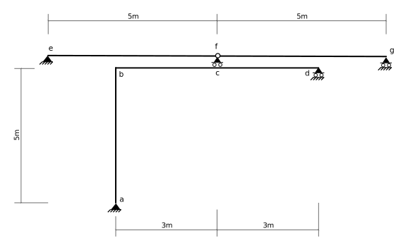
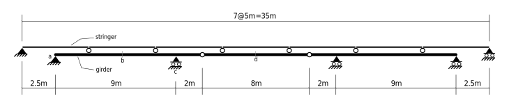

# 5. Influence Lines

## 5.3 Suggested Problems

### Problem 5.3-01

Sketch influence lines for the following effects:

1. Moment at $a$.
1. Moment at $b$.
1. Shear at $b$.
1. Shear at $c$.
1. Shear just to the left of $d$.
1. Shear just to the right of $d$.
1. Moment at d.
1. Shear at $e$.
1. Shear just to the left of $f$.
1. Shear just to the right of $f$.
1. Moment at $f$.

The structure is subjected to a uniform _live load_ of 20kN/m
and a concentrated _live load_ of 60kN (acting simultaneously).
Determine the range of each effect for this loading condition.
Show the correwsponding position of the loads, for each.

([Partial-Solution](../../images/influencelines/suggested-problems/problem-01-beam-ans-1.svg) - influence lines)

([Partial-Solution](../../images/influencelines/suggested-problems/problem-01-beam-ans-2.svg) - effect of live loads)

### Problem 5.3-02

Sketch influence lines for the following effects:

1. Vertical reaction at $a$.
1. Moment at $a$.
1. Shear at $b$.
1. Moment at $b$.
1. Moment at $c$.
1. Vertical reaction at $d$.
1. Shear just to the left of $d$.
1. Shear just to the right of $d$.
1. Moment at $d$.

([Partial-Solution](../../images/influencelines/suggested-problems/problem-02-beam-ans-1.svg))

### Problem 5.3-03

In the above frame, loads are applied vertically to the horizontal member $bcdef$.
Sketch influence lines for the following effects.

1. Vertical reaction at $a$.
1. Horizontal reaction at $a$.
1. Moment $M_{ba}$ at the top of the column $ab$.

([Partial-Solution](../../images/influencelines/suggested-problems/problem-03-frame-ans-1.svg))

### Problem 5.3-04

In the above frame, loads are applied vertically to the horizontal member $efg$.
Sketch influence lines for the following effects.

1. Vertical reaction at $a$.
1. Moment at $c$.
1. Moment at $b$.
1. Vertical reaction at $e$.

([Partial-Solution](../../images/influencelines/suggested-problems/problem-04-frame-ans-1.svg))

### Problem 5.3-05

In the above structure, vertical loads are applied to the stringers, which in turn are simply
supported by the girder.  Draw influence lines for the following effects:

1. Vertical reaction on the girder, at $a$.
1. Moment in the girder at point $b$ (midway between the supports).
1. Shear in girder just to the left of the support at $c$.
1. Moment in the girder over the support at $c$.
1. Moment in the girder at point $d$ (at the centre of the span).
1. Shear in the girder just to the right of the support at $c$.
1. Vertical reaction on the girder at $c$.

([Partial-Solution](../../images/influencelines/suggested-problems/problem-05-stringers-ans-1.svg))
