# 2: Forces in Statically Determinate Beams and Plane Frames

## Suggested Problems - Reactions in Beams

Solve for the reactions for all of the following beam problems and
show your results on a complete free body diagram.  Click on
the link to see the answer.

### Problem 01

[Answer](../../images/sdbeams/probs-beams/P-2-3-0001-soln.svg)

### Problem 02
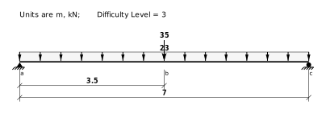
[Answer](../../images/sdbeams/probs-beams/P-2-3-0002-soln.svg)

### Problem 03
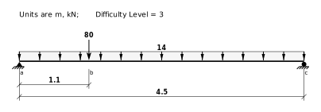
[Answer](../../images/sdbeams/probs-beams/P-2-3-0003-soln.svg)

### Problem 04
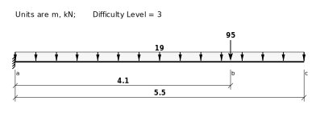
[Answer](../../images/sdbeams/probs-beams/P-2-3-0004-soln.svg)

### Problem 05
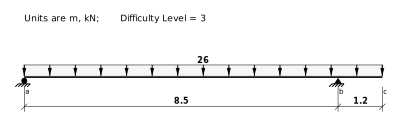
[Answer](../../images/sdbeams/probs-beams/P-2-3-0005-soln.svg)

### Problem 06
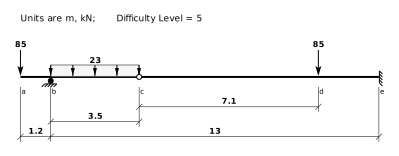
[Answer](../../images/sdbeams/probs-beams/P-2-3-0006-soln.svg)

### Problem 07
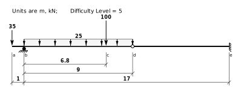
[Answer](../../images/sdbeams/probs-beams/P-2-3-0007-soln.svg)

### Problem 08
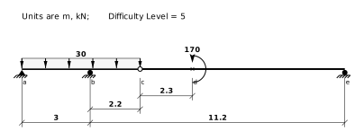
[Answer](../../images/sdbeams/probs-beams/P-2-3-0008-soln.svg)

### Problem 09
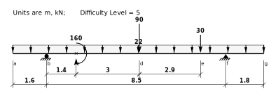
[Answer](../../images/sdbeams/probs-beams/P-2-3-0009-soln.svg)

### Problem 10
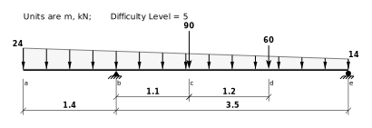
[Answer](../../images/sdbeams/probs-beams/P-2-3-0010-soln.svg)

### Problem 11
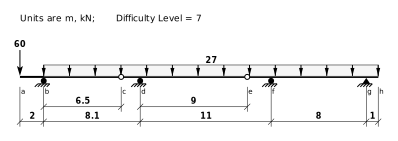
[Answer](../../images/sdbeams/probs-beams/P-2-3-0011-soln.svg)

### Problem 12
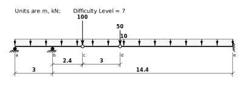
[Answer](../../images/sdbeams/probs-beams/P-2-3-0012-soln.svg)

### Problem 13
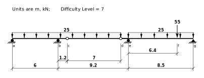
[Answer](../../images/sdbeams/probs-beams/P-2-3-0013-soln.svg)

### Problem 14
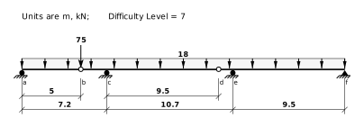
[Answer](../../images/sdbeams/probs-beams/P-2-3-0014-soln.svg)

### Problem 15
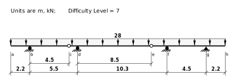
[Answer](../../images/sdbeams/probs-beams/P-2-3-0015-soln.svg)

### Problem 16
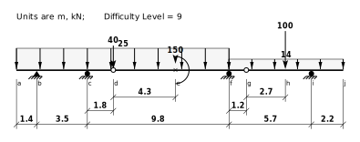
[Answer](../../images/sdbeams/probs-beams/P-2-3-0016-soln.svg)

### Problem 17
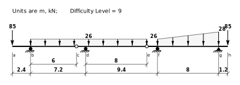
[Answer](../../images/sdbeams/probs-beams/P-2-3-0017-soln.svg)

### Problem 18
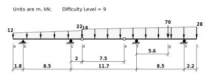
[Answer](../../images/sdbeams/probs-beams/P-2-3-0018-soln.svg)

### Problem 19
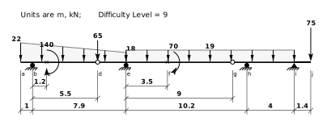
[Answer](../../images/sdbeams/probs-beams/P-2-3-0019-soln.svg)

### Problem 20
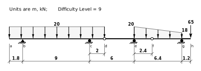
[Answer](../../images/sdbeams/probs-beams/P-2-3-0020-soln.svg)

