# 3: Forces in Statically Determinate Trusses

## 3.8: Problem Set

### 3.8.1 Problem Set 1 - Stability and Determinacy

For each of the following trusses:

* determine if the truss is stable, and
* if the truss is stable, state the degree of indeterminacy

Click on the link to see the solution.

#### Problem 1a)

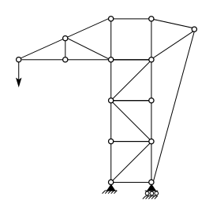

[Solution](../../images/sdtrusses/problems/ps-truss-01-soln.svg)

#### Problem 1b)

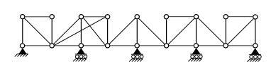

[Solution](../../images/sdtrusses/problems/ps-truss-02-soln.svg)

#### Problem 1c)

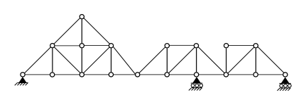

[Solution](../../images/sdtrusses/problems/ps-truss-03-soln.svg)

#### Problem 1d)

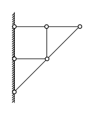

[Solution](../../images/sdtrusses/problems/ps-truss-04-soln.svg)

#### Problem 1e)

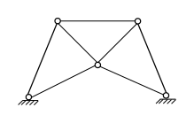

[Solution](../../images/sdtrusses/problems/ps-truss-05-soln.svg)

#### Problem 1f)

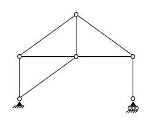

[Solution](../../images/sdtrusses/problems/ps-truss-06-soln.svg)

#### Problem 1g)

[Solution](../../images/sdtrusses/problems/ps-truss-07-soln.svg)

#### Problem 1h)

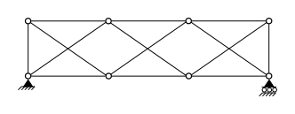

[Solution](../../images/sdtrusses/problems/ps-truss-08-soln.svg)

#### Problem 1i)

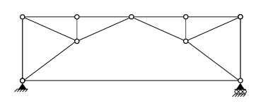

[Solution](../../images/sdtrusses/problems/ps-truss-09-soln.svg)

#### Problem 1j)

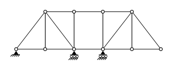

[Solution](../../images/sdtrusses/problems/ps-truss-12-soln.svg)

#### Problem 1k)

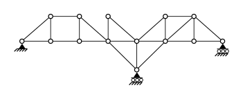

[Solution](../../images/sdtrusses/problems/ps-truss-13-soln.svg)

#### Problem 1l)

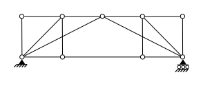

[Solution](../../images/sdtrusses/problems/ps-truss-14-soln.svg)

#### Problem 1m)

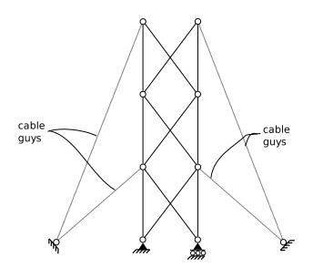

[Solution](../../images/sdtrusses/problems/ps-truss-15-soln.svg)

### 3.8.2 Problem Set 2 - Member Forces

Determine all member forces in the following trusses.

####   Problem 2a)

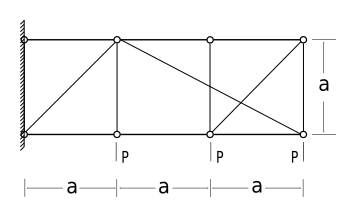

[Solution](../../images/sdtrusses/problems/ps-truss-10-soln.svg)

####   Problem 2b)

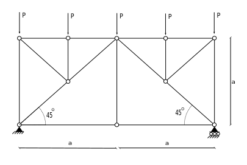

[Solution](../../images/sdtrusses/problems/ps-truss-11-soln.svg)

####   Problem 2c)

[Solution](../../images/sdtrusses/problems/ps-truss-16-soln.svg)

####   Problem 2d)

[Solution](../../images/sdtrusses/problems/ps-truss-17-soln.svg)
