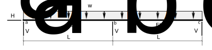

# 7: Statically Indeterminate Beams and Plane Frames

## 7.3: Example, Beam Structure 2 - Alternate Redundants

Draw shear force and bending moment diagrams for the following structure.

   Figure 7.3-1:  Real structure

This example will illustrate the choice of internal bending moments as 
redundants. 

### 1: Determine statical determinacy

The structure is one degree statically indeterminate.  The 
complete free body diagram is shown in Fig. 7.3-2.

   Figure 7.3-2:  Real structure, free body diagram

### 2: Choose the redundants

For this example, we choose the internal bending moment at the 
center support, point _b_, as the redundant.  

Releasing this redundant
means releasing the constraint against rotational discontinuity at that
point, and is essentially the same as inserting a hinge at that point.

### 3: Analyze the primary structure under real loads

Fig. 7.3-3 shows the primary structure under the real loads
and the bending moments that result from this.

   Figure 7.3-3: Determinate structure, real loads

An analysis using equilibrium would determine the following reactive
forces on the primary structure:

$$
   \begin{split}
   H_{a0} &= 0\\
   \\
   V_{a0} &= wL/2\\
   \\
   V_{b0} &= wL\\
   \\
   V_{c0} &= wL/2
   \end{split}
$$

Also seen in the Fig. 7.3-3 is the deflected shape showing the rotational
discontinuity, $\theta_{10}$, introduced by releasing the redundant.

### 4: Apply a unit value of the redundant

Fig. 7.3-4 shows the determinate structure with unit values of the redundants
imposed.  Note that internal bending moments _always_ occur in equal and 
opposite pairs at a point, so we must apply an equal and opposite pair of 
unit moments.

   Figure 7.3-4: Determinate structure, unit redundant

Equilibrium will tell us that:

$$
   \begin{split}
   h_{a1} &= 0\\
   \\
   v_{a1} &= 1/L\\
   \\
   v_{b1} &= -2/L~~~~~(\therefore\downarrow)\\
   \\
   v_{c1} &= 1/L
   \end{split}
$$

### 5: Displacements in the primary structure

Using the unit value structure as the virtual system and
integrating the product of the moment diagrams, taking
advantage of symmetry about point _b_, we get a value
for the relative rotation of the tangents to the elastic curve
at point _b_ in the primary structure:

$$
   \begin{split}
   \theta_{10} &= \int \frac{m_1 M}{E I} dx\\
               &= 2 \times \frac{1}{EI} \times \frac{L}{3}\times 1\times\frac{wL^2}{8}\\
   \\
   \theta_{10} &= \frac{w L^3}{12 E I}
   \end{split}
$$

### 6: Flexibility coefficients

The angle of rotation between the tangents in the released structure due
to a unit value of the redundant is:

$$
   \begin{split}
   f_{11} &= \int \frac{m_1 m_1}{E i} dx\\
          &= 2\times\frac{1}{EI}\times\frac{L}{3}\times 1\times 1\\
   \\
   f_{11} &= \frac{2 L}{3 E I}
   \end{split}
$$

### 7: Compatibility equation

There is no rotational discontinuity in the real structure. In other words,
$\theta_1=0$.  Fig. 7.3-5 shows the graphical compatibilty 'equation'
that expresses the real structure as the sum of the primary structure
with real loads plus the released structure with the redundant applied.

   Figure 7.3-5: Superposition of Structures

We can express that by superposition algebraically thus:

$$
   0 = \theta_{10} + M_b f_{11}
$$

where $M_b$ is the currently unknown real bending moment in the 
real structure.

### 8: Solve for the unknown redundant

$$
   \begin{split}
   0 &= \frac{w L^3}{12 E I} + M_b \frac{2 L}{3 E I}\\
   \\
   M_b &= -\frac{w L^2}{8}~~~~~(\therefore \mathrm{compr.~on~bottom})
   \end{split}
$$

### 9: Determine reactions by superposition

The reactions in the real structure can now be determined by superposition.

$$
   \begin{split}
   H_a &= 0\\
   \\
   V_a &= V_{a0} + M_b v_{a1}\\
       &= \frac{w L}{2} - \frac{w L^2}{8}\times\frac{1}{L}\\
   V_a &= \frac{3 w L}{8}\\
   \\
   V_b &= V_{b0} + M_b v_{a2}\\
       &= w L + -\frac{w L^2}{8}\times -\frac{2}{L}\\
   V_b &= \frac{5 w L}{4}\\
   \\
   V_c &= V_a\\
   V_c &= \frac{3 w L}{8}
   \end{split}
$$

   Figure 7.3-6: Summary Results
   
