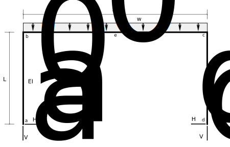
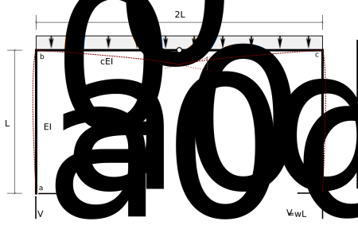
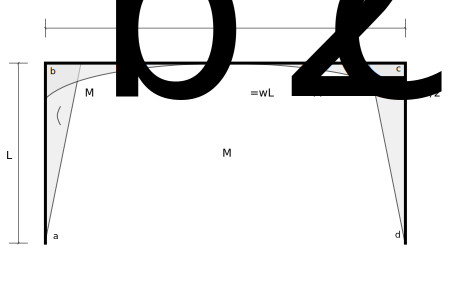
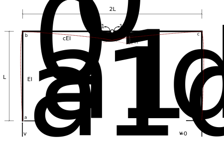

# 7: Statically Indeterminate Beams and Plane Frames

## 7.8: Example -  Frame Example 3

Determine all of the reactions for the following frame:

   Figure 7.8-1: Frame Example 3

This problem will illustrate the use of internal bending moments as redundants.

Note that rather than having a fixed ratio of the $EI$ of the beam to that of the columns,
we used symbol $c$ to denote that ratio.  Our solution will be a bit more general that way,
and it will allow us to explore the effects of changing that ratio on structural responses
such as reaction forces or bending moments.

### 1: Statical determinacy

The frame is 1 degree statically indeterminate.

### 2: Identify redundants

   Figure 7.8-2: Free body of real structure.

Choose the bending moment in the beam at the centre (point *e*) as the redundant.

This has the advantage of retaining symmetery of the frame, and we may be able to use that
to slightly reduce the work involved.  Choosing any of the reaction forces as redundants
would destroy that symmetry.

### 3: Analyze the primary structure

   Figure 7.8-3: Determinate structure with real loads

The release of the moments at point *e* results in a rotational discontinuity that is
not in the real structure.

   Figure 7.8-4: Bending moments in the determinate structure.

### 4: Apply unit values of the redundants

   Figure 7.8-5: Determinate structure with unit redundants

   Figure 7.8-6: Bending moments resulting from the unit redundant

### 5: Compute Displacements in the primary structure

### 6: Compute flexibilty coefficients

### 7: Write compatibility equation

In the real structure, the realtive rotation between the beam portions
on each side of point _e_ is zero (the beam is continuous through
point _e_, and thus there is no rotational difference of the
tangents).

$$
   \begin{split}
   0 &= \theta_{10} + M_e f_{11}\\
     &= -\left(\frac{c+1}{3 c}\right)\frac{w L^3}{E I_0} + M_e \left(\frac{2c+6}{3c}\right)\frac{L}{E I_0}
   \end{split}
$$

### 8: Solve for the redundant

Solving the above for the redundant moment $M_e$, we get:

$$
   M_e = \left(\frac{c+1}{2c+6}\right)w L^2
$$

### 9: Use superposition to determine the reactions

$$
   \begin{split}
   H_a &= H_{a0} + M_e h_{a1}\\
       &= \frac{W L}{2} + \left(\frac{c+1}{2c+6}\right)w L^2 \times\frac{-1}{L}\\
   H_a &= \frac{1}{c+3} wL
   \\
   H_d &= H_a~~~~~\mathrm{(symmetry)}
   \\
   V_a &= V_{a0} + M_e v_{a1}\\
       &= wL + M_1\times 0\\
   V_a &= wL\\
   \\
   V_d &= V_a
   \end{split}
$$

## Observations

$$
   M_e = \left(\frac{c+1}{2c+6}\right)w L^2
$$

As $c\rightarrow\infty$ (i.e., as the beam stiffness becomes very much larger than
the column stiffness), the above value for the center moment

$$
   M_e \rightarrow \frac{1}{2} w L^2
$$

The bending moment for a simply supported beam of length $2L$ is
$w\times(2L)^2/8 = w L^2/2$.  Thus, as the beam gets stiffer relative to the columns, 
the columns are less effective at reducing the centerline bending moment
