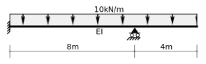
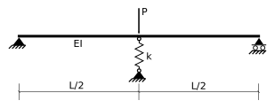
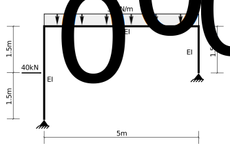
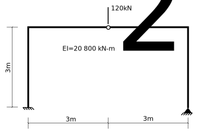

# 7: Statically Indeterminate Beams and Plane Frames
=====================================================

## 7.10: Suggested Problems

### Problem 7.10-1

Determine the reactions and draw the shear force and bending moment
diagrams for the following beam structure.  Choose the vertical force
of the right reaction as the redundant.

   Problem 7.10-1

Partial Solution [(svg, one page)](../../../../images/sibeams/flexibility/problems/beam-1-soln-1.svg)_

### Problem 7.10-2

Determine the reactions and draw the shear force and bending moment
diagrams for the following beam structure.  Choose the moment in the
left support as the redundant.

   Problem 7.10-2

Full Solution [Problem 7.10-2 (pdf, multiple pages)](../../../../images/sibeams/flexibility/problems/problem-7-10-2-soln.pdf)_

### Problem 7.10-3

Determine the reactions and draw the shear force and bending moment
diagrams for the following beam structure.  Choose the vertical force in the
left support as the redundant.

   Problem 7.10-3

Partial Solution [Problem 7.10-3 (pdf, single page)](../../../../images/sibeams/flexibility/problems/problem-7-10-3-soln.svg)_

### Problem 7.10-4

Determine the center reaction (i.e., the force in the spring) for the
following structure.  Verify your solution for $k=0$ and $k=\infty$.

   Problem 7.10-4

[7.10-4 Full Solution](../../../../images/sibeams/flexibility/problems/beam-2-soln-1.svg)

### Problem 7.10-5

Draw the shear force and bending moment diagrams for the following frame structure.

   Problem 7.10-5

[7.10-5 Full Solution](../../../../images/sibeams/flexibility/problems/problem-7-10-5-soln-1.pdf)_

### Problem 7.10-6

Draw the shear force and bending moment diagrams for the following frame 
structure.

   Problem 7.10-6

### Problem 7.10-7

The following frame structure is subjected to a settlement of 10mm downward of 
the right support.  Draw the shear force and bending moments resulting from 
this support movement.

   Problem 7.10-7

[7.10-7 Full Solution](../../../../images/sibeams/flexibility/problems/problem-7-10-7-soln-1.pdf)_

### Problem 7.10-8

The following frame undergoes a temperature change of $+50^\circ C$.
Determine the shears, moments, and support forces resulting from this.

   Problem 7.10-8

[7.10-8 Full Solution](../../../../images/sibeams/flexibility/problems/problem-7-10-8-soln-1.pdf)_
