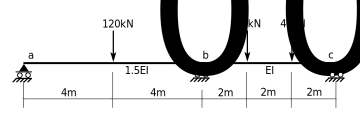

# 8. Slope Deflection

## 8.4 Suggested Problems
 
Use the method of slope deflection to solve the following problems.
For each, draw a free body diagram showing the reactions and draw shear
force and bending moment diagrams.

### Problem 8.4-1

[Problem 8.4-1 Solution](../../../../../images/sibeams/stiffness/slope-deflection/problems/problem-01-soln.pdf)

### Problem 8.4-2

[Problem 8.4-2 Solution](../../../../../images/sibeams/stiffness/slope-deflection/problems/problem-02-soln.pdf)

### Problem 8.4-3

### Problem 8.4-4

### Problem 8.4-5

[Problem 8.4-5 Solution](../../../../../images/sibeams/stiffness/slope-deflection/problems/problem-05-soln.pdf)

### Problem 8.4-6

### Problem 8.4-7

[Problem 8.4-7 Solution](../../../../../images/sibeams/stiffness/slope-deflection/problems/problem-07-soln.pdf)

### Problem 8.4-8

[Problem 8.4-8 Partial Solution](../../../../../images/sibeams/stiffness/slope-deflection/problems/problem-08-soln.pdf)
