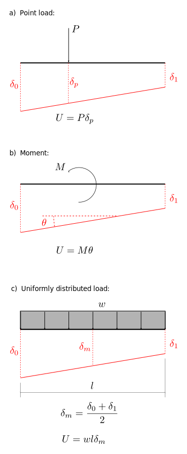

# 4: Method of Virtual Work (1): Principle of Virtual Displacements

## 4.2 Virtual work done by real loads acting through virtual displacements

1. The work done by an applied point load is the magnitude of the load times 
   the distance through which it moves.
2. The work done by an applied moment is the magnitude of the moment times 
   the rotation it experiences.
3. The work done by a uniformly distributed load (i.e, with constant $w$) 
   subject to a linearly varying displacement, is the magnitude of the total 
   load ($=wl$) times the displacement acting at the centroid of the load.

